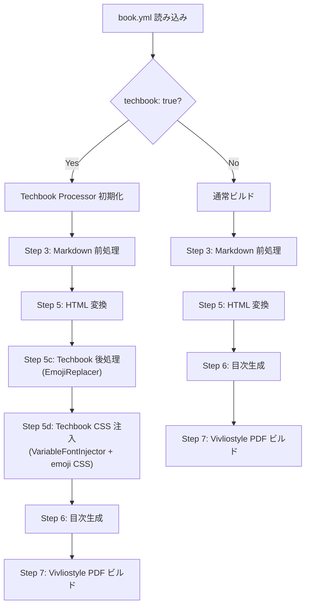
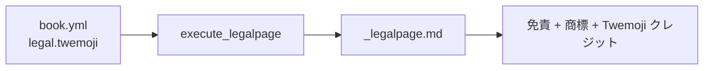
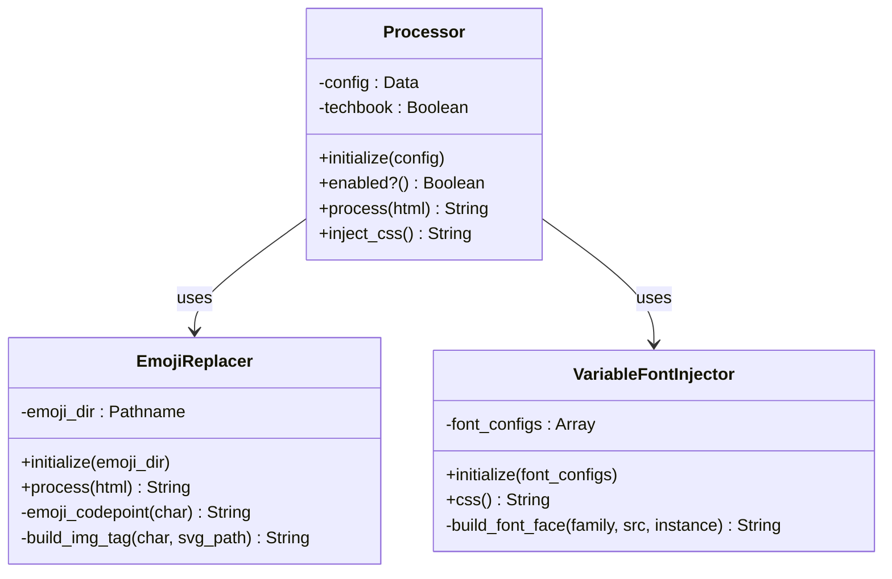

# 設計書: Techbook モード

## 概要

Techbook モードは、技術書典向け印刷用 PDF 生成において Chromium PDF エンジンに起因する2つの問題を回避するための前処理パイプラインである。

| 問題 | 原因 | 対処 |
|------|------|------|
| カラー絵文字の Type 3 フォント化 | Chromium がカラービットマップグリフを CIDFont として埋め込めない | Twemoji SVG `` タグへの差し替え |
| 可変フォントの PDF 出力不正 | Chromium PDF エンジンが `font-variation-settings` を正しく処理できない | 静的 `@font-face` インスタンスの自動注入 |

本モードは `book.yml` の `output.pdf.techbook: true` で有効化される。ビルドパイプライン上では Markdown → HTML 変換後、Vivliostyle レンダリング前に挿入される。

### 設計判断

1. **CreditInserter クラスは作成しない** — Twemoji クレジット表記は `legal.twemoji` を `book.yml` に追加し、既存の `vs create:legalpage` コマンドで生成する。専用クラスの追加は過剰抽象化にあたる。
2. **名前空間は `Vivlio::Starter::CLI::Techbook`** — 既存の `Vivlio::Starter::CLI` 名前空間に合わせ、`lib/vivlio/starter/cli/techbook/` 配下に配置する。techbook_spec.md の `VivlioStarter::Techbook` は採用しない。
3. **Ruby 4.0+ イディオム必須** — `it` パラメータ、パターンマッチング、エンドレスメソッド、ハッシュ省略記法を使用する。
4. **Common::CONFIG はドット記法でアクセスする** — `Common::CONFIG` は `Data.define` による再帰的ラッパーオブジェクトであり、シンボルキーを使用する。設定値へのアクセスにはドット記法と安全ナビゲーション演算子（`&.`）を優先する（例: `config.output&.pdf&.techbook`）。`[]`、`dig`、`fetch`、パターンマッチング（`deconstruct_keys`）も利用可能だが、新規コードではドット記法を標準とする。

---

## アーキテクチャ

### ビルドパイプラインにおける位置づけ



### パイプライン統合ポイント

Techbook 処理は `UnifiedBuildPipeline` の Step 5（HTML 変換）完了後に新ステップとして挿入する。具体的には `convert_sections_html!` の後、`generate_toc_and_pdf!` の前に実行する。

```ruby
# pipeline.rb の register_common_prep_steps に追加
add_step('Step 5c (techbook post-process)', -> { run_techbook_post_process })
```

### legalpage 統合

Twemoji クレジットは `execute_legalpage` メソッドを拡張し、`legal.twemoji` が設定されている場合に免責・商標セクションの後にクレジットセクションを追加する。



---

## コンポーネントとインターフェース

### クラス構成



### ファイル配置

```
lib/vivlio/starter/cli/
  techbook/
    processor.rb            # エントリポイント
    emoji_replacer.rb       # 絵文字 SVG 差し替え
    variable_font_injector.rb  # 可変フォント静的インスタンス注入
```

### Processor

Techbook モードのエントリポイント。設定の読み取りと EmojiReplacer / VariableFontInjector の統括を担う。

```ruby
# lib/vivlio/starter/cli/techbook/processor.rb
module Vivlio
  module Starter
    module CLI
      module Techbook
        class Processor
          # @param config [Data] book.yml の設定オブジェクト（Common::CONFIG の再帰的 Data ラッパー）
          def initialize(config)
            @config = config
            @techbook = config.output&.pdf&.techbook == true
          end

          def enabled? = @techbook

          # HTML 中の絵文字を Twemoji SVG に差し替える
          # @param html [String] 変換対象の HTML
          # @return [String] 処理済み HTML（無効時はそのまま返す）
          def process(html)
            return html unless enabled?

            EmojiReplacer.new.process(html)
          end

          # Techbook 用 CSS（絵文字スタイル + 可変フォント静的インスタンス）を返す
          # @return [String] CSS 文字列（無効時は空文字列）
          def inject_css
            return "" unless enabled?

            css_parts = []
            css_parts << emoji_css
            font_css = VariableFontInjector.new(variable_font_configs).css
            css_parts << font_css unless font_css.empty?
            css_parts.join("\n")
          end

          private

          def emoji_css
            <<~CSS
              /* Vivlio Starter: techbook emoji style */
              img.vs-emoji {
                display: inline;
                width: 1em;
                height: 1em;
                vertical-align: -0.15em;
              }
            CSS
          end

          def variable_font_configs
            Array(@config.output&.pdf&.variable_fonts)
          end
        end
      end
    end
  end
end
```

### EmojiReplacer

HTML 中の Unicode 絵文字を検出し、gem 同梱の Twemoji SVG ファイルが存在する場合に `` タグへ差し替える。

```ruby
# lib/vivlio/starter/cli/techbook/emoji_replacer.rb
module Vivlio
  module Starter
    module CLI
      module Techbook
        class EmojiReplacer
          # Unicode Emoji 検出用正規表現
          # Emoji_Presentation を持つ文字 + Variation Selector 付き文字を対象とする
          EMOJI_REGEX = /[\p{Emoji_Presentation}\p{Emoji}\uFE0F]+/

          # @param emoji_dir [Pathname, String, nil] SVG ディレクトリ（nil 時は gem 同梱パスを使用）
          def initialize(emoji_dir = nil)
            @emoji_dir = Pathname(emoji_dir || default_emoji_dir)
          end

          # HTML 中の絵文字を SVG img タグに差し替える
          # @param html [String]
          # @return [String]
          def process(html)
            html.gsub(EMOJI_REGEX) do |match|
              replace_emoji(match)
            end
          end

          private

          def default_emoji_dir
            File.expand_path('../../../../../stylesheets/twemoji', __dir__)
          end

          # 絵文字文字列を img タグに変換する（SVG が存在する場合のみ）
          def replace_emoji(char)
            codepoint = emoji_codepoint(char)
            svg_path = @emoji_dir.join("#{codepoint}.svg")
            svg_path.exist? ? build_img_tag(char, svg_path) : char
          end

          # 絵文字の Unicode コードポイントを Twemoji ファイル名形式に変換する
          # 例: "✅" → "2705"、複合絵文字 "👨‍💻" → "1f468-200d-1f4bb"
          def emoji_codepoint(char)
            char.codepoints
                .reject { it == 0xFE0F }  # Variation Selector-16 を除外
                .map { it.to_s(16).downcase }
                .join("-")
          end

          def build_img_tag(char, svg_path)
            %()
          end
        end
      end
    end
  end
end
```

### VariableFontInjector

`book.yml` の `output.pdf.variable_fonts` 設定から静的 `@font-face` 宣言を生成する。

```ruby
# lib/vivlio/starter/cli/techbook/variable_font_injector.rb
module Vivlio
  module Starter
    module CLI
      module Techbook
        class VariableFontInjector
          # @param font_configs [Array<Hash>] variable_fonts 設定配列
          def initialize(font_configs)
            @font_configs = Array(font_configs).compact
          end

          # 静的 @font-face 宣言の CSS を生成する
          # @return [String] CSS 文字列（設定なしの場合は空文字列）
          def css
            return "" if @font_configs.empty?

            declarations = @font_configs.flat_map { generate_declarations(it) }
            return "" if declarations.empty?

            "/* Vivlio Starter: techbook variable font static instances */\n" +
              declarations.join("\n")
          end

          private

          # 1つのフォント設定から全インスタンスの @font-face 宣言を生成する
          def generate_declarations(config)
            family = config_value(config, :family)
            src = config_value(config, :src)
            instances = config_value(config, :instances)

            unless family && src && instances
              Common.log_warn("[Techbook] variable_fonts エントリに必須フィールドが不足: #{config.inspect}")
              return []
            end

            Array(instances).map { build_font_face(family, src, it) }
          end

          def build_font_face(family, src, instance)
            weight = config_value(instance, :weight)
            settings = config_value(instance, :settings)
            derived_family = "#{family}-#{weight}"

            <<~CSS
              @font-face {
                font-family: "#{derived_family}";
                src: url("#{src}") format("woff2");
                font-weight: #{weight};
                font-style: normal;
                font-variation-settings: #{settings};
              }
            CSS
          end

          # Hash / Data 両対応のアクセサ
          # Common::CONFIG 経由の設定値は再帰的 Data ラッパーだが、
          # テスト等で Hash が渡される場合にも対応する
          def config_value(obj, key)
            case obj
            when Hash then obj[key.to_sym] || obj[key.to_s]
            else obj.respond_to?(key) ? obj.public_send(key) : nil
            end
          end
        end
      end
    end
  end
end
```

### execute_legalpage 拡張

既存の `CreateCommands.execute_legalpage` を拡張し、`legal.twemoji` が設定されている場合に Twemoji クレジットセクションを追加する。

```ruby
# create.rb の execute_legalpage 内、trademark セクションの後に追加
def execute_legalpage(options)
  apply_verbose(options)
  FileUtils.mkdir_p(Common::CACHE_DIR)
  target = File.join(Common::CACHE_DIR, '_legalpage.md')

  disclaimer, trademark = legal_texts
  body = <<~MD
    <h1 style="display: none;">本書について</h1>
    <div class="disclaimer">
      <h2>■免責</h2>
      #{disclaimer.split(/\r?\n/).map { |line| "  <p>#{line}</p>" }.join("\n")}
    </div>

    <div class="trademark">
      <h2>■商標</h2>
      #{trademark.split(/\r?\n/).map { |line| "  <p>#{line}</p>" }.join("\n")}
    </div>
  MD

  # Twemoji クレジット（legal.twemoji が設定されている場合のみ）
  # Common::CONFIG は再帰的 Data ラッパーのため、ドット記法 + 安全ナビゲーションでアクセスする
  twemoji_credit = Common::CONFIG.legal&.twemoji
  if twemoji_credit && !twemoji_credit.to_s.strip.empty?
    body += <<~MD

      <div class="twemoji-credit">
        <h2>■絵文字クレジット</h2>
        #{twemoji_credit.to_s.split(/\r?\n/).map { |line| "  <p>#{line}</p>" }.join("\n")}
      </div>
    MD
  end

  safe_write(target, body)
  Common.log_success("生成しました: #{target}")
end
```

---

## データモデル

### book.yml 設定スキーマ（Techbook 関連）

```yaml
output:
  pdf:
    techbook: true          # Boolean, デフォルト: false
    variable_fonts:         # Array, 省略可
      - family: "Noto Sans JP"
        src: "fonts/NotoSansJP-VF.woff2"
        instances:
          - weight: 400
            settings: '"wght" 400'
          - weight: 700
            settings: '"wght" 700'

legal:
  twemoji: |                # String, 省略可
    絵文字画像: Twemoji (https://twemoji.twitter.com) © Twitter, Inc. (CC BY 4.0)
```

### 設定値の型定義

| パス | 型 | デフォルト | 説明 |
|------|----|-----------|------|
| `output.pdf.techbook` | Boolean | `false` | Techbook モードの有効/無効 |
| `output.pdf.variable_fonts` | Array\<Hash\> | `[]` | 可変フォント設定 |
| `output.pdf.variable_fonts[].family` | String | (必須) | フォントファミリー名 |
| `output.pdf.variable_fonts[].src` | String | (必須) | フォントファイルパス |
| `output.pdf.variable_fonts[].instances` | Array\<Hash\> | (必須) | 静的インスタンス定義 |
| `output.pdf.variable_fonts[].instances[].weight` | Integer | (必須) | CSS font-weight 値 |
| `output.pdf.variable_fonts[].instances[].settings` | String | (必須) | CSS font-variation-settings 値 |
| `legal.twemoji` | String | `nil` | Twemoji クレジット表記テキスト |

### SVG ファイル命名規則

```
stylesheets/twemoji/{codepoint}.svg
```

- `codepoint`: Unicode コードポイントの小文字16進数表記
- 複合絵文字: ハイフン結合（例: `1f468-200d-1f4bb.svg`）
- Variation Selector-16 (`U+FE0F`) はファイル名から除外

### EmojiReplacer 出力 HTML

```html

```

| 属性 | 値 | 説明 |
|------|----|------|
| `src` | 絶対パス | gem インストール先基準の SVG ファイルパス |
| `alt` | 元の絵文字文字 | アクセシビリティ用代替テキスト |
| `class` | `"emoji vs-emoji"` | スタイリング用クラス |
| `width` / `height` | `"1em"` | 行内テキストと同サイズ |
| `style` | `"vertical-align: -0.15em;"` | ベースライン調整 |


---

## 正当性プロパティ

*プロパティとは、システムのすべての有効な実行において成り立つべき特性や振る舞いのことである。人間が読める仕様と機械的に検証可能な正当性保証の橋渡しとなる。*

### Property 1: 無効モードでの HTML パススルー

*任意の* HTML 文字列に対して、Techbook モードが無効（`techbook: false` または省略）の Processor で `process` を呼び出した場合、入力 HTML と完全に同一の文字列が返されること。

**Validates: Requirements 1.2, 1.3, 6.4**

### Property 2: 絵文字の SVG img タグ差し替え

*任意の* Unicode 絵文字文字と、その絵文字に対応する SVG ファイルが存在する場合、EmojiReplacer は当該絵文字のすべての出現箇所を `` タグに置換すること。生成される `` タグは `src`（SVG への絶対パス）、`alt`（元の絵文字文字）、`class="emoji vs-emoji"`、`width="1em"`、`height="1em"`、`style="vertical-align: -0.15em;"` を含むこと。

**Validates: Requirements 2.2, 2.6, 9.2**

### Property 3: 非絵文字コンテンツの保全

*任意の* 絵文字を含まない HTML 文字列、または対応する SVG ファイルが存在しない絵文字のみを含む HTML 文字列に対して、EmojiReplacer は入力をそのまま返すこと。

**Validates: Requirements 2.3, 2.7**

### Property 4: コードポイント変換の正当性

*任意の* Unicode 文字列に対して、`emoji_codepoint` メソッドは各コードポイントを小文字16進数に変換し、ハイフンで結合した文字列を返すこと。Variation Selector-16（U+FE0F）はファイル名から除外されること。

**Validates: Requirements 2.4**

### Property 5: Twemoji クレジットセクションの構造

*任意の* 非空の `legal.twemoji` テキスト（複数行を含む）に対して、`execute_legalpage` が生成する HTML は `<div class="twemoji-credit">` で囲まれ、`<h2>■絵文字クレジット</h2>` の見出しを含み、テキストの各行が個別の `<p>` タグで出力されること。

**Validates: Requirements 4.2, 4.3**

### Property 6: 可変フォント @font-face 宣言の生成

*任意の* 有効な `variable_fonts` 設定（`family`、`src`、`instances` を含む）に対して、VariableFontInjector は各インスタンスごとに `font-family`（ファミリー名-ウェイト形式）、`src`（woff2 形式の url）、`font-weight`、`font-style: normal`、`font-variation-settings` を含む `@font-face` ブロックを生成すること。

**Validates: Requirements 5.1, 5.2**

### Property 7: 不完全なフォント設定のスキップ

*任意の* `variable_fonts` エントリにおいて、`family`、`src`、`instances` のいずれかが欠けている場合、VariableFontInjector はそのエントリをスキップし、不正なエントリに対する `@font-face` 宣言を生成しないこと。

**Validates: Requirements 8.3**

### Property 8: 絵文字差し替え時の HTML 構造保全

*任意の* HTML 要素（`<p>`、`<li>`、`<td>`、`<span>` 等）の内部に絵文字が出現する場合、EmojiReplacer は絵文字文字のみを `` タグに置換し、囲んでいる HTML タグ、属性、および非絵文字テキストコンテンツをすべて保全すること。

**Validates: Requirements 9.1, 9.3**

---

## エラーハンドリング

### 設定エラー

| エラー状況 | 対処 |
|-----------|------|
| `output.pdf.techbook` が Boolean 以外の値 | `false` として扱い、Techbook モードを無効化 |
| `output.pdf.variable_fonts` が配列以外 | 空配列として扱い、フォント注入をスキップ |
| `variable_fonts` エントリに必須フィールド不足 | 当該エントリをスキップし、`Common.log_warn` で警告出力 |
| `legal.twemoji` が空文字列 | クレジットセクションを生成しない |

### ファイルシステムエラー

| エラー状況 | 対処 |
|-----------|------|
| `stylesheets/twemoji/` ディレクトリが存在しない | EmojiReplacer は全絵文字をスルー（SVG なしと同じ動作） |
| SVG ファイルの読み取り権限なし | 当該絵文字をスルー |
| gem インストールパスの解決失敗 | `Pathname(__dir__)` ベースのフォールバック |

### パイプラインエラー

| エラー状況 | 対処 |
|-----------|------|
| Techbook 処理中の例外 | `Common.log_error` で報告し、元の HTML をそのまま使用してビルド続行 |
| CSS 注入の失敗 | 空文字列を返し、ビルド続行（フォント表示が崩れる可能性あり） |

---

## テスト戦略

### テストフレームワーク

- **Minitest** — プロジェクト標準に準拠
- **DAMP > DRY** — 各テストで Arrange/Act/Assert が完結
- **統合テスト重視** — 公開 API の入出力を中心に検証
- **DI で外部依存を差し替え** — EmojiReplacer の `emoji_dir` をコンストラクタ引数で注入

### プロパティベーステスト

本機能は純粋関数（絵文字差し替え、コードポイント変換、CSS 生成）を多く含むため、プロパティベーステストが適用可能である。

- **ライブラリ**: [propcheck](https://github.com/Qqwy/ruby-prop_check) gem（Ruby 向け PBT ライブラリ）
- **最小反復回数**: 各プロパティテストで 100 回以上
- **タグ形式**: `Feature: techbook-mode, Property {number}: {property_text}`

### テストファイル構成

```
test/vivlio/starter/cli/techbook/
  processor_test.rb              # Processor の統合テスト
  emoji_replacer_test.rb         # EmojiReplacer のユニット + プロパティテスト
  variable_font_injector_test.rb # VariableFontInjector のユニット + プロパティテスト
  legalpage_twemoji_test.rb      # execute_legalpage の Twemoji クレジット拡張テスト
```

### テスト分類

#### プロパティベーステスト（PBT）

| Property | テスト内容 | 生成戦略 |
|----------|-----------|---------|
| P1 | 無効モードパススルー | ランダム HTML 文字列 |
| P2 | 絵文字 SVG 差し替え | ランダム絵文字 + モック SVG ディレクトリ |
| P3 | 非絵文字コンテンツ保全 | ASCII/HTML 文字列（絵文字なし） |
| P4 | コードポイント変換 | ランダム Unicode 文字 |
| P5 | Twemoji クレジット構造 | ランダム複数行テキスト |
| P6 | @font-face 宣言生成 | ランダムフォント設定 |
| P7 | 不完全設定スキップ | 必須フィールドをランダムに欠落させた設定 |
| P8 | HTML 構造保全 | ランダム HTML 要素 + 絵文字 |

#### ユニットテスト（具体例）

| テスト | 検証内容 |
|--------|---------|
| `test_should_enable_when_techbook_true` | `techbook: true` で `enabled?` が `true` を返す |
| `test_should_disable_when_techbook_false` | `techbook: false` で `enabled?` が `false` を返す |
| `test_should_disable_when_techbook_omitted` | キー省略時に `enabled?` が `false` を返す |
| `test_should_replace_checkmark_emoji` | ✅ → `` |
| `test_should_skip_emoji_without_svg` | SVG なし絵文字がそのまま残る |
| `test_should_inject_emoji_css_when_enabled` | `inject_css` に `img.vs-emoji` ルールが含まれる |
| `test_should_return_empty_css_when_disabled` | 無効時に `inject_css` が空文字列を返す |
| `test_should_generate_font_face_for_each_instance` | 2インスタンス設定で2つの `@font-face` が生成される |
| `test_should_skip_entry_missing_family` | `family` 欠落エントリがスキップされる |
| `test_should_generate_twemoji_credit_section` | `legal.twemoji` 設定時にクレジットセクションが生成される |
| `test_should_omit_twemoji_credit_when_not_set` | `legal.twemoji` 未設定時にクレジットなし |
| `test_should_resolve_emoji_dir_from_gem_path` | デフォルトパスが gem 内の `stylesheets/twemoji/` を指す |

#### 統合テスト

| テスト | 検証内容 |
|--------|---------|
| `test_should_process_html_with_mixed_emoji_and_text` | 絵文字とテキストが混在する HTML の正しい処理 |
| `test_should_inject_both_emoji_and_font_css` | `inject_css` が絵文字 CSS とフォント CSS の両方を含む |
| `test_should_handle_compound_emoji` | 複合絵文字（ZWJ シーケンス等）の正しい処理 |
