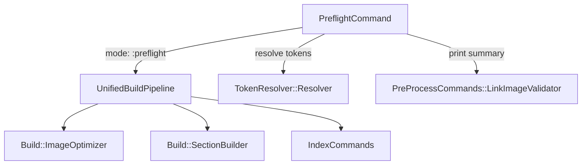

# vs-preflight 設計ドキュメント

## Overview

`vs preflight` は `vs build`（約600秒）の前に原稿のエラーチェックだけを約6秒で行う高速チェックコマンドである。

### 設計方針

専用パイプラインクラスを新設するのではなく、既存の `UnifiedBuildPipeline` に `mode: :preflight` を追加する。
これにより：

- `pipeline.rb` に `register_preflight_steps` を1メソッド追加するだけで実現できる
- build 側の Step 1〜4 の変更が preflight に自動追従する
- 専用パイプラインクラスが不要で、重複実装を避けられる

### 実行ステップ

```
Step 1: 画像最適化（--no-resize でスキップ）
Step 2: テーマ画像準備
Step 3: Markdown前処理（preprocess_sections!）
Step 4: 索引スキャン（index_enabled? の場合のみ）
```

Step 0（クリーン）・Step 5 以降（HTML変換・PDF生成）は実行しない。
中間生成物のクリーンアップも実行しない。

---

## Architecture

```
bin/vs
  └─ CLI.start(argv)
       └─ RootCommand#call
            └─ PreflightCommand#call
                 ├─ TokenResolver::Resolver#resolve(targets)  # 章トークン解決
                 └─ UnifiedBuildPipeline.new(self, entries:, mode: :preflight)
                      └─ register_preflight_steps
                           ├─ Step 1: Build::ImageOptimizer.optimize_images!
                           ├─ Step 2: Build::ImageOptimizer.prepare_theme_images!
                           ├─ Step 3: Build::SectionBuilder.preprocess_sections!(entries)
                           └─ Step 4: IndexCommands.process_index_for_build!
```

### コンポーネント間の依存関係



---

## Components and Interfaces

### 新規ファイル

| ファイル | 役割 |
|---|---|
| `lib/vivlio/starter/cli/samovar/preflight_command.rb` | PreflightCommand（Samovar CLI） |

### 変更ファイル

| ファイル | 変更内容 |
|---|---|
| `lib/vivlio/starter/cli/build/pipeline.rb` | `register_steps` にパターンマッチ追加、`register_preflight_steps` メソッド追加 |
| `lib/vivlio/starter/cli/loader.rb` | `require_relative 'preflight'` 追加（不要なら省略） |
| `lib/vivlio/starter/cli/samovar.rb` | `require_relative 'samovar/preflight_command'` 追加 |
| `lib/vivlio/starter/cli/samovar/root_command.rb` | `public_commands` に `'preflight'` 追加 |
| `lib/vivlio/starter/cli/samovar/help_command.rb` | preflight をヘルプ一覧に追加 |

### PreflightCommand インターフェース

```ruby
class PreflightCommand < Samovar::Command
  self.description = 'ビルド前の原稿エラーチェックを高速実行します（Step 1〜4 のみ）'

  many :targets, 'チェック対象（章番号 / 範囲 / スラッグ）', default: []

  options do
    option '--[no]-resize', '画像最適化を行う（--no-resize で無効）', default: true, key: :resize
    option '--log <level>', 'ログレベルを指定（error/warn/info/debug）', key: :log_level
    option '-h/--help', 'このコマンドの使い方を表示', key: :help
  end

  def call
    # --help 表示
    # LinkImageValidator リセット
    # TokenResolver で entries 解決
    # UnifiedBuildPipeline.new(self, entries:, mode: :preflight).run
    # サマリー表示
    # エラーあり → 1、警告のみ → 0
  end
end
```

### UnifiedBuildPipeline の変更

```ruby
# register_steps を pattern matching に変更
def register_steps
  case mode
  in :single    then register_single_mode_steps
  in :preflight then register_preflight_steps
  in _          then register_full_mode_steps
  end
end

# preflight 専用ステップ登録
def register_preflight_steps
  [
    ['Step  1 (optimize images)',      -> { run_step1_optimize_images }],
    ['Step  2 (prepare theme images)', -> { Build::ImageOptimizer.prepare_theme_images! }],
    ['Step  3 (preprocess sections)',  -> { Build::SectionBuilder.preprocess_sections!(entries) }],
    ['Step  4 (index scan and build)', -> { run_step4_index_processing }],
  ].each { |label, handler| add_step(label, handler) }
end
```

---

## Data Models

### PreflightCommand の入出力

```
入力:
  targets: Array<String>   # 章トークン（空 = 全章）
  options[:resize]: Boolean
  options[:log_level]: String | nil

出力（標準出力）:
  各ステップのログ（Common.log_action / log_warn / log_error 経由）
  サマリー:
    ⚠️  警告: N 件
    ❌  エラー: N 件
    ⏱  経過時間: N.Ns

終了コード:
  0: エラーなし（警告のみ、または問題なし）
  1: エラー1件以上
```

### エラー・警告フォーマット

| 種別 | 記号 | フォーマット |
|---|---|---|
| 画像ファイル不在 | ⚠️ | `{ファイル名}:{行番号} - 画像 '{画像名}' が見つかりません` |
| コードインクルードファイル不在 | ❌ | `ファイルが見つかりません: {パス}` |
| QueryStream展開エラー | ❌ | `QueryStream 展開エラー: {詳細}` |
| クロスリファレンス未定義ラベル | ⚠️ | `{ファイル名}:{行番号} - 未定義のラベルID: {ラベル}` |

これらのフォーマットは既存の `Common.log_warn` / `Common.log_error` 経由で出力される。
`PreProcessCommands::LinkImageValidator` が画像検証を担い、サマリーは `LinkImageValidator.print_summary` を参考に実装する。

---

## Correctness Properties

*A property is a characteristic or behavior that should hold true across all valid executions of a system—essentially, a formal statement about what the system should do. Properties serve as the bridge between human-readable specifications and machine-verifiable correctness guarantees.*

### Property Reflection（冗長性の排除）

prework 分析の結果、以下の property 候補が得られた：

- 2.3: 任意の Entry 配列に対して preprocess_sections! が呼ばれる
- 3.1: 任意の画像警告に対して出力フォーマットが正しい
- 3.2: 任意のコードインクルードエラーに対して出力フォーマットが正しい
- 3.3: 任意の QueryStream エラーに対して出力フォーマットが正しい
- 3.4: 任意のクロスリファレンス警告に対して出力フォーマットが正しい
- 3.5: 任意の警告件数・エラー件数・経過時間に対してサマリーが正しい
- 3.6: エラーが1件以上 → 終了コード 1
- 3.7: 警告のみ（エラーなし）→ 終了コード 0

**冗長性の検討：**

- 3.1〜3.4 はいずれも「任意の入力に対して出力フォーマットが正しい」という同一パターン。
  これらは「任意のエラー/警告メッセージに対して、フォーマットが仕様通りである」という1つの property に統合できる。
  ただし、各フォーマットは独立しているため、統合すると検証が曖昧になる。個別に保持する。

- 3.6 と 3.7 は「エラー件数と終了コードの関係」を表す。
  「エラー件数 > 0 → 終了コード 1」と「エラー件数 = 0 → 終了コード 0」は、
  「終了コードはエラー件数が正かどうかで決まる」という1つの property に統合できる。統合する。

- 2.3 は「全 Entry に対して前処理が実行される」という invariant。独立して保持する。

**最終 property 一覧：**

1. 全 Entry に対して前処理が実行される（2.3）
2. 画像警告フォーマットの正確性（3.1）
3. コードインクルードエラーフォーマットの正確性（3.2）
4. QueryStream エラーフォーマットの正確性（3.3）
5. クロスリファレンス警告フォーマットの正確性（3.4）
6. サマリーの完全性（3.5）
7. 終了コードとエラー件数の関係（3.6 + 3.7 統合）

---

### Property 1: 全 Entry に対して前処理が実行される

*For any* Entry 配列（空でない）に対して preflight を実行したとき、配列内の全 Entry に対して `Build::SectionBuilder.preprocess_sections!` が呼ばれること。

**Validates: Requirements 2.3**

---

### Property 2: 画像警告フォーマットの正確性

*For any* ファイル名・行番号・画像名の組み合わせに対して、画像ファイル不在の警告メッセージは `⚠️ {ファイル名}:{行番号} - 画像 '{画像名}' が見つかりません` の形式に一致すること。

**Validates: Requirements 3.1**

---

### Property 3: コードインクルードエラーフォーマットの正確性

*For any* ファイルパスに対して、コードインクルード対象ファイル不在のエラーメッセージは `❌ ファイルが見つかりません: {パス}` の形式に一致すること。

**Validates: Requirements 3.2**

---

### Property 4: QueryStream エラーフォーマットの正確性

*For any* 詳細メッセージに対して、QueryStream 展開エラーのメッセージは `❌ QueryStream 展開エラー: {詳細}` の形式に一致すること。

**Validates: Requirements 3.3**

---

### Property 5: クロスリファレンス警告フォーマットの正確性

*For any* ファイル名・行番号・ラベルIDの組み合わせに対して、未定義ラベル参照の警告メッセージは `⚠️ {ファイル名}:{行番号} - 未定義のラベルID: {ラベル}` の形式に一致すること。

**Validates: Requirements 3.4**

---

### Property 6: サマリーの完全性

*For any* 警告件数 w（0以上）・エラー件数 e（0以上）・経過時間 t（正の実数）の組み合わせに対して、preflight 完了後のサマリー出力は警告件数・エラー件数・経過時間の全てを含むこと。

**Validates: Requirements 3.5**

---

### Property 7: 終了コードとエラー件数の関係

*For any* エラー件数 e（0以上の整数）に対して、preflight の終了コードは `e > 0 ? 1 : 0` に等しいこと。
すなわち、エラーが1件以上あれば終了コード 1、エラーがなければ（警告のみでも）終了コード 0 となること。

**Validates: Requirements 3.6, 3.7**

---

## Error Handling

### エラー種別と対応

| エラー種別 | 対応 |
|---|---|
| 章トークンが catalog.yml に存在しない | `log_error` でメッセージを表示し、終了コード 1 で終了 |
| プロジェクト外での実行 | `Common.ensure_configured!` が例外を発生させ、RootCommand がハンドリング |
| ステップ実行中の例外 | `StandardError` をキャッチし、`log_error` で表示して終了コード 1 |
| `--log` オプションの不正値 | BuildCommand と同様に normalize_log_option_tokens で正規化 |

### 終了コード

```
0: 正常終了（エラーなし。警告は0件以上あってもよい）
1: エラーあり（エラーが1件以上検出された場合）
1: 実行時例外（StandardError が発生した場合）
```

---

## Testing Strategy

### テスト方針

**デュアルテストアプローチ：**
- 例示テスト（unit tests）: 特定の入力・出力・オプション動作を確認
- プロパティテスト（property-based tests）: 普遍的な性質を多数の入力で検証

**プロパティテストライブラリ：** `propcheck`（Ruby 向け PBT ライブラリ）

各プロパティテストは最低 100 イテレーション実行する。
タグ形式: `# Feature: vs-preflight, Property {N}: {property_text}`

### 例示テスト（unit tests）

```
test_should_run_all_chapters_when_no_targets_given
  → 引数なしで全章が対象になることを確認

test_should_resolve_chapter_number_token
  → "0" トークンが 00-preface.md に解決されることを確認

test_should_resolve_range_token
  → "1-10" トークンが 01-xxx〜10-xxx に解決されることを確認

test_should_skip_step1_when_no_resize
  → --no-resize で Step 1 がスキップされることを確認

test_should_skip_step4_when_index_disabled
  → index_glossary.enabled = false で Step 4 がスキップされることを確認

test_should_not_generate_html_or_pdf
  → preflight 実行後に HTML/PDF が生成されないことを確認

test_should_register_in_public_commands
  → RootCommand.public_commands に 'preflight' が含まれることを確認

test_should_appear_in_help_output
  → HelpCommand の COMMAND_CATEGORIES に preflight が含まれることを確認

test_should_print_help_with_help_option
  → --help / -h でヘルプが表示されることを確認
```

### プロパティテスト（property-based tests）

```ruby
# Feature: vs-preflight, Property 1: 全 Entry に対して前処理が実行される
property 'preprocess_sections! is called for all entries' do
  # Generator: 1〜10件のランダムな Entry 配列
  # Assert: preprocess_sections! が entries 全体に対して呼ばれる
end

# Feature: vs-preflight, Property 2: 画像警告フォーマットの正確性
property 'image warning message matches expected format' do
  # Generator: ランダムなファイル名・行番号・画像名
  # Assert: メッセージが /⚠️ .+:\d+ - 画像 '.+' が見つかりません/ にマッチ
end

# Feature: vs-preflight, Property 3: コードインクルードエラーフォーマットの正確性
property 'code include error message matches expected format' do
  # Generator: ランダムなファイルパス
  # Assert: メッセージが /❌ ファイルが見つかりません: .+/ にマッチ
end

# Feature: vs-preflight, Property 4: QueryStream エラーフォーマットの正確性
property 'querystream error message matches expected format' do
  # Generator: ランダムな詳細メッセージ
  # Assert: メッセージが /❌ QueryStream 展開エラー: .+/ にマッチ
end

# Feature: vs-preflight, Property 5: クロスリファレンス警告フォーマットの正確性
property 'cross-reference warning message matches expected format' do
  # Generator: ランダムなファイル名・行番号・ラベルID
  # Assert: メッセージが /⚠️ .+:\d+ - 未定義のラベルID: .+/ にマッチ
end

# Feature: vs-preflight, Property 6: サマリーの完全性
property 'summary contains warning count, error count, and elapsed time' do
  # Generator: ランダムな警告件数・エラー件数・経過時間
  # Assert: サマリー文字列が3つの値を全て含む
end

# Feature: vs-preflight, Property 7: 終了コードとエラー件数の関係
property 'exit code equals (error_count > 0 ? 1 : 0)' do
  # Generator: ランダムな非負整数（エラー件数）
  # Assert: exit_code == (error_count > 0 ? 1 : 0)
end
```

### テストファイル配置

```
test/
  cli/
    samovar/
      preflight_command_test.rb   # 例示テスト
    build/
      preflight_pipeline_test.rb  # プロパティテスト（pipeline の preflight mode）
```
