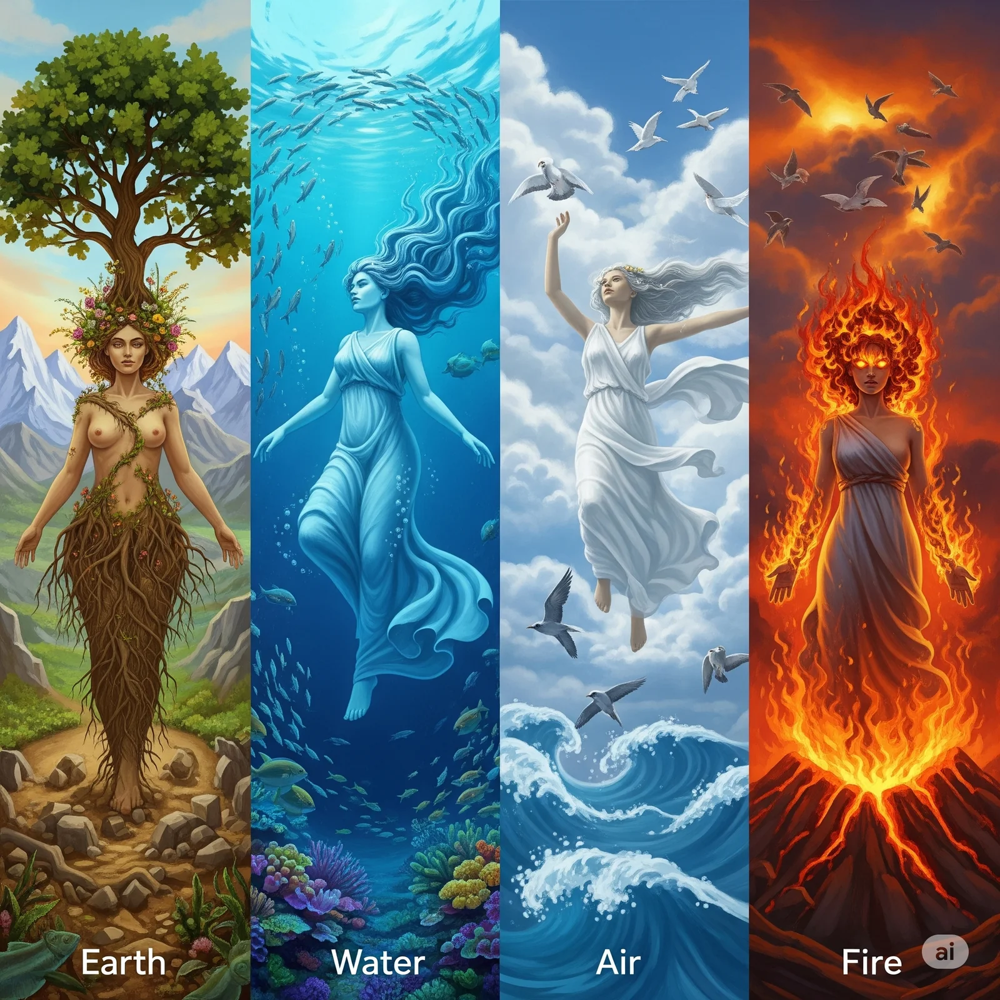
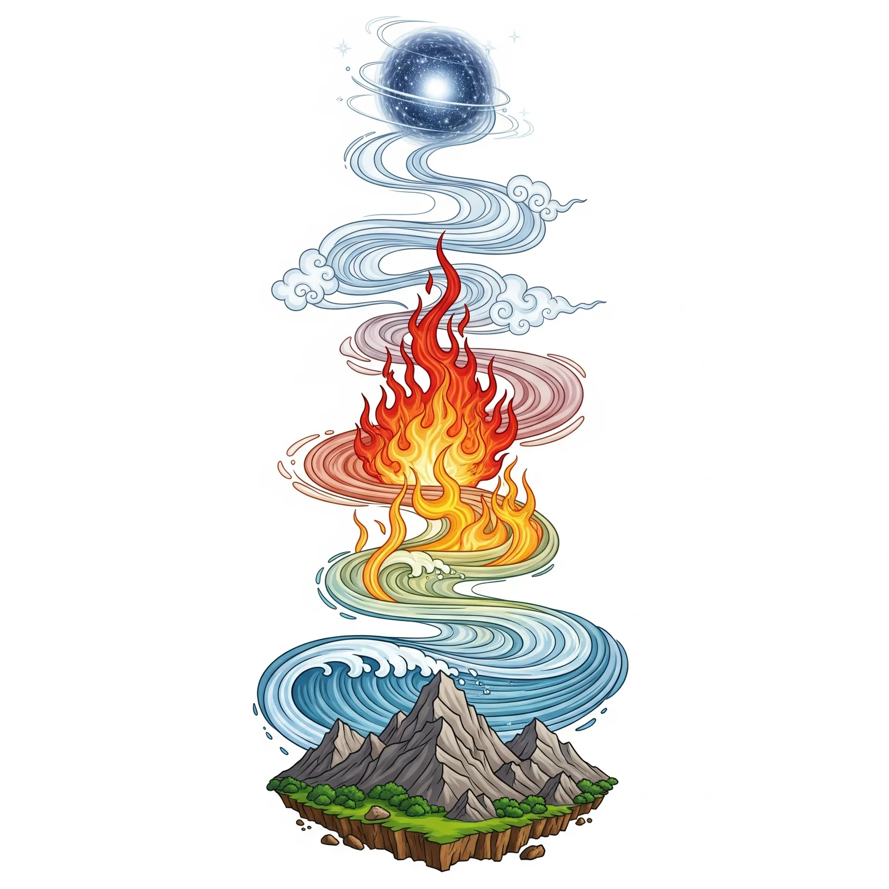
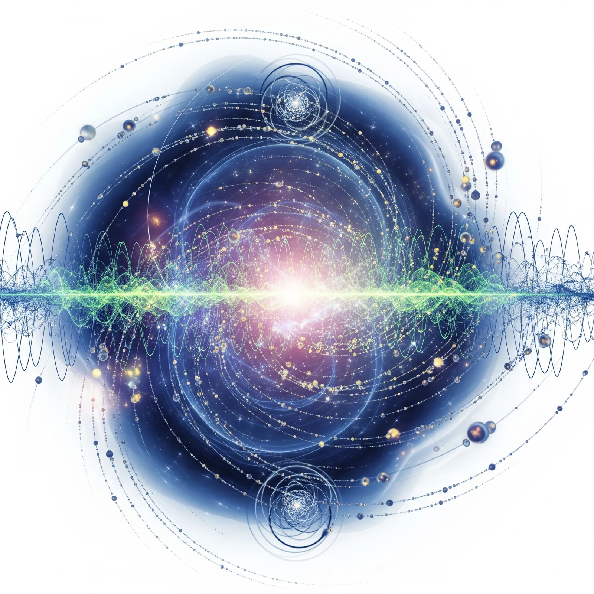

---
link:
- rel: stylesheet
  href: stylesheets/chapter.css
- rel: stylesheet
  href: stylesheets/12.css
lang: ja
---

# 万物の根源を求めて

:::{.chapter-lead}
人類は古来より、この世界の成り立ちや物質の根源について考え続けてきました。古代ギリシャの四大元素、仏教の五大、神道の世界観、そして現代物理学に至るまで、時代と文化を超えて人々は同じ問いを投げかけてきました。この章では、多様な文化や時代における「万物の根源」への探求の軌跡をたどり、現代の私たちが受け継いだ知の遺産を振り返ります。一見異なるように見えるこれらの思想が、実は深いところでつながっていることに気づくことでしょう。
:::

## 四大元素

:::{.section-lead}
古代ギリシャの哲学者たちが提唱した、万物を構成する基本的な4つの元素です。タレスやエンペドクレスらによるこの思想は、単なる物質観を超え、自然現象の本質を理解しようとする人間の知的な営みの始まりを象徴しています。当時の人々が日常で触れる自然現象を説明するための素朴ながらも深遠な世界観は、現代科学の礎ともなりました。
:::

### 四つの元素

#### 1. 火（Fire / πῦρ）
- **性質**: 熱く、乾燥
- **特徴**: 上昇する性質、変化を促す力
- **象徴**: エネルギー、情熱、破壊と創造

#### 2. 空気（Air / ἀήρ）
- **性質**: 熱く、湿潤
- **特徴**: 軽やか、流動的
- **象徴**: 思考、コミュニケーション、精神

#### 3. 水（Water / ὕδωρ）
- **性質**: 冷たく、湿潤
- **特徴**: 下降する性質、適応性
- **象徴**: 感情、直感、浄化

#### 4. 土（Earth / γῆ）
- **性質**: 冷たく、乾燥
- **特徴**: 重く、安定
- **象徴**: 物質性、安定性、豊穣

### 歴史的発展

#### エンペドクレス（紀元前490-430年頃）
- 四大元素説の創始者
- 万物はこれら4つの元素の組み合わせで構成されると提唱

#### アリストテレス（紀元前384-322年）
- 四大元素説を体系化
- 第5の元素「エーテル（aether）」を天体の構成要素として追加
- 各元素に「熱・冷」「乾・湿」の性質を組み合わせて説明

### 影響と意義

#### 科学への影響
- 中世まで自然哲学の基礎理論
- 錬金術の理論的基盤
- 近世の化学革命まで約2000年間支配的理論

#### 文化への影響
- 占星術、医学（四体液説）
- 芸術、文学における象徴体系
- 現代でも性格分類や心理学で参照される

四大元素説は科学的には否定されましたが、人間の思考パターンや世界観を理解する上で重要な文化的遺産として今も研究されています。

## 五大（ごだい）

:::{.section-lead}
仏教における宇宙万物を構成する五つの基本要素です。日本では平安時代、空海（弘法大師）が真言密教とともに広まりました。五大は単なる物質の分類を超え、人間の身体や精神、さらには宇宙の真理までも包括する壮大な世界観を形成しています。特に空の思想は、すべての要素を貫く根本原理として、後の日本文化や思想に深い影響を与えました。
:::

### 五つの要素

#### 1. 地（ち / पृथ्वी）
- **性質**: 堅固性、支持する力
- **特徴**: 物質の基盤、安定性
- **象徴**: 大地、骨格、肉体の基礎
- **五輪塔**: 最下段の方形（立方体）

#### 2. 水（すい / आप्）
- **性質**: 湿潤性、結合する力
- **特徴**: 流動性、適応性
- **象徴**: 血液、体液、感情
- **五輪塔**: 下から2段目の球形

#### 3. 火（か / तेजस्）
- **性質**: 温熱性、変化させる力
- **特徴**: エネルギー、消化、変換
- **象徴**: 体温、消化力、情熱
- **五輪塔**: 中段の三角形（宝珠形）

#### 4. 風（ふう / वायु）
- **性質**: 動性、運動させる力
- **特徴**: 呼吸、循環、伝達
- **象徴**: 呼吸、血液循環、神経
- **五輪塔**: 上から2段目の半球形

#### 5. 空（くう / आकाश）
- **性質**: 無障礙性、すべてを包含
- **特徴**: 空間、可能性、智慧
- **象徴**: 意識、悟り、仏性
- **五輪塔**: 最上段の宝珠形

{width="95%"}

### 歴史的背景

#### インド哲学での起源
- **サーンキヤ哲学**: 五元素説（パンチャマハーブータ）として体系化
- **ヨーガ哲学**: 修行における身体観として発展
- **アーユルヴェーダ**: 医学理論の基礎として活用

#### 日本への伝来
- **空海（774-835年）**: 唐から真言密教とともに導入
- **密教思想**: 即身成仏の理論的基盤として重要視
- **五輪塔**: 供養塔として日本各地に建立

### 実践的応用

#### 宗教的実践
- **瞑想法**: 五大を観想する修行
- **護摩法**: 火の要素を中心とした儀式
- **曼荼羅**: 五大を配置した宇宙図

#### 文化的影響
- **建築**: 五重塔、五輪塔の構造
- **芸術**: 仏画、彫刻における表現
- **武道**: 合気道などの身体観

<!-- ### 西洋四大元素との比較

| 要素 | 仏教五大 | ギリシャ四大元素 |
|------|---------|------------|
| 固体 | 地 | 土 |
| 液体 | 水 | 水 |
| 気体 | 風 | 空気 |
| エネルギー | 火 | 火 |
| 空間・意識 | 空 | （エーテル） | -->

五大思想は単なる物質論ではなく、精神性と物質性を統合した宇宙観として、現代でも瞑想や心身統合の実践において重要な意味を持ち続けています。

## 神道における 世界の根源

:::{.section-lead}
神道では、世界の根源を**「神（かみ）」**そのものとして捉えます。万物に宿る霊的な力や神秘的な働き、山や川、岩や木々、そして人に至るまで、あらゆる存在が神々の働きの現れであるという世界観が特徴です。天地{人間|じんかん}にあり、生かされている喜びや自然の営み、生命の神秘、そして人知を超えた大いなる存在への畏敬の念が、神道の根底に流れる思想です。
:::

### 根源的概念

#### 1. {天之御中主神|あめのみなかぬしのかみ}
- **位置**: 最初に現れた根源神
- **性質**: 宇宙の中心、万物の根源
- **特徴**: {独神|ひとりがみ}、{隠身|かくりみ}の神
- **意味**: 天の中心を司る主宰神

#### 2. {高御産巣日神|たかみむすひのかみ}、{神産巣日神|かむむすひのかみ}、{天之御中主神|あめのみなかぬしのかみ}
- **役割**: {造化三神|ぞうかのさんしん} 創造・生成を司る神々
- **{産巣日|むすひ}**: 生命力、創造力の根源
- **意味**: 万物を生み出す霊的エネルギー

#### 3. 「{産霊|むすひ}」の思想
- **概念**: 生成・結合・創造の根源的力
- **特徴**: 物質的要素ではなく、霊的・生命的エネルギー
- **現れ**: 万物の生成、成長、調和

### 神道的世界観の特徴

#### 物質論的要素の不在
- 四大元素や五大のような物質的構成要素を設定しない
- 世界は「神の働き」「霊的エネルギー」によって成り立つ

#### 「神」の多層的理解
- **個別神**: 具体的な神々 {天照大神|あまてらすおおみかみ}、{須佐之男命|すさおのおのみこと}など
- **根源神**: 宇宙の根源的存在
- **神性**: 万物に宿る霊的本質

#### 「八百万の神」思想
- **汎神論的**: すべてのものに神が宿る
- **自然崇拝**: 山、川、木、石などすべてが神の現れ
- **生命観**: 生きとし生けるものすべてに神性を認める

### 古事記・日本書紀での表現

#### 天地開闢（てんちかいびゃく）
> 天地初発之時、於高天原成神名、  
> 天之御中主神、次高御産巣日神、次神産巣日神

- 天地が初めて分かれた時、{高天原|たかまがはら}に現れた神々
- 物質的分離ではなく、神々の出現として描写

#### 「混沌」から「秩序」へ
- **混沌**: 天地未分の状態
- **分化**: 神々の働きによる世界の展開
- **調和**: 万物の調和的共存

### 他の思想との比較

| 思想体系 | 根源 | 特徴 |
|---------|------|------|
| ギリシャ | 四大元素 | 物質的構成要素 |
| 仏教 | 五大 | 物質と精神の統合 |
| 神道 | 神・{産霊|むすひ} | 霊的エネルギー・生命力 |

### 現代への影響

#### 日本人の自然観
- **自然との共生**: 自然を征服対象ではなく共存相手として捉える
- **季節感**: 四季の変化を神々の働きとして感受
- **環境意識**: 自然保護の精神的基盤

#### 文化的表現
- **建築**: 神社建築における自然との調和
- **芸術**: 日本画、庭園における自然表現
- **祭り**: 自然の恵みへの感謝の表現

神道における世界の根源は、物質的要素ではなく**「神という霊的エネルギー」「{産霊|むすひ}という生命創造力」**であり、これが日本独特の自然観や生命観の基盤となっています。

{width="100%"}

## 現代物理学における物質の根源

<!-- :::{.section-lead}
古代から現代まで、人類は世界の根源を探究し続けてきました。現代物理学は実験と理論により、驚くべき世界像を明らかにしています。原子や素粒子の振る舞いから宇宙の成り立ちまで、科学の進歩は私たちに新たな世界観をもたらしました。しかし、その探求の根底には、古代の哲学者たちが抱いた「世界は何からできているのか」という根源的な問いが脈々と受け継がれています。この章では、古代の思想から現代の量子論に至るまで、人類が追い求めてきた「根源」への探求の軌跡をたどります。
::: -->

:::{.section-lead}
古代から現代まで、人類は世界の根源を探究し続けてきました。現代物理学は実験と理論により、驚くべき世界像を明らかにしています。原子や素粒子の振る舞いから宇宙の成り立ちまで、科学の進歩は私たちに新たな世界観を{齎|もたら}しました。この章では、古代の思想から現代の量子論に至るまで、人類が追い求めてきた「根源」への探求の軌跡をたどります。
:::

### 歴史的発展

#### 1. フロギストン説（17-18世紀）
- **提唱者**: ゲオルク・シュタール（1659-1734）
- **理論**: 燃焼は物質から「フロギストン（燃素）」が放出される現象
- **問題**: 燃焼後に質量が増加する現象を説明できず
- **終焉**: ラヴォアジエの酸素発見（1774年）により否定

#### 2. 原子論の復活（19世紀）
- **ドルトンの原子説（1803年）**: 物質は分割不可能な原子から構成
- **アボガドロの法則（1811年）**: 分子概念の導入
- **メンデレーエフの周期表（1869年）**: 元素の体系的分類

#### 3. 原子構造の発見（20世紀初頭）
- **電子の発見（1897年）**: J.J.トムソンによる陰極線実験
- **原子核の発見（1911年）**: ラザフォードの散乱実験
- **ボーア模型（1913年）**: 量子化された電子軌道
### 現代の物質観

#### 素粒子物理学

##### 1. レプトン（軽粒子）
- **電子（e⁻）**: 原子を構成、電気を運ぶ
- **ミューオン（μ⁻）**: 電子の重い仲間
- **タウ粒子（τ⁻）**: さらに重いレプトン
- **ニュートリノ（νₑ, νμ, ντ）**: 質量がほぼゼロ、相互作用が極めて弱い

##### 2. クォーク（強粒子の構成要素）
- **アップクォーク（u）**: 電荷 +2/3、陽子・中性子を構成
- **ダウンクォーク（d）**: 電荷 -1/3、陽子・中性子を構成
- **その他**: チャーム（c）、ストレンジ（s）、トップ（t）、ボトム（b）

##### 3. 力を媒介するボソン
- **光子（γ）**: 電磁気力
- **W・Zボソン**: 弱い核力
- **グルーオン（g）**: 強い核力
- **ヒッグスボソン（H）**: 質量の起源
#### 量子論的世界観

##### 1. 波動粒子二重性
- **物質**: 粒子であり同時に波でもある
- **不確定性原理**: 位置と運動量を同時に正確に測定不可能
- **観測問題**: 観測行為が現実を決定する

##### 2. 量子もつれ
- **非局所性**: 離れた粒子間の瞬間的相関
- **アインシュタインの「不気味な遠隔作用」**
- **ベルの不等式**: 量子論の予測が実験で確認

##### 3. 真空の構造
- **量子ゆらぎ**: 真空中でも粒子が生成・消滅
- **カシミール効果**: 真空エネルギーの実験的証明
- **ヒッグス場**: 宇宙全体に充満する場
#### 宇宙論的視点

##### ビッグバン理論
- **138億年前**: 宇宙の始まり
- **インフレーション**: 急激な空間膨張
- **元素合成**: 水素・ヘリウムの生成
- **星の誕生**: 重元素の核融合による生成

##### 暗黒物質・暗黒エネルギー
- **通常物質**: 宇宙の約5%
- **暗黒物質**: 約27%（重力でのみ相互作用）
- **暗黒エネルギー**: 約68%（宇宙膨張を加速）

#### 統一理論への挑戦

##### 1. 標準模型
- **成功**: 素粒子と3つの力を統一的記述
- **限界**: 重力を含まない、暗黒物質を説明できない

##### 2. 超弦理論
- **基本概念**: 点粒子ではなく振動する弦
- **次元**: 10次元または11次元時空
- **課題**: 実験的検証が困難

##### 3. 量子重力理論
- **ループ量子重力**: 時空の量子化
- **因果的動的三角分割**: 時空の離散化
- **創発重力**: 重力は基本的力でなく創発現象
#### 哲学的含意

##### 還元主義の限界
- **創発現象**: 全体は部分の単純な和以上
- **複雑系**: 予測不可能な振る舞い
- **意識問題**: 物質から意識がどう生まれるか

##### 実在論vs反実在論
- **実在論**: 客観的現実が存在
- **反実在論**: 観測可能な現象のみが実在
- **量子論**: 観測前の状態は確定していない

### 古代思想との対話

| 思想 | 根源概念 | 現代物理学との関連 |
|------|---------|------------------|
| ギリシャ四大元素 | 火・空気・水・土 | プラズマ・気体・液体・固体の相 |
| 仏教五大 | 地・水・火・風・空 | 物質・エネルギー・空間・時間の統合 |
| 神道 | 神・{産霊|むすひ} | 情報・創発・自己組織化 |

 

現代物理学は、世界の根源を **「量子場の励起状態としての粒子」 「情報とエネルギーの相互変換」 「観測者と被観測系の不可分性」** として理解します。これは古代の直観的洞察と驚くほど共鳴する側面を持ちつつ、実験的検証という新たな次元を加えた世界観といえます。

 

{width="75%"}