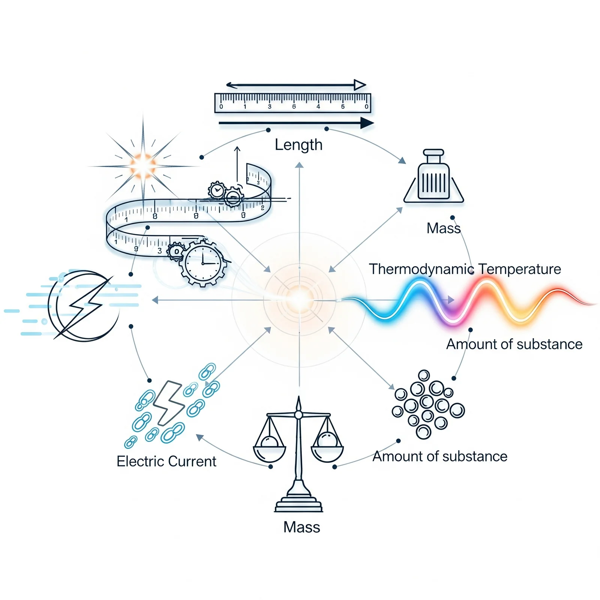
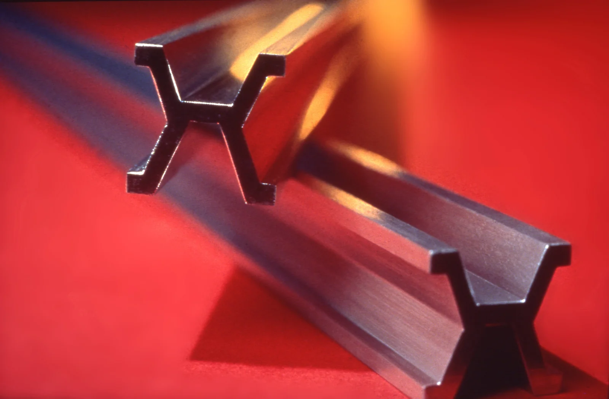
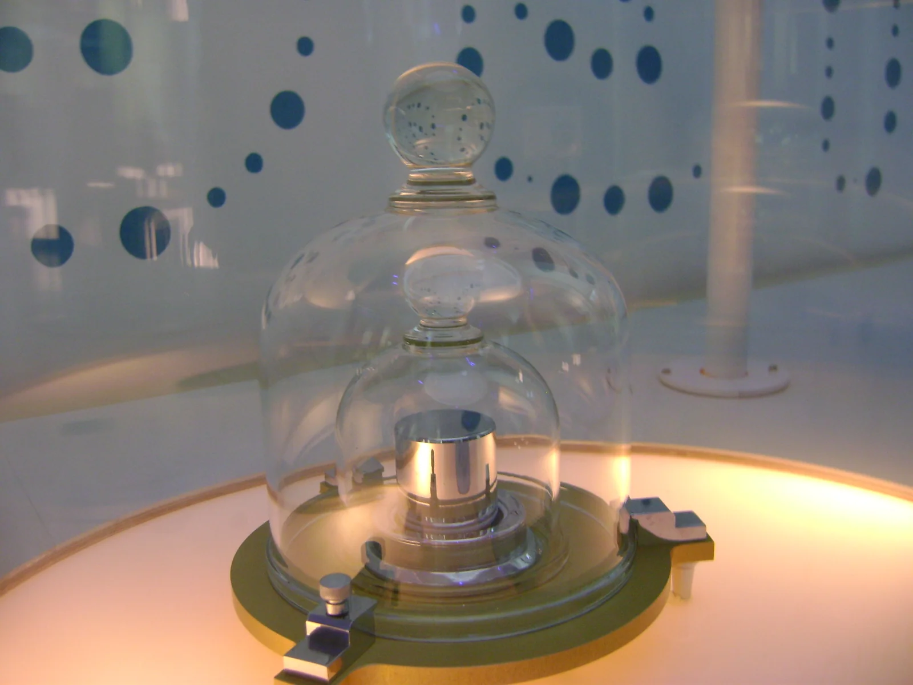
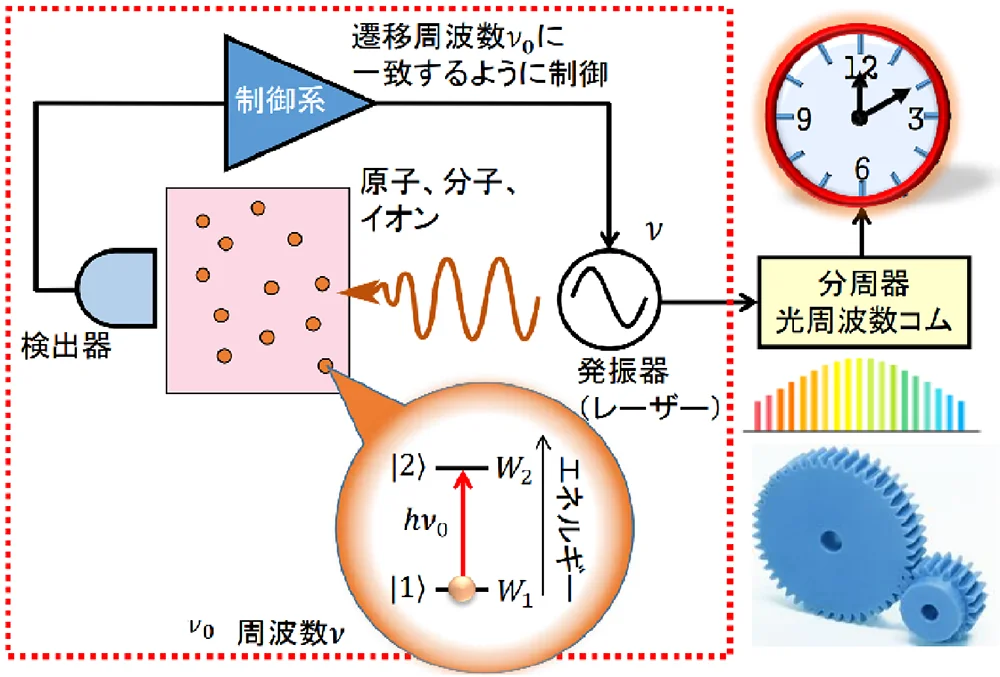

---
link:
- rel: stylesheet
  href: stylesheets/theme.css
- rel: stylesheet
  href: stylesheets/chapter.css
- rel: stylesheet
  href: stylesheets/21.css
lang: ja
---

# 国際単位系(SI単位)の話

:::{.chapter-lead}
単位は科学技術の共通言語です。国際単位系（SI単位）は、世界中で使われる統一された測定の基準で、長さ、重さ、時間など、あらゆる物理量を正確に表現するための基盤となります。この章では、SI単位の成り立ちから基本単位、接頭語の使い方まで、電気・電子技術を学ぶ上で欠かせない単位の知識をわかりやすく解説します。単位を正しく理解することで、技術的なコミュニケーションがより正確でスムーズになることでしょう。
:::

## SI単位の成り立ち
:::{.section-lead}
SI単位は **Système International d'unités** の略で、1960年の第11回国際度量衡総会(CGPM)で採択された国際的な単位系です。フランス語で「国際単位系」を意味し、メートル条約に基づいてメートル法を発展させたものです。現在では、ほぼ全ての国で公式に採用され、科学技術の進歩を支える重要な基盤となっています。
:::

SI単位はメートル法を基礎とした政界共通の単位系で、7つの基本単位（秒、メートル、キログラム、アンペア、ケルビン、モル、カンデラ）から構成されています。

 

{width=75% .float-right}

### メートルの起源

メートルの定義は、フランス革命時代（1792年）に始まります。フランス科学アカデミーは「地球の赤道から北極までの子午線の長さの1000万分の1」を1メートルと定義しました。

{width=40% .float-right}

この測定のため、天文学者ピエール・メシャン（Pierre Méchain）とジャン・バティスト・ドランブル（Jean-Baptiste Delambre）が、1792年から1798年にかけて、**ダンケルク（フランス北部）からバルセロナ（スペイン）まで**の子午線弧を三角測量で測定しました。

現在のメートルは光の速度を基準とした物理定数で定義されていますが、この歴史的な測量がメートル法の出発点となりました。

### キログラムの起源
1キログラムの当初の定義は「水1リットルの質量」でした。1795年の定義では、「大気圧下で氷の溶けつつある温度における水」となっていましたが、その後、水の体積は温度に依存することが分かり、そのため、「最大密度における蒸留水1立方デシメートル（1リットル）の質量」と定義されました。しかし、水の密度は気圧と温度に影響され（水の密度が最大となる温度は約4°C）、気圧にはその因子に質量が含まれています。すなわち、このキログラムの定義には循環定義が含まれていることになります。この問題を避けるため、1799年に、当時のキログラムの定義に合わせた白金製の原器が作製されました。

{width=40% .float-right}

現在のキログラムは、プランク定数 $h$ を正確に $6.62607015 \times 10^{-34}\,\text{J} \cdot \text{s}$ と定義することで定められています。プランク定数は、量子力学の基本定数で、光子のエネルギーと振動数の関係を表す比例定数です。具体的には、光子のエネルギー $E = h\nu$ と相対性理論の質量エネルギー等価の式 $E = mc^2$ を組み合わせ、特定の振動数 $\nu$ の光子のエネルギーに等しい静止エネルギーを持つ物体の質量を1キログラムと定義しています。

### 秒の起源
「秒」は、歴史的には地球の自転の周期の長さ、すなわち「一日の長さ」(LOD: Length of Day) を基に定義されていました。すなわち、LODを24分割した太陽時を60分割して「分」、さらにこれを60分割して「秒」が決められ、結果としてLODの86400分の1が「秒」と定義されてきました。しかしながら、19世紀から20世紀にかけての天文学的観測から、LODには$10^{-8}$程度の変動があることが判明し、時間の定義にはそぐわないと判断されました。そのため、地球の公転周期に基づく定義を経て、1967年に、原子核が持つ普遍的な現象を利用したセシウム原子時計が秒の定義として採用されています。

なお、1秒は偶然にも人間の標準的な心臓拍動の間隔に近いです。

 

光格子時計は、レーザー光で作られた光の格子に原子を閉じ込め、その原子の振動を計測することで時間を測定する、世界で最も正確な時計の一つです。100億年に1秒程度の誤差しかなく、次世代の精密時計として注目されています。
光格子時計は、2001年に東京大学の香取秀俊教授によって考案されました。レーザー光で生成された光格子に、冷却された原子を閉じ込め、その原子の振動を計測することで時間を測定します。従来のセシウム原子時計と比較して、100倍以上の精度を持つとされています。

 

{width=80% .float-right}

## 基本単位 / 組立単位 接頭辞

:::{.section-lead}
基本単位は、SI単位系の基礎となる7つの単位で、これらを組み合わせることであらゆる物理量を表現できます。
:::

基本単位は、これ以上分解できない独立した物理量を表します。これらを掛け合わせたり割ったりして得られる単位を「組み立て単位」と呼び、複雑な物理量を表現します。例えば、速さはメートル毎秒（$\text{m}/\text{s}$）という組み立て単位で表されます。

また、特に重要な組み立て単位には、その功績を称えて科学者などの名前にちなんだ「固有名称」が与えられています。例えば、力の単位ニュートン（$\text{N}$）や、電力の単位ワット（$\text{W}$）などがあります。これらの単位は、基本単位の組み合わせで表すことも可能ですが、頻繁に使われるため固有の名称が与えられています。

 

| 基本量 | 名称 | 記号 |
|------|----------|------|
| 時間 | 秒 | $\text{s}$ |
| 長さ | メートル | $\text{m}$ |
| 質量 | キログラム | $\text{kg}$ |
| 電流 | アンペア | $\text{A}$ |
| 熱力学温度 | ケルビン | $\text{K}$ |
| 物質量 | モル | $\text{mol}$ |
| 光度 | カンデラ | $\text{cd}$ |

---

### 組立単位

組立単位は基本単位を組み合わせたものです。

| 組立単位 | 名称 | 記号 |
|------|----------|------|
| 面積 | 平方メートル | $\text{m}^2$ |
| 体積 | 立方メートル | $\text{m}^3$ |
| 速度 | メートル毎秒 | $\text{m}/\text{s}$ |
| 加速度 | メートル毎秒毎秒 | $\text{m}/\text{s}^2$ |
| 質量密度 | キログラム毎立方メートル | $\text{kg}/\text{m}^3$ |
| 濃度 | モル毎立方メートル | $\text{mol}/\text{m}^3$ |

### 固有名称を持つSI組立単位

組立単位の中には固有の名称で表記するものもあります。著名な科学者名に因むものもあります。

| 量 | 単位名 | 記号 | 他のSI単位 | SI基本単位 | 備考 |
|----|--------|------|------------|------------|------|
| 平面角 | ラジアン | $\text{rad}$ | - | - | 円の半径の長さに等しい弧を挟む中心角。$1\,\text{rad} = 57.29578^\circ$ |
| 立体角 | ステラジアン | $\text{sr}$ | - | - | 球の半径の平方に等しい面積をもつ球面部分の立体角。全球は$4\pi\,\text{sr}$ |
| 周波数 | ヘルツ | $\text{Hz}$ | - | $\text{s}^{-1}$ | 周期的変化が1秒間に何回繰り返されるかを示す |
| 力 | ニュートン | $\text{N}$ | - | $\text{m}\cdot\text{kg}\cdot\text{s}^{-2}$ | 物体に加速度を生じたり、変形を生じたりする作用 |
| 圧力・応力 | パスカル | $\text{Pa}$ | $\text{N}/\text{m}^2$ | $\text{m}^{-1}\cdot\text{kg}\cdot\text{s}^{-2}$ | 面を境にして垂直に押し合う力 |
| エネルギー・仕事・熱量 | ジュール | $\text{J}$ | $\text{N}\cdot\text{m}$ | $\text{m}^2\cdot\text{kg}\cdot\text{s}^{-2}$ | 物体が物理的な仕事をする能力 |
| 仕事率・電力 | ワット | $\text{W}$ | $\text{J}/\text{s}$ | $\text{m}^2\cdot\text{kg}\cdot\text{s}^{-3}$ | 単位時間当たりのエネルギー |
| 電気量・電荷 | クーロン | $\text{C}$ | - | $\text{s}\cdot\text{A}$ | 電流と時間の積。物体が帯びている静電気量 |
| 電圧・電位 | ボルト | $\text{V}$ | $\text{W}/\text{A}$ | $\text{m}^2\cdot\text{kg}\cdot\text{s}^{-3}\cdot\text{A}^{-1}$ | 2点間の電位の差 |
| 静電容量 | ファラド | $\text{F}$ | $\text{C}/\text{V}$ | $\text{m}^{-2}\cdot\text{kg}^{-1}\cdot\text{s}^4\cdot\text{A}^2$ | 電荷を蓄える能力の大きさ |
| 電気抵抗 | オーム | $\Omega$ | $\text{V}/\text{A}$ | $\text{m}^2\cdot\text{kg}\cdot\text{s}^{-3}\cdot\text{A}^{-2}$ | 電流の流れにくさを表す |
| コンダクタンス | ジーメンス | $\text{S}$ | $\text{A}/\text{V}$ | $\text{m}^{-2}\cdot\text{kg}^{-1}\cdot\text{s}^3\cdot\text{A}^2$ | 電流の流れやすさ。電気抵抗の逆数 |
| 磁束 | ウェーバー | $\text{Wb}$ | $\text{V}\cdot\text{s}$ | $\text{m}^2\cdot\text{kg}\cdot\text{s}^{-2}\cdot\text{A}^{-1}$ | 磁界中のある垂直断面を通過する磁力線の数 |
| 磁束密度 | テスラ | $\text{T}$ | $\text{Wb}/\text{m}^2$ | $\text{kg}\cdot\text{s}^{-2}\cdot\text{A}^{-1}$ | 単位断面積当たりを通過する磁束 |
| インダクタンス | ヘンリー | $\text{H}$ | $\text{Wb}/\text{A}$ | $\text{m}^2\cdot\text{kg}\cdot\text{s}^{-2}\cdot\text{A}^{-2}$ | 電流の変化速度が誘導起電力に比例する比例常数 交流電流の周波数に比例した流れにくさの比例常数 |
| セルシウス温度 | セルシウス度 | $^\circ\text{C}$ | - | $\text{K}$ | $\theta(^\circ\text{C}) = T(\text{K}) - 273.15$ |
| 光束 | ルーメン | $\text{lm}$ | $\text{cd}\cdot\text{sr}$ | - | 光度$1\,\text{cd}$の点光源から$1\,\text{sr}$の立体角内に放射される光束 |
| 照度 | ルクス | $\text{lx}$ | $\text{lm}/\text{m}^2$ | - | $1\,\text{m}^2$の面を$1\,\text{lm}$の光束で一様に照らした時の照度 |
| 放射能 | ベクレル | $\text{Bq}$ | - | $\text{s}^{-1}$ | 1秒間に1個の原子崩壊を起こす放射能 |
| 放射線量 | グレイ | $\text{Gy}$ | $\text{J}/\text{kg}$ | $\text{m}^2\cdot\text{s}^{-2}$ | 放射線のイオン化作用によって、$1\,\text{kg}$の物質に$1\,\text{J}$のエネルギーを与える吸収線量 |
| 線量当量 | シーベルト | $\text{Sv}$ | $\text{J}/\text{kg}$ | $\text{m}^2\cdot\text{s}^{-2}$ | 放射線の生物学的効果の強さを考慮した量 |

**出典**: [ウシオ電機](https://www.ushio.co.jp/jp/technology/glossary/material/attached_material_07.html) [^url1]

---

### 国際単位系(SI単位系)での接頭辞一覧

接頭辞は、SI単位の前に付けることで、その単位の大きさを$10$の累乗で表すための記号です。例えば、キロ（$\text{k}$）は$10^3$倍を、ミリ（$\text{m}$）は$10^{-3}$倍を表します。これにより、$10^{-18}$（アト）から$10^{24}$（ヨタ）までの広範囲な値を簡潔に表現できます。

| 接頭辞| 接頭辞| 記号 | 乗数 |
|----------------|---------------|------|------|
| クエタ | quetta | $\text{Q}$ | $10^{30} = 1\,000\,000\,000\,000\,000\,000\,000\,000\,000\,000$倍 |
| ロナ | ronna | $\text{R}$ | $10^{27} = 1\,000\,000\,000\,000\,000\,000\,000\,000\,000$倍 |
| ヨタ | yotta | $\text{Y}$ | $10^{24} = 1\,000\,000\,000\,000\,000\,000\,000\,000$倍 |
| ゼタ | zetta | $\text{Z}$ | $10^{21} = 1\,000\,000\,000\,000\,000\,000\,000$倍 |
| エクサ | exa | $\text{E}$ | $10^{18} = 1\,000\,000\,000\,000\,000\,000$倍 |
| ペタ | peta | $\text{P}$ | $10^{15} = 1\,000\,000\,000\,000\,000$倍 |
| テラ | tera | $\text{T}$ | $10^{12} = 1\,000\,000\,000\,000$倍 |
| ギガ | giga | $\text{G}$ | $10^{9} = 1\,000\,000\,000$倍 |
| メガ | mega | $\text{M}$ | $10^{6} = 1\,000\,000$倍 |
| キロ | kilo | $\text{k}$ | $10^{3} = 1\,000$倍 |
| ヘクト | hecto | $\text{h}$ | $10^{2} = 100$倍 |
| デカ | deca | $\text{da}$ | $10^{1} = 10$倍 |
| （基準） | - | - | $10^{0} = 1$倍 |

---

| 接頭辞| 接頭辞| 記号 | 乗数 |
|----------------|---------------|------|------|
| （基準） | - | - | $10^{0\phantom{1}} = 1$倍 |
| デシ   | deci  | $\text{d}$ | $10^{-1\phantom{1}} = \tfrac{1}{10}$ |
| センチ | centi | $\text{c}$ | $10^{-2\phantom{1}} = \tfrac{1}{100}$ |
| ミリ   | milli | $\text{m}$ | $10^{-3\phantom{1}} = \tfrac{1}{1\,000}$ |
| マイクロ | micro | $\text{μ}$ | $10^{-6\phantom{1}} = \tfrac{1}{1\,000\,000}$ |
| ナノ   | nano  | $\text{n}$ | $10^{-9\phantom{1}} = \tfrac{1}{1\,000\,000\,000}$ |
| ピコ   | pico  | $\text{p}$ | $10^{-12} = \tfrac{1}{1\,000\,000\,000\,000}$ |
| フェムト | femto | $\text{f}$ | $10^{-15} = \tfrac{1}{1\,000\,000\,000\,000\,000}$ |
| アト   | atto  | $\text{a}$ | $10^{-18} = \tfrac{1}{1\,000\,000\,000\,000\,000\,000}$ |
| ゼプト | zepto | $\text{z}$ | $10^{-21} = \tfrac{1}{1\,000\,000\,000\,000\,000\,000\,000}$ |
| ヨクト | yocto | $\text{y}$ | $10^{-24} = \tfrac{1}{1\,000\,000\,000\,000\,000\,000\,000\,000}$ |
| ロント | ronto | $\text{r}$ | $10^{-27} = \tfrac{1}{1\,000\,000\,000\,000\,000\,000\,000\,000\,000}$ |
| クエクト | quecto | $\text{q}$ | $10^{-30} = \tfrac{1}{1\,000\,000\,000\,000\,000\,000\,000\,000\,000\,000}$ |

[^url1]: https://www.ushio.co.jp/jp/technology/glossary/material/attached_material_07.html
