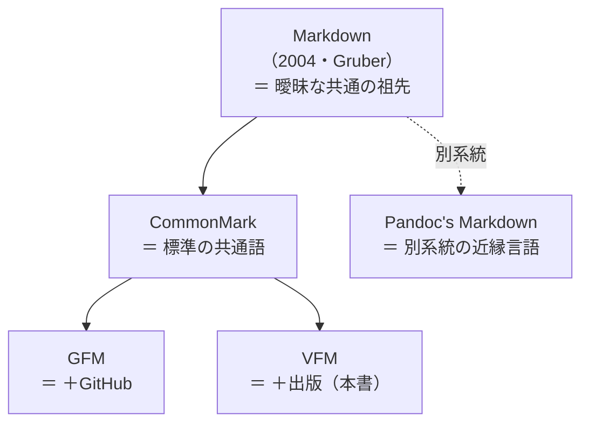

# Markdown 執筆チュートリアル

:::{.chapter-lead}
本章では、Vivlio Starter で技術書を執筆するための Markdown 記法を体系的に解説します。見出し・リスト・コード・表・画像といった基本の書き方に加え、脚注・ルビ・数式など出版向けの記法も項目ごとに紹介します。本章を読めば、原稿を書き始めるのに必要な記法は一通り揃います。コラム・画像レイアウトなどの便利な拡張記法は次章で解説し、巻末付録には全記法を逆引きできる「記法早見表」を用意しています。
:::

## Markdown とは

### Markdown の概要

Markdown は、ジョン・グルーバー（John Gruber）とアーロン・スワーツ（Aaron Swartz）によって2004年に開発された軽量マークアップ言語です。「書きやすく、読みやすい」ことを目指して設計され、プレーンテキストで構造化された文書を作成できます。

### 開発者と歴史

#### 開発者
- **ジョン・グルーバー**: Daring Fireball の著者、Markdown の考案者
- **アーロン・スワーツ**: プログラマー、情報活動家。14歳で RSS 1.0 の仕様策定に貢献

#### 歴史的背景
- **2004年**: Markdown 最初のバージョン公開
- **2014年**: CommonMark プロジェクト開始（標準化の取り組み）
- **2017年**: GitHub Flavored Markdown（GFM）の仕様公開
- **2024年**: CommonMark 0.31.2 リリース（最新版）

### Markdown の特徴

#### 主な特徴
- **シンプル**: 直感的な記法で学習コストが低い
- **軽量**: 特別なソフトウェア不要で、テキストエディタで編集可能
- **汎用性**: 多くのプラットフォームでサポート
- **変換可能**: HTML、PDF、Word など様々な形式に変換
- **バージョン管理友好**: テキストファイルなので Git で管理しやすい

#### なぜ Markdown が選ばれるのか
- **執筆に集中**: 書式設定から解放され、内容に集中できる
- **移植性**: どの環境でも同じように表示される
- **ウェブ対応**: HTML との親和性が高く、ウェブ公開が容易
- **技術文書向け**: コードブロック、テーブル、リストなど技術文書に必要な要素をサポート

### 主な用途

#### 技術分野
- **ドキュメント**: API ドキュメント、仕様書
- **README**: GitHub や GitLab のプロジェクト説明
- **技術ブログ**: Zenn、Qiita、Note などのプラットフォーム
- **学術論文**: 簡単な学術文書やレポート

#### 出版分野
- **技術書**: プログラミング言語の入門書
- **同人誌**: 技術同人誌や個人出版
- **電子書籍**: EPUB や PDF 形式の電子書籍
- **マニュアル**: 製品マニュアルや取扱説明書

#### その他
- **メモ**: 個人の知識管理
- **スライド**: Markdown からプレゼンテーション作成
- **チャット**: Slack や Discord での整形テキスト

### Markdown のエコシステム

#### 処理系
- **パーサー**: Markdown を解析するライブラリ
- **レンダラー**: 各形式に変換するツール
- **エディタ**: Markdown 専用の編集環境

#### 拡張仕様（フレーバー）

Markdown には長らく公式の標準がなく、実装ごとに解釈が揺れていました。その揺れを厳密に定義し直した **CommonMark** が、今日の共通の土台です。主要なフレーバーは、この CommonMark を基準に位置づけられます。



- **CommonMark**: 実装間の揺れをなくした厳密な標準仕様（すべての土台）
- **GFM**（GitHub Flavored Markdown）: CommonMark にテーブル・タスクリスト・打ち消し線などを加えた拡張。最も広く使われている
- **VFM**（Vivliostyle Flavored Markdown）: CommonMark に組版向けの拡張を加えたもの。**本書（Vivlio Starter）が採用**している
- **Pandoc**: CommonMark とは別系統の高機能な方言であり、多形式を相互変換するツールでもある

:::{.memo}
言語に喩えると、CommonMark は「標準の共通語」、GFM と VFM は「同じ共通語に業界の専門語彙を足したもの」で、方言というより上位互換の関係です。CommonMark の範囲で書けば、どのフレーバーでも同じに読めます。Pandoc だけは同じ祖先から別系統に発展した近縁の言語にあたり、大部分は共通するものの細部の解釈が異なります。
:::

### Vivlio Starter と Markdown

Vivlio Starter は Markdown を中核技術として採用し、技術書執筆に最適化された環境を提供します：

- **VFM 対応**: 出版物向けの拡張機能
- **PDF 生成**: CSS 組版による美しい出力
- **相互参照**: 技術書に必須の参照機能
- **自動化**: ビルドプロセスの完全自動化

## 基本記法

Vivlio Starter が扱う Markdown は、**CommonMark 仕様**（バージョン 0.31.2）に準拠し、そこに出版向けの拡張（VFM と Vivlio Starter 独自の調整）を加えたものです。本節では、原稿執筆に必要な記法を項目ごとに解説します。CommonMark にない記法には、その旨を付記します。

### 見出し

```markdown
# 第1レベル見出し
## 第2レベル見出し
### 第3レベル見出し
#### 第4レベル見出し
##### 第5レベル見出し
###### 第6レベル見出し
```
- `#` の数でレベルを指定します（1〜6）
- 行頭に `#` を書き、後ろに半角スペースを 1 つ以上空けます

### テキスト装飾

```markdown
**太字** または __太字__
*斜体* または _斜体_
***太字と斜体***
~~取り消し線~~
```

標準の Markdown では `*斜体*` は斜体（イタリック）です。欧文では斜体がよく映えますが、和文の斜体は読みにくく紙面になじまないため、**Vivlio Starter では斜体の指定を下線で表示します**（CSS で調整しています。`***太字と斜体***` は太字＋下線になります）。

表示結果は次のようになります。{.aki}

**太字** または __太字__
*斜体* または _斜体_
***太字と斜体***
~~取り消し線~~

### 改行と段落

Vivlio Starter では、**エンターキーで改行した位置が、そのまま紙面の改行になります**（ハード改行）。多くの Markdown 処理系では改行のために行末へスペース 2 つや `<br>` を書く必要がありますが、その必要はありません。日本語の文章を見たまま直感的に書けます。

```markdown
はじめまして。
Vivlio Starter の世界へようこそ。
```

表示結果は次のようになります。{.aki}

はじめまして。
Vivlio Starter の世界へようこそ。

段落を分けるときは、空行で区切ります。

```markdown
これは1段落目です。

これは2段落目です。
```

:::{.memo}
改行がそのまま反映されるため、詩や歌詞も見たままの形で組めます。なお、コードブロックの中はこの仕組みとは無関係に、書いたとおり保たれます。
:::

### リスト

#### 箇条書きリスト
```markdown
- 項目1
- 項目2
  - 子項目1
  - 子項目2
- 項目3
```

#### 番号付きリスト
```markdown
1. 最初の項目
2. 2番目の項目
3. 3番目の項目
   1. 子項目1
   2. 子項目2
```

#### リストのルール
- **箇条書き**: `-`, `*`, `+` のいずれかで開始（3 つは同義で、見た目は変わりません）
- **番号付き**: 数字とドットで開始（実際の数字は無視）
- **字下げ（インデント）**: 親リスト項目のテキスト開始位置に合わせて字下げ。入れ子（ネスト）にするときは **3 スペース以上** 字下げします。
- **入れ子（ネスト）**: 番号付きリストの入れ子もサポート
- **箇条書きのマーカー**: ネストの深さに応じて「● → ○ → ・」と自動で変わります。記法はなく、字下げするだけです（Kindle では第 3 レベルが ■ になります）

マーカーの変化は、次のように子リストを字下げするだけで得られます。{.aki}

```markdown
- 第 1 レベル
  - 第 2 レベル
    - 第 3 レベル
```

表示結果は次のようになります。{.aki}

- 第 1 レベル
  - 第 2 レベル
    - 第 3 レベル

#### 英字・ローマ数字の番号リスト（fancy list）

数字のかわりに英字やローマ数字のマーカーで書くと、そのままの様式で組まれます（Pandoc の `fancy_lists` 互換）。**先頭項目のマーカー表記でそのリスト全体の様式が決まり**、区切りはピリオド `X.`・片括弧 `X)`・両括弧 `(X)` の 3 種が使えます。

| 様式 \ 区切り | `X.`（ピリオド） | `X)`（片括弧） | `(X)`（両括弧） |
|:---|:---:|:---:|:---:|
| 数字 `1` | 標準リスト | 標準リスト | `(1) (2) …` |
| 小英字 `a` | `a. b. …` | `a) b) …` | `(a) (b) …` |
| 大英字 `A` | `A. B. …` | `A) B) …` | `(A) (B) …` |
| 小ローマ数字 `i` | `i. ii. …` | `i) ii) …` | `(i) (ii) …` |
| 大ローマ数字 `I` | `I. II. …` | `I) II) …` | `(I) (II) …` |

```markdown
a. 最初の項目
b. 二番目の項目

(1) 括弧付き数字の項目
(2) 二番目の項目
```

表示結果は次のようになります。{.aki}

a. 最初の項目
b. 二番目の項目

(1) 括弧付き数字の項目
(2) 二番目の項目

先頭マーカーの値が開始番号になります（`E.` なら E から＝5 番目から、`(iv)` なら 4 から）。ネストした子リストにも同じ判定がレベルごとに適用されるので、「`1.` の子に `(a)`」のような階層ごとに違うマーカーも、そのまま書くだけで組めます。

```markdown
1. 概要
   (a) 選択肢イ
   (b) 選択肢ロ
2. インストール方法
```

1. 概要
   (a) 選択肢イ
   (b) 選択肢ロ
2. インストール方法

:::{.notice}
fancy list を使うときの約束事です。

- **大文字＋ピリオドで始めるときはマーカーの後に空白 2 つ** を置きます（`A.  項目`）。空白 1 つの `B. Russell は…` のような英文の書き出しを、リストと誤認しないための規則です（2 項目目以降は空白 1 つで構いません）
- 単文字の `i` `v` `x` `c` などは **ローマ数字を優先** して解釈します（`c.` は英字 3 番目ではなくローマ数字の 100）
- `(1) ` で段落を書き始めるとリスト化されます。地の文にしたいときは `\(1)` とエスケープしてください
- 同じリストの途中でマーカー様式を変えることはできません（先頭の様式で続行し、警告が出ます）。様式を変えたいときは空行を挟んで別のリストに分けます
- fancy list の項目内では、ルビ・脚注参照・リンクの脚注化など一部の記法が使えません。**短い列挙向け** の記法です。長文やリッチな項目には標準の番号リストを使ってください
:::

複合番号（`1.1` 形式の `:::{.outline-list}`）や、装飾付きリスト（青コメ・赤コメ）は、次章「拡張記法リファレンス」の「リスト装飾」で解説します。

### 定義リスト

用語とその説明を並べるときは、定義リスト記法が便利です。CommonMark にはない記法ですが、Pandoc や Markdown Extra で広く使われており、Vivlio Starter でも対応しています。用語を 1 行で書き、次の行から `: `（コロン＋スペース）で説明を続けると、`<dl>` / `<dt>` / `<dd>` に変換されます。

```markdown
用語1
: 用語1の説明
用語2
: 用語2の説明
  複数行に亘るときには字下げをして書き始めます。
Ruby
: まつもとゆきひろ氏(Matz)が開発したプログラミング言語です。
  動的型付けとオブジェクト指向の特徴を持っています。
: 宝石の名前。赤い色で美しい。
: `<ruby>` は振り仮名に用いるHTMLタグです。
```

実行例は次のようになります。{.aki}

用語1
: 用語1の説明
用語2
: 用語2の説明  
  複数行に亘るときには字下げをして書き始めます。
Ruby
: まつもとゆきひろ氏(Matz)が開発したプログラミング言語です。
  動的型付けとオブジェクト指向の特徴を持っています。
: 宝石の名前。赤い色で美しい。
: `<ruby>` は振り仮名に用いるHTMLタグです。

**記述のポイント:**

- 用語は行頭に 1 行で書く（太字記号などは不要）
- 説明は次の行から `: `（コロン＋スペース）で始める
- 1 つの用語に複数の説明を付けるときは `: ` 行を続けて並べる
- 説明が複数行にわたるときは、2 行目以降を半角スペースで字下げする

### コードブロック

コードの書き方には、文中に埋め込む**インラインコード**と、複数行をまとめて示す**フェンスコードブロック**の 2 種類があります。

#### インラインコード

文中のコマンド名や変数名は、バッククォート 1 つで囲みます。

```markdown
ビルドは `vs build` コマンドで実行します。
```

表示結果は次のようになります。{.aki}

ビルドは `vs build` コマンドで実行します。

バッククォート自身を含めたい場合は、2 つのバッククォートで囲みます。

```markdown
コードは `` `code` `` のように囲みます。
```

表示結果は次のようになります。{.aki}

コードは `` `code` `` のように囲みます。

#### フェンスコードブロック

複数行のコードは、3 つのバッククォートで囲みます。言語名を指定するとシンタックスハイライトが適用されます（行番号も自動で付きます）。

````markdown
```ruby
def hello(name)
  puts "Hello, #{name}!"
end
```
````

表示結果は次のようになります。{.aki}

```ruby
def hello(name)
  puts "Hello, #{name}!"
end
```

:::{.notice}
フェンスの前後には**空行**を入れてください。Vivlio Starter は改行をそのまま反映する（ハード改行）ため、地の文に続けて空行なしでフェンスを書くと、段落の続きと解釈されてコードブロックになりません。
:::

#### ファイル名（キャプション）の表示

言語名に続けてコロンとファイル名を書くと、コードブロックの上にファイル名が表示されます。

````markdown
```ruby:hello.rb
def hello(name)
  puts "Hello, #{name}!"
end
```
````

表示結果は次のようになります。{.aki}

```ruby:hello.rb
def hello(name)
  puts "Hello, #{name}!"
end
```

#### 入れ子コードブロック

本書のように Markdown を解説する場面では、コードブロックの中にコードブロックを書きたくなります。外側を `~`（チルダ）のフェンスにするか、外側のバッククォートの数を増やすと、内側のフェンスが文字どおり表示されます。

チルダを使う場合は、次のように書きます。

````markdown
~~~markdown
```ruby
def hello(name)
  puts "Hello, #{name}!"
end
```
~~~
````

バッククォートを 4 つに増やす場合は、次のように書きます。

~~~~markdown
````markdown
```ruby
def hello(name)
  puts "Hello, #{name}!"
end
```
````
~~~~

どちらも、表示結果は次のようになります（外側のフェンスは消え、内側のフェンスが文字どおり表示されます）。{.aki}

~~~markdown
```ruby
def hello(name)
  puts "Hello, #{name}!"
end
```
~~~

:::{.memo}
外部ファイルの取り込み・開始行番号の指定・コメントの強調などの拡張は、次章「拡張記法リファレンス」の「ソースコード」節で解説します。
:::

### 水平線（改ページ）

標準の Markdown では、3 つ以上のハイフン・アスタリスク・アンダースコアのいずれかを 1 行に書くと、水平線（区切り線）になります。

```markdown
---
***
___
```

ただし **Vivlio Starter では、これらを水平線ではなく改ページとして扱います**。CSS 組版や電子書籍では、内容の区切りを 1 本の線ではなくページの改まりで表すのが一般的な慣行だからです。上のいずれかを 1 行だけで書いた箇所で、そのページが改まります（区切り線そのものは表示されません）。

:::{.memo}
本文の途中で意図的に改ページしたいときに、この記法が使えます。逆に「ここは区切り線を引きたいだけ」というときも改ページになるので、区切り線のつもりで誤用しないよう注意してください。
:::

### エスケープ

`\`（バックスラッシュ）を前置することで、Markdown の記法として解釈される記号をそのまま表示できます。

```markdown
\*アスタリスク\*
\`バッククォート\`
\# ハッシュ
\- ハイフン
```

### 表（テーブル）

表を表示するには次のように記述します。

```markdown
| 言語      | 開発者              | 主な特徴                     |
|-----------|---------------------|------------------------------|
| HTML      | Tim Berners-Lee     | ウェブページの構造を定義       |
| CSS       | Håkon Wium Lie       | スタイルとレイアウトを制御     |
| JavaScript| Brendan Eich        | 動的なウェブ機能を実装         |
| Ruby      | まつもとゆきひろ   | オブジェクト指向スクリプト言語 |
```

#### 配置制御の例

それぞれの枡目（セル）の配置を指定することも可能です。

```markdown
| 左揃え              | 中央揃え | 右揃え |
|:--------------------|:-------:|-------:|
| これは左に配置されます | 中央です   | 右です |
| 長いテキスト        | 短い     | 123    |
```

#### テーブルのルール（GFM拡張）
- パイプ `|` で列を区切る
- ハイフン `-` でヘッダーと本体を区切る
- コロン `:` で配置を制御
  - `:--` 左寄せ（デフォルト）
  - `:-:` 中央揃え
  - `--:` 右寄せ

さらに Vivlio Starter では、複数行ヘッダー・セルの横結合・行の多い表の圧縮表示（`.long-table`）・横長の表の 90 度回転（`.rotate-table`）にも対応しています。次章「表のレイアウト」で解説します。

### リンクと画像

```markdown
[リンクテキスト](https://example.com)

[リンクテキスト](https://example.com "タイトル")

```

#### リンクの形式
- **インラインリンク**: `[text](url)`
- **参照リンク**: `[text][id]` と `[id]: url`
- **自動リンク**: `<https://example.com>`

#### 画像のキャプション

画像を 1 行に単独で書くと（前後に本文を続けない）、代替テキストがそのまま画像の下にキャプションとして表示されます。本文と同じ行に混ぜた画像は、キャプションのないインライン画像になります。

```markdown


本文の途中に書いた画像  はインライン扱いです。
```

代替テキストは読み上げソフトでも読まれるため、画像の内容を言葉にしておくと親切です。「図 2-1: …」のような図番号付きのキャプションを付けたい場合は、次章「画像レイアウト」の `** タイトル **` 記法を使います。

### 引用ブロック

```markdown
> 通常の引用

> **引用元**: 著者名
> 
> 引用内容を詳細に記述できます。

> 入れ子の引用
>> 2レベル目の引用
```

#### 引用ブロックのルール
- `>` で始まる行が引用
- 連続する `>` で複数段落
- `>>` で入れ子引用

### 生のHTML

```markdown
<div class="custom">
  これはHTML要素です
</div>
```

CommonMark ではHTMLタグをそのまま使用できます。

### 脚注

脚注は次のように記述します。参照番号による脚注と、インライン脚注の2種類があります。

#### 参照番号による脚注
`[^css]` のように記述し、文末に `[^css]: 内容` の形で定義します。同じ脚注を本文中で何度も参照でき、詳細な説明や外部リンクに適しています。

#### インライン脚注
`^[簡単な補足]` のように記述し、その場で内容を完結させます。一回限りの短い注釈に便利で、定義を別に書く必要がありません。

```markdown
VivliostyleはCSS組版の先駆者です[^css]。
詳細は公式ドキュメントを参照^[簡単な補足]。

[^css]: [CSS組版の歴史](https://example.com/css-history)
```

### ルビ（振り仮名）

`{単語|よみ}` の形で、日本語の読み仮名をルビとして指定できます。

```markdown
{相対性理論|そうたいせいりろん}は、{Albert Einstein|アルバート・アインシュタイン}が1905年に発表しました。
{光電効果|こうでんこうか}の研究でノーベル賞を受賞しています。
```

実行例は次のようになります。

{相対性理論|そうたいせいりろん}は、{Albert Einstein|アルバート・アインシュタイン}が1905年に発表しました。
{光電効果|こうでんこうか}の研究でノーベル賞を受賞しています。

:::{.note}
ルビは `{}`（波括弧）です。よく似た `[用語|読み]`（角括弧）は索引・用語集への登録記法で、別の機能です（「索引・用語集機能」の章で解説します）。
:::

### 数式

数式は、標準的な LaTeX の数式記法で書けます（MathJax 互換）。ビルド時に MathJax で画像化して埋め込むため、PDF でも EPUB・Kindle でも同じように表示されます。書き方は 2 種類あります。

- **インライン数式** `$...$` — 文中に埋め込む小さな数式
- **ディスプレイ数式** `$$...$$` — 数式だけを独立した行に、中央寄せで大きく表示

```markdown
三平方の定理 $a^2 + b^2 = c^2$ は、直角三角形の 3 辺の関係を表します。

オイラーの等式は、次の式です。

$$e^{i\pi} + 1 = 0$$
```

表示結果は次のようになります。{.aki}

三平方の定理 $a^2 + b^2 = c^2$ は、直角三角形の 3 辺の関係を表します。

オイラーの等式は、次の式です。

$$e^{i\pi} + 1 = 0$$

オイラーの等式は、ネイピア数 $e$・虚数単位 $i$・円周率 $\pi$ という出自の異なる 3 つの数が 1 つに結ばれる等式で、「数学でもっとも美しい式」とも呼ばれます。

使える記号・コマンドの一覧は、次のサイトが便利です。

- [Easy Copy MathJax](https://easy-copy-mathjax.nakaken88.com/) — 日本語の記号一覧。クリックするだけで記法をコピーできます
- [MathJax 公式ドキュメント](https://docs.mathjax.org/en/latest/input/tex/macros/index.html) — 対応コマンドの一覧（英語）

---
