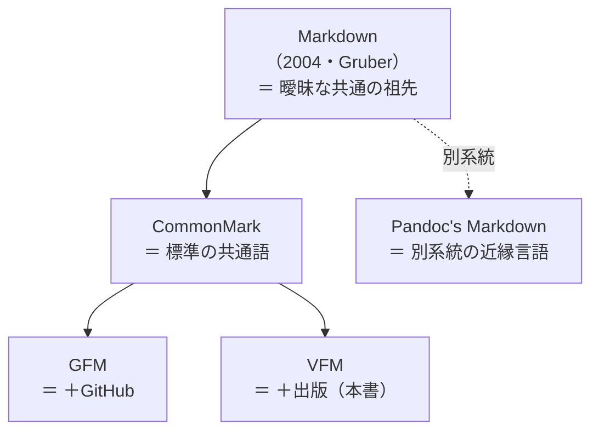

# Markdown 執筆チュートリアル

:::{.chapter-lead}
技術書の原稿では、見出しや本文だけでなく、コード・表・画像・脚注・数式など、性質の異なる要素を扱います。本章では、それらを Markdown で書くための基本記法を、実際の表示と見比べながら説明します。一度にすべてを身につける必要はありません。まずは見出しと本文から書き始め、必要になった記法をこの章へ探しに戻る使い方もできます。コラムや画像レイアウトなどの拡張は次章で扱い、巻末の「記法早見表」には全記法を逆引きできる形でまとめています。
:::

## Markdown とは

### Markdown の概要

Markdown は、ジョン・グルーバー（John Gruber）とアーロン・スワーツ（Aaron Swartz）によって 2004 年に開発された軽量マークアップ言語です。書きやすさと、元のテキストのまま読めることを大切にして設計されました。見出しには `#`、箇条書きには `-` といった短い記号を添えるだけで、プレーンテキストの原稿に文書の構造を与えられます。

- **シンプル**: 覚える記号がごく少なく、学習の負担が小さい
- **軽量**: 専用のソフトウェアは不要で、テキストエディターだけで書ける
- **移植性**: どの環境でも同じように表示される
- **変換可能**: HTML・PDF・EPUB・Word など、さまざまな形式へ変換できる
- **バージョン管理との相性**: テキストファイルなので Git で差分を追える

原稿を書いている間は内容に集中し、見た目は組版の段階で整えられます。README のような短い文書から一冊の技術書まで、Markdown が幅広く使われているのは、この分担がしやすいためです。

### 標準化とフレーバー

Markdown は簡潔である一方、初期の仕様には解釈の余地が残っていました。同じ記述でも、変換に使うソフトウェアによって結果が異なることがありました。

- **2004 年**: Markdown 最初のバージョン公開
- **2014 年**: CommonMark プロジェクト開始（標準化の取り組み）
- **2017 年**: GitHub Flavored Markdown（GFM）の仕様公開
- **2024 年**: CommonMark 0.31.2 リリース（最新版）

その曖昧さを一つずつ定義し直した **CommonMark** が、現在の共通の土台です。主要なフレーバー（拡張仕様）は、CommonMark に用途ごとの記法を加える形で位置づけられます。


```mermaid
graph TD
  MD["Markdown<br/>（2004・Gruber）<br/>＝ 曖昧な共通の祖先"]
  CM["CommonMark<br/>＝ 標準の共通語"]
  PD["Pandoc's Markdown<br/>＝ 別系統の近縁言語"]
  GFM["GFM<br/>＝ ＋GitHub"]
  VFM["VFM<br/>＝ ＋出版（本書）"]
  MD --> CM
  MD -.別系統.-> PD
  CM --> GFM
  CM --> VFM
```

- **CommonMark**: 実装間の揺れをなくした厳密な標準仕様（すべての土台）
- **GFM**（GitHub Flavored Markdown）: CommonMark にテーブル・タスクリスト・打ち消し線などを加えた拡張。もっとも広く使われている
- **VFM**（Vivliostyle Flavored Markdown）: CommonMark に組版向けの拡張を加えたもの。**本書（Vivlio Starter）が採用**している
- **Pandoc**: CommonMark とは別系統の高機能な方言であり、多形式を相互変換するツールでもある

:::{.memo}
言語に喩えるなら、CommonMark は「標準の共通語」、GFM と VFM は、そこへ用途別の専門語彙を加えたものです。CommonMark の範囲で書いた原稿は、どちらのフレーバーでも同じように解釈できます。Pandoc は同じ Markdown を起点にしながら別系統で発展しており、大部分の書き方は共通しますが、細部の解釈が異なります。
:::

### Vivlio Starter と Markdown

Vivlio Starter は Markdown を原稿の形式に採用し、そこへ技術書に必要な組版機能を重ねています。文章は読みやすいテキストのまま保ち、書籍として必要な処理はビルド時にまとめて行います。

- **VFM 対応**: 出版物向けの拡張機能
- **PDF 生成**: CSS 組版による美しい出力
- **相互参照**: 技術書に必須の参照機能
- **自動化**: ビルドプロセスの完全自動化

## 基本記法

Vivlio Starter が扱う Markdown は、**CommonMark 仕様**（バージョン 0.31.2）に準拠し、出版向けの VFM と Vivlio Starter 独自の調整を加えています。ここからは、原稿でよく使う記法を項目ごとに見ていきます。CommonMark の範囲を越える記法には、その旨を添えています。

### 見出し

```markdown
# 第1レベル見出し
## 第2レベル見出し
### 第3レベル見出し
#### 第4レベル見出し
##### 第5レベル見出し
###### 第6レベル見出し
```
- `#` の数でレベルを指定します（1〜6）
- 行頭に `#` を書き、後ろに半角スペースを 1 つ以上空けます。

### テキスト装飾

```markdown
**太字** または __太字__
*斜体* または _斜体_
***太字と斜体***
~~取り消し線~~
```

標準の Markdown では、`*斜体*` を斜体（イタリック）で表示します。欧文ではよく使われる表現ですが、和文を傾けると字形が読みにくくなるため、**Vivlio Starter では斜体の指定を下線で表示します**。これは CSS による調整で、`***太字と斜体***` は太字と下線の組み合わせになります。

表示結果は次のようになります。{.aki}

**太字** または __太字__
*斜体* または _斜体_
***太字と斜体***
~~取り消し線~~

### 改行と段落

Vivlio Starter では、**エンターキーで改行した位置が、そのまま紙面の改行になります**。この動作をハード改行と呼びます。多くの Markdown 処理系では、行末にスペースを二つ置くか `<br>` を書かなければ改行されませんが、Vivlio Starter では原稿上の行の区切りがそのまま反映されます。会話文や短い説明を、紙面で見せたい形に近い状態で書けます。

```markdown
はじめまして。
Vivlio Starter の世界へようこそ。
```

表示結果は次のようになります。{.aki}

はじめまして。
Vivlio Starter の世界へようこそ。

段落を分けるときは、空行で区切ります。

```markdown
これは1段落目です。

これは2段落目です。
```

:::{.memo}
改行がそのまま反映されるので、詩や歌詞の行分けも原稿の形を保って組めます。コードブロックの中はハード改行の設定にかかわらず、入力した改行と空白がそのまま保たれます。
:::

### リスト

#### 箇条書きリスト
```markdown
- 項目1
- 項目2
  - 子項目1
  - 子項目2
- 項目3
```

#### 番号付きリスト
```markdown
1. 最初の項目
2. 2番目の項目
3. 3番目の項目
   1. 子項目1
   2. 子項目2
```

#### リストのルール
<!-- no-lint -->
- **箇条書き**: `-`, `*`, `+` のいずれかで開始（3 つは同義で、見た目は変わりません）
- **番号付き**: 数字とドットで開始（実際の数字は無視）
- **字下げ（インデント）**: 親リスト項目のテキスト開始位置に合わせて字下げ。入れ子（ネスト）にするときは**3 スペース以上**字下げします。
- **入れ子（ネスト）**: 番号付きリストの入れ子もサポート
- **箇条書きのマーカー**: ネストの深さに応じて「● → ○ → ・」と自動で変わります。記法はなく、字下げするだけです（Kindle では第 3 レベルが ■ になります）。

マーカーの変化は、次のように子リストを字下げするだけで得られます。{.aki}

```markdown
- 第 1 レベル
  - 第 2 レベル
    - 第 3 レベル
```

表示結果は次のようになります。{.aki}

- 第 1 レベル
  - 第 2 レベル
    - 第 3 レベル

#### 英字・ローマ数字の番号リスト（fancy list）

項目の先頭を英字やローマ数字で書くと、その形式を保った番号リストになります（Pandoc の `fancy_lists` 互換）。**最初の項目に書いたマーカーが、リスト全体の形式を決めます**。区切りには、ピリオド `X.`・片括弧 `X)`・両括弧 `(X)` の三種類があります。

| 様式 \ 区切り | `X.`（ピリオド） | `X)`（片括弧） | `(X)`（両括弧） |
|:---|:---:|:---:|:---:|
| 数字 `1` | 標準リスト | 標準リスト | `(1) (2) …` |
| 小英字 `a` | `a. b. …` | `a) b) …` | `(a) (b) …` |
| 大英字 `A` | `A. B. …` | `A) B) …` | `(A) (B) …` |
| 小ローマ数字 `i` | `i. ii. …` | `i) ii) …` | `(i) (ii) …` |
| 大ローマ数字 `I` | `I. II. …` | `I) II) …` | `(I) (II) …` |

```markdown
a. 最初の項目
b. 二番目の項目

(1) 括弧付き数字の項目
(2) 二番目の項目
```

表示結果は次のようになります。{.aki}

a. 最初の項目
b. 2番目の項目

(1) 括弧付き数字の項目
(2) 2番目の項目

先頭マーカーの値は、そのリストの開始番号にもなります。`E.` なら E、つまり 5 番目から、`(iv)` なら 4 から始まります。入れ子にした子リストにも階層ごとに同じ判定が働くため、親を `1.`、子を `(a)` とする構成も原稿に書いた形で組めます。

```markdown
1. 概要
   (a) 選択肢イ
   (b) 選択肢ロ
2. インストール方法
```

1. 概要
   (a) 選択肢イ
   (b) 選択肢ロ
2. インストール方法

:::{.notice}
fancy list には、通常の番号リストと異なる規則があります。

- **大文字＋ピリオドで始めるときはマーカーの後に空白 2 つ**を置きます（`A.  項目`）。空白 1 つの `B. Russell は…` のような英文の書き出しを、リストと誤認しないための規則です（2 項目目以降は空白 1 つで構いません）
- 単文字の `i` `v` `x` `c` などは**ローマ数字を優先**して解釈します（`c.` は英字 3 番目ではなくローマ数字の 100）
- `(1) ` で段落を書き始めるとリスト化されます。地の文にしたいときは `\(1)` とエスケープしてください。
- 同じリストの途中でマーカー様式を変えることはできません（先頭の様式で続行し、警告が出ます）。様式を変えたいときは空行を挟んで別のリストに分けます。
- fancy list の項目内では、ルビ・脚注参照・リンクの脚注化など一部の記法が使えません。**短い列挙向け**の記法です。長文やリッチな項目には標準の番号リストを使ってください。
:::

#### タスクリスト

進捗を示す一覧には、チェックボックス付きのタスクリストを使えます。リストの記号に続けて、未了なら `[ ]`、完了なら `[x]` を書きます。

```markdown
- [x] 原稿を書く
- [ ] 図版を用意する
- [ ] 索引を整える
```

表示結果は次のようになります。{.aki}

- [x] 原稿を書く
- [ ] 図版を用意する
- [ ] 索引を整える

角括弧の中には、未了なら**空白一つ**、完了なら `x` を置きます。大文字の `X` でも構いません。閉じ角括弧の後ろにも空白が必要なので、`- [x]原稿を書く` はチェックボックスとして解釈されません。番号付きリスト（`1. [ ] …`）でも同じ記法を使えます。

:::{.notice}
チェックボックスの枠は罫線で描いています。Kindle は罫線の細かな指定を解さないため、`□`（未了）と `■`（済み）の文字に置き換わります。

同じリストの中にチェックボックスのない項目を混ぜると、その項目からも行頭の記号（●）が消えます。一覧の途中に補足を挟みたいときは、字下げして子項目にしてください。
:::

複合番号（`1.1` 形式の `:::{.outline-list}`）や、装飾付きリスト（青コメ・赤コメ）は、次章「拡張記法リファレンス」の「リスト装飾」で解説します。

### 定義リスト

用語集や概念の説明では、用語と定義を対にして並べる定義リストが使えます。CommonMark には含まれませんが、Pandoc や Markdown Extra で広く採用されている記法です。用語を一行で書き、次の行を `: `（コロンとスペース）で始めると、`<dl>`・`<dt>`・`<dd>` の要素へ変換されます。

```markdown
用語1
: 用語1の説明
用語2
: 用語2の説明
  複数行に亘るときには字下げをして書き始めます。
Ruby
: まつもとゆきひろ氏(Matz)が開発したプログラミング言語です。
  動的型付けとオブジェクト指向の特徴を持っています。
: 宝石の名前。赤い色で美しい。
: `<ruby>` は振り仮名に用いるHTMLタグです。
```

実行例は次のようになります。{.aki}

用語1
: 用語1の説明
用語2
: 用語2の説明  
  複数行に亘るときには字下げをして書き始めます。
Ruby
: まつもとゆきひろ氏(Matz)が開発したプログラミング言語です。
  動的型付けとオブジェクト指向の特徴を持っています。
: 宝石の名前。赤い色で美しい。
: `<ruby>` は振り仮名に用いるHTMLタグです。

**記述のポイント:**

- 用語は行頭に 1 行で書く（太字記号などは不要）
- 説明は次の行から `: `（コロン＋スペース）で始める
- 一つの用語に複数の説明を付けるときは `: ` 行を続けて並べる
- 説明が複数行にわたるときは、2 行目以降を半角スペースで字下げする

### コードブロック

コードの示し方は、文中の名前や短い命令を囲む**インラインコード**と、複数行をまとめる**フェンスコードブロック**に分かれます。文章の一部として読ませるか、独立したコードとして見せるかで使い分けます。

#### インラインコード

文中のコマンド名や変数名は、バッククォート 1 つで囲みます。

```markdown
ビルドは `vs build` コマンドで実行します。
```

表示結果は次のようになります。{.aki}

ビルドは `vs build` コマンドで実行します。

バッククォート自身を含めたい場合は、2 つのバッククォートで囲みます。

```markdown
コードは `` `code` `` のように囲みます。
```

表示結果は次のようになります。{.aki}

コードは `` `code` `` のように囲みます。

#### フェンスコードブロック

複数行のコードは、三つのバッククォートで囲みます。開始側のバッククォートに言語名を続けるとシンタックスハイライトが適用され、行番号も付きます。

````markdown
```ruby
def hello(name)
  puts "Hello, #{name}!"
end
```
````

表示結果は次のようになります。{.aki}

```ruby
def hello(name)
  puts "Hello, #{name}!"
end
```

:::{.notice}
フェンスの前後には**空行**を入れてください。Vivlio Starter は改行をそのまま反映する（ハード改行）ため、地の文に続けて空行なしでフェンスを書くと、段落の続きと解釈されてコードブロックになりません。
:::

:::{.notice}
**コードブロックにはフェンスを使います。** 標準の Markdown には、四つのスペースで字下げする方法もありますが、Vivlio Starter では対応していません。字下げした行は、入れ子のリストの続きともコードとも解釈できるためです。フェンスで囲めば、コードの範囲と言語を原稿上で明確に示せます。
:::

#### ファイル名（キャプション）の表示

言語名に続けてコロンとファイル名を書くと、コードブロックの上にファイル名が表示されます。

````markdown
```ruby:hello.rb
def hello(name)
  puts "Hello, #{name}!"
end
```
````

表示結果は次のようになります。{.aki}

```ruby:hello.rb
def hello(name)
  puts "Hello, #{name}!"
end
```

#### 入れ子コードブロック

Markdown の書き方そのものを解説するときは、コードブロックの内側に、さらにフェンスを含めることがあります。外側を `~`（チルダ）のフェンスにするか、外側のバッククォートを内側より多くすると、内側のフェンスを記号のまま表示できます。

チルダを使う場合は、次のように書きます。

````markdown
~~~markdown
```ruby
def hello(name)
  puts "Hello, #{name}!"
end
```
~~~
````

バッククォートを 4 つに増やす場合は、次のように書きます。

~~~~markdown
````markdown
```ruby
def hello(name)
  puts "Hello, #{name}!"
end
```
````
~~~~

どちらも、表示結果は次のようになります（外側のフェンスは消え、内側のフェンスが文字どおり表示されます）。{.aki}

~~~markdown
```ruby
def hello(name)
  puts "Hello, #{name}!"
end
```
~~~

:::{.memo}
外部ファイルの取り込み・開始行番号の指定・コメントの強調などの拡張は、次章「拡張記法リファレンス」の「ソースコード」節で解説します。
:::

### 水平線（改ページ）

標準の Markdown では、3 つ以上のハイフン・アスタリスク・アンダースコアのいずれかを 1 行に書くと、水平線（区切り線）になります。

```markdown
---
***
___
```

ただし、**Vivlio Starter では、これらを水平線ではなく改ページとして扱います**。CSS 組版や電子書籍では、内容の大きな区切りをページの改まりで表すことが多いためです。いずれかの記号を一行だけで書くと、その位置でページが改まり、区切り線自体は表示されません。

**改ページ記号の前後には空行を置いてください。** 直前の行から続けて書くと、Markdown の規則では、その文が見出しとして解釈されます。`---` なら第 2 レベル、`===` なら第 1 レベルの見出しです。改ページのつもりで書いた箇所が見出しになると、目次にもその文が現れます。

:::{.memo}
この記法は、本文の途中で意図的にページを改めるときに使います。Vivlio Starter では、Markdown の水平線記法は改ページとして扱うため、紙面上に線は表示されません。
:::

### エスケープ

`\`（バックスラッシュ）を前置することで、Markdown の記法として解釈される記号をそのまま表示できます。

```markdown
\*アスタリスク\*
\`バッククォート\`
\# ハッシュ
\- ハイフン
```

### 表（テーブル）

表は、縦線に見立てたパイプ `|` で列を区切って書きます。原稿の状態でも行と列の関係を読み取れるので、数値や項目の比較に向いています。

```markdown
| 言語       | 開発者           | 主な特徴                       |
| ---------- | ---------------- | ------------------------------ |
| HTML       | Tim Berners-Lee  | ウェブページの構造を定義       |
| CSS        | Håkon Wium Lie   | スタイルとレイアウトを制御     |
| JavaScript | Brendan Eich     | 動的なウェブ機能を実装         |
| Ruby       | まつもとゆきひろ | オブジェクト指向スクリプト言語 |
```

#### 配置制御の例

区切り行のコロンを使うと、列ごとにセルの配置を指定できます。

```markdown
| 左揃え                 | 中央揃え | 右揃え |
| :--------------------- | :------: | -----: |
| これは左に配置されます | 中央です | 右です |
| 長いテキスト           |   短い   |    123 |
```

#### テーブルのルール（GFM拡張）
- パイプ `|` で列を区切る
- ハイフン `-` でヘッダーと本体を区切る
- コロン `:` で配置を制御
  - `:--` 左寄せ（既定）
  - `:-:` 中央揃え
  - `--:` 右寄せ

さらに Vivlio Starter では、複数行ヘッダー・セルの横結合・行の多い表の圧縮表示（`.long-table`）・横長の表の 90 度回転（`.rotate-table`）にも対応しています。次章「表のレイアウト」で解説します。

### リンクと画像

```markdown
[リンクテキスト](https://example.com)

[リンクテキスト](https://example.com "タイトル")

```

#### リンクの形式
- **インラインリンク**: `[text](url)`
- **参照リンク**: `[text][id]` と `[id]: url`
- **自動リンク**: `<https://example.com>`

#### 画像のキャプション

画像を一行に単独で書くと、代替テキストが画像の下にキャプションとして表示されます。本文と同じ行に置いた画像は、文章の一部となるインライン画像として扱われ、キャプションは付きません。

```markdown


本文の途中に書いた画像  はインライン扱いです。
```

代替テキストは、画像を表示できない環境や読み上げソフトでも使われます。画像が伝えている内容を、短い言葉で分かるように記述してください。「図 2-1: …」のような図番号付きのキャプションには、次章「画像レイアウト」で説明する `** タイトル **` 記法を使います。

### 引用ブロック

```markdown
> 通常の引用

> **引用元**: 著者名
> 
> 引用内容を詳細に記述できます。

> 入れ子の引用
>> 2レベル目の引用
```

#### 引用ブロックのルール
- `>` で始まる行が引用
- 連続する `>` で複数段落
- `>>` で入れ子引用

### 生のHTML

```markdown
<div class="custom">
  これはHTML要素です
</div>
```

CommonMark では、HTML タグを原稿へ直接書けます。Markdown の記法だけでは表せない構造を補えますが、出力形式によって表示が変わる場合があるため、必要な箇所に絞って使います。

### 脚注

本文の流れを保ちながら補足や出典を添えたいときは、脚注を使います。Vivlio Starter では、別の場所に内容を定義する参照形式と、その場に書くインライン形式の二種類を利用できます。

#### 参照番号による脚注
`[^css]` のように記述し、文末に `[^css]: 内容` の形で定義します。同じ脚注を本文中で何度も参照でき、詳細な説明や外部リンクに適しています。

#### インライン脚注
`^[簡単な補足]` のように記述し、その場で内容を完結させます。1回限りの短い注釈に便利で、定義を別に書く必要がありません。

```markdown
VivliostyleはCSS組版の先駆者です[^css]。
詳細は公式ドキュメントを参照^[簡単な補足]。

[^css]: [CSS組版の歴史](https://example.com/css-history)
```

### ルビ（振り仮名）

読みにくい固有名詞や専門用語には、`{単語|よみ}` の形でルビを付けられます。縦棒の左側が本文に見える語、右側がその上に添える読みです。

```markdown
{相対性理論|そうたいせいりろん}は、{Albert Einstein|アルバート・アインシュタイン}が1905年に発表しました。
{光電効果|こうでんこうか}の研究でノーベル賞を受賞しています。
```

実行例は次のようになります。

{相対性理論|そうたいせいりろん}は、{Albert Einstein|アルバート・アインシュタイン}が1905年に発表しました。
{光電効果|こうでんこうか}の研究でノーベル賞を受賞しています。

:::{.note}
ルビは `{}`（波括弧）です。よく似た `[用語|読み]`（角括弧）は索引・用語集への登録記法で、別の機能です（「索引・用語集機能」の章で解説します）。
:::

### 数式

数式は、文中に置く `$…$`（インライン数式）と、独立した行に置く `$$…$$`（ディスプレイ数式）で書き分けます。ビルド時に画像へ変換して埋め込むため、PDF・EPUB・Kindle のどの形式でも同じ形で表示されます。

:::{.note}
**「ディスプレイ数式」は、LaTeX の *display math* を訳した言葉**で、GitHub・Zenn・Qiita など Markdown を扱う場でも同じ呼び方をします。日本語組版の用語では「別行立て」と言い、こちらは数式に限らず引用などにも使います。本書では「ディスプレイ数式」で通します。
:::

```markdown
三平方の定理 $a^2 + b^2 = c^2$ は、直角三角形の 3 辺の関係を表します。

オイラーの等式は、次の式です。

$$e^{i\pi} + 1 = 0$$
```

表示結果は次のようになります。{.aki}

三平方の定理 $a^2 + b^2 = c^2$ は、直角三角形の 3 辺の関係を表します。

オイラーの公式は、次の式です。

$$e^{i\pi} + 1 = 0$$

オイラーの公式は、ネイピア数 $e$・虚数単位 $i$・円周率 $\pi$ という出自の異なる三つの数が一つに結ばれる等式で、「数学でもっとも美しい式」とも呼ばれます。

#### LaTeX を知らなくても書けます

上の例では LaTeX の記法を使いましたが、Vivlio Starter は Unicode の数式記号も解釈します。**LaTeX を使わず、見たままの形で書いた式も数式として組まれます。** 上付き文字や根号は、日本語入力の変換や記号パレットから入力できます。短い式は Unicode で、複雑な式は LaTeX で書くなど、内容に合った方法を選べます。

```markdown
球の体積は $(4/3)πr³$、水の分子式は $H₂O$ です。
プランク定数は $6.626×10⁻³⁴$、第一宇宙速度は $√(GM/R)$ で求まります。
```

表示結果は次のようになります。{.aki}

球の体積は $(4/3)πr³$、水の分子式は $H₂O$ です。
プランク定数は $6.626×10⁻³⁴$、第一宇宙速度は $√(GM/R)$ で求まります。

:::{.note}
根号は**直後のひとかたまり**に掛かります。``√x+1`` は「√x に 1 を足す」という意味になるので、全体に掛けたいときは ``√(x+1)`` と括弧で括ってください。
:::

利用できる表記は、巻末の「数式記法早見表」にまとめています。バッククォートで囲んだ数式の扱いと、インライン数式・ディスプレイ数式を選ぶ基準は、次章「便利な拡張記法」で詳しく説明します。必要な記法を確かめながらでも、数式を含む原稿を書き進められます。
