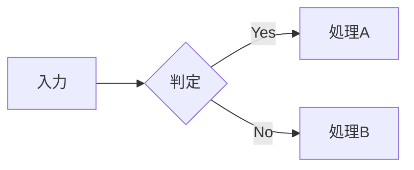

# 拡張記法リファレンス

:::{.chapter-lead}
前章の記法だけでも原稿は書けますが、本として読みやすく組むには、補足を本文から分けたり、画像と文章を並べたりする場面が出てきます。本章では、コラム・注記・画像レイアウト・表・装飾など、技術書の紙面を整えるための拡張記法をまとめます。最初から通読するより、作りたい紙面に応じて必要な項目を引くリファレンスとしても使えます。相互参照・索引・データ展開は、仕組みを追いやすいよう、それぞれ独立した章で説明します。
:::

## 拡張記法の基本

Vivlio Starter の拡張記法の多くは、VFM（Vivliostyle Flavored Markdown）のカスタムコンテナ構文を使います。内容を `:::` で囲み、開始行にクラス名を書くと、その範囲へ意味と見た目を与えられます。

```markdown
:::{.クラス名}
ここに内容を書く
:::
```

開始側の `:::` にクラス名を指定すると、対応するスタイルが適用されます。終了側は `:::` だけで閉じます。`:::` と `{` の間には、スペースがあってもなくても構いません。

```markdown
:::{.column}
スペースなし（どちらでも可）
:::

::: {.column}
スペースあり（どちらでも可）
:::
```

一つの段落だけにクラスを付けるときは、`:::` で囲まずに、段落の末尾へ `{.クラス名}` と書く方法もあります（`{.aki}`・`{.small}`・`{.text-right}` など）。どちらが使えるかは、各記法の説明に書いてあります。

### クラスを組み合わせる

一つのコンテナには、複数のクラスを空白で区切って指定できます。内容の役割を表すクラスと、配置を表すクラスを分けて重ねられます。

```markdown
:::{.column .align-center}
##### 中央寄せのコラム

内容がここに入ります。
:::
```

### 独自のクラスを足す

本章にない装飾がほしいときは、任意のクラス名でブロックを囲み、`stylesheets/custom.css` に見た目を定義します。

```markdown
:::{.marker-box}
ここは蛍光ペン風に強調したい内容です。
:::
```

`stylesheets/custom.css` に `.marker-box { background: #ffeb3b; }` のような定義を加えると、次のビルドから装飾が反映されます。ビルド前チェック（`vs preflight`）は `stylesheets/` からクラス名を集め、どこにも定義のないクラス名が原稿にあると、綴りの誤りを疑って知らせます。

## リード文

### `.chapter-lead` — 章リード

章の冒頭で、これから扱う内容と読みどころを伝える導入文です。本文より大きめの文字で表示されるため、章を開いた読者が先の流れを掴める長さにまとめます。

```markdown
:::{.chapter-lead}
本章では〇〇について解説します。
:::
```

### `.section-lead` — 節リード

節（h2）の直後に置く導入文です。複数の話題を含む長い節や、前の節から話題が大きく変わるところで、これから説明する範囲を数行にまとめます。

```markdown
## インストール

:::{.section-lead}
3ステップで完了します。
:::
```

## 注記・補足

本文から分けて添えたい内容は、囲みで示します。囲みは 5 種類あり、「読み飛ばしてもよいか」「実行する前に必ず読んでほしいか」で使い分けます。

| 囲み | 使いどころ |
|---|---|
| `.notice` | 実行する前に確かめないと失敗すること |
| `.note` | 本文と同じ重みで読んでほしい補足 |
| `.memo` | 読み飛ばしてもよい短い補足（用語・前提） |
| `.tip` | 知っていると手間が減る近道 |
| `.column` | 独立した読み物（背景・歴史・余談） |

迷ったときは、読み飛ばされて困るなら `.notice` か `.note`、困らないなら `.memo`・`.tip`・`.column` から選びます。

### `.notice` — 実行前の注意

操作を誤ると結果が変わる条件や、実行する前に確かめるべきことを、左側の線で強調します。読み飛ばされると失敗につながる内容に絞って使います。

```markdown
:::{.notice}
`--force` オプションは既存ファイルを上書きします。実行前にバックアップを取ってください。
:::
```

表示結果は次のようになります。{.aki}

:::{.notice}
`--force` オプションは既存ファイルを上書きします。実行前にバックアップを取ってください。
:::

### `.note` — 本文と同じ重みの補足

本文と関係の深い補足を、上下の線で挟んで表示します。流れの中で読んでほしいものの、本文とは区別したい内容に使います。

```markdown
:::{.note}
この設定は `book.yml` の `theme` セクションで変更できます。
:::
```

表示結果は次のようになります。{.aki}

:::{.note}
この設定は `book.yml` の `theme` セクションで変更できます。
:::

### `.memo` — 読み飛ばしてもよい短い補足

用語の説明や前提の確認など、知っている読者は読み飛ばしてよい短い補足を表示します。本文へ入れると流れを分けてしまう説明を、近くに添えられます。

```markdown
:::{.memo}
覚書きや注釈など、本文の補足メモをここに書きます。
:::
```

表示結果は次のようになります。{.aki}

:::{.memo}
覚書きや注釈など、本文の補足メモをここに書きます。
:::

### `.tip` — 手間が減る近道

知っていると作業が短くなる方法を表示します。本文の手順だけでも目的は果たせるが、知っておくと便利な情報に向いています。

```markdown
:::{.tip}
`vs preflight` を使うと、ビルド前にエラーを素早く確認できます。
:::
```

表示結果は次のようになります。{.aki}

:::{.tip}
`vs preflight` を使うと、ビルド前にエラーを素早く確認できます。
:::

### `.column` — コラム

本文から少し離れた背景や歴史、余談を、独立した読み物として枠で囲みます。丸ゴシック体で組まれ、本文とは違う読み物であることが紙面で分かります。

```markdown
:::{.column}
**コラムタイトル**

ここにコラムの内容を書きます。
:::
```

表示結果は次のようになります。{.aki}

:::{.column}
**コラムタイトル**

ここにコラムの内容を書きます。
:::

### `.small` — 補足を小さめに組む

本文の理解には必須ではないものの、残しておきたい細かな注意点や背景は、`:::{.small}` で囲めます。本文より一段小さな文字にし、左右を内側へ寄せて組むので、情報の優先度を紙面上で示せます。枠やラベルは付かず、囲みよりも控えめに本文へ添えられます。

```markdown
:::{.small}
`9007199254740993`（2の53乗＋1）を3で割った答えはちょうど `3002399751580331` ですが、`to_f` を経由すると `3002399751580330.5` になります。`fdiv` は整数のまま割るので、正しい値のままです。
:::
```

表示結果は次のようになります。{.aki}

:::{.small}
`9007199254740993`（2の53乗＋1）を3で割った答えはちょうど `3002399751580331` ですが、`to_f` を経由すると `3002399751580330.5` になります。`fdiv` は整数のまま割るので、正しい値のままです。
:::

1 段落だけのときは、段落の末尾へ `{.small}` と書くこともできます。

```markdown
細かい話ですが、丸めが一度で済むぶん誤差も乗りません。{.small}
```

表示結果は次のようになります。{.aki}

細かい話ですが、丸めが一度で済むぶん誤差も乗りません。{.small}

文字は小さくなりますが、**行送りは本文のまま保たれます**。版面の行の位置から外れないため、隣のページと行の位置がそろったままになります。{.aki}

脚注は前章の「脚注」で説明しています。

## テキストの配置

### `.align-left` / `.align-center` / `.align-right`

ブロック単位でテキストを寄せて表示します。

```markdown
:::{.align-left}
左寄せで表示されるテキストブロックです。
:::

:::{.align-center}
中央寄せで表示されるテキストブロックです。
:::

:::{.align-right}
右寄せで表示されるテキストブロックです。
:::
```

表示結果は次のようになります。{.aki}

:::{.align-left}
左寄せで表示されるテキストブロックです。
:::

:::{.align-center}
中央寄せで表示されるテキストブロックです。
:::

:::{.align-right}
右寄せで表示されるテキストブロックです。
:::

### `.text-left` / `.text-center` / `.text-right`

`.text-*` は、要素の幅を変えずに**文字の揃え方だけ**を変えます。段落・見出し・表のセルなどで、文字を右端や中央に揃えたいときに使います。

`:::` で囲めば、中の段落がすべて揃います。

```markdown
:::{.text-right}
この段落全体が右寄せで表示されます。
複数行あっても、すべて右端に揃います。
:::
```

表示結果は次のようになります。{.aki}

:::{.text-right}
この段落全体が右寄せで表示されます。
複数行あっても、すべて右端に揃います。
:::

段落や見出しの末尾に `{.text-right}` を付けると、その要素だけが右寄せになります。

```markdown
右寄せにしたい段落です。{.text-right}

#### 右寄せの見出し {.text-right}
```

表示結果は次のようになります。{.aki}

右寄せにしたい段落です。{.text-right}

#### 右寄せの見出し {.text-right}

#### `.align-right` と `.text-right` の違い

ただの段落に当てると、どちらも文字が右端に並ぶので同じに見えます。違いが出るのは、枠の見える要素に当てたときです。

| クラス | 要素の幅 | 主な用途 |
|---|---|---|
| `.align-right` | 内容の幅に縮む | 画像・短いブロックを右端に寄せる |
| `.text-right` | 変わらない（親の幅のまま） | 段落・見出し・セルの文字を右端に揃える |

枠付きの `.column` に当てて見比べると、`.align-right` は**枠そのものが内容の幅に縮んで右端へ寄り**、`.text-right` は**枠が全幅のまま中の文字だけ右に揃い**ます。

```markdown
:::{.column .align-right}
align-right：枠が内容の幅に縮んで右端へ寄ります。
:::

:::{.column .text-right}
text-right：本文の全幅のまま、文字だけ右端へ揃います。
:::
```

表示結果は次のようになります。{.aki}

:::{.column .align-right}
align-right：枠が内容の幅に縮んで右端へ寄ります。
:::

:::{.column .text-right}
text-right：本文の全幅のまま、文字だけ右端へ揃います。
:::

ブロックそのものを動かすときは `.align-*`、要素の幅を保ったまま文字の揃え方だけを変えるときは `.text-*` を選びます。

## 会話文

### `.talk` — 話者ごとに発話を並べる

対話形式のページは、`:::{.talk}` ブロックの中へ**「キー: 発話」**を並べて書きます。原稿では話者を短いキーで示し、表示名・色・アバターなどの見た目は設定ファイルで管理します。

まず話者を `config/talk.yml` に定義します。本書の雛形には、遙香（`haruka`）と未來（`mirai`）の 2 人が入っています。

```yaml
haruka:
  name: 遙香           # 表示名（省略時はキーをそのまま表示）
  color: purple        # テーマ色名 / HEX（省略時はテーマのアクセント色）
  avatar: haruka.webp  # images/characters/ 内のファイル名（省略可）
  side: left           # left / right（省略時は出現順に自動割当）

mirai:
  name: 未來
  color: blue
  avatar: mirai.webp
  side: right
```

色だけを決めるなら、`mirai: blue` のように値へ色を書く簡易形も使えます（表示名はキーのままになります）。

本文では、行頭の**キー＋半角コロン＋空白**で話者を切り替えます。行頭を字下げした行は、直前の発話の続きになります。発話内では強調・コード・リンクなど通常のインライン記法が使えます。

```markdown
:::{.talk}
haruka: Vivliostyle は CSS で組版するエンジンです。
mirai: CSS だけで本が作れるんですか？
haruka: そうです。このガイドブック自体が実例ですよ。
       複数行に続けたいときは行頭をインデントします。
:::
```

表示結果は次のようになります。{.aki}

:::{.talk}
haruka: Vivliostyle は CSS で組版するエンジンです。
mirai: CSS だけで本が作れるんですか？
haruka: そうです。このガイドブック自体が実例ですよ。
       複数行に続けたいときは行頭をインデントします。
:::

キーは半角英数（ローマ字）で書くので、IME を切り替えずに入力できます。アバター画像は `images/characters/` に置きます（未指定なら表示名だけの色付きラベルになります）。`config/talk.yml` は任意ファイルで、会話文を使わないプロジェクトでは不要です。

アバター画像をまだ用意していない場合は、`avatar: auto` を指定できます。**話者色の円に表示名の先頭一文字を白抜きした簡易アバター**が生成されるので、会話のレイアウトを先に確認できます。後から画像ファイル名へ差し替えても、本文の発話は変更する必要がありません。`display:` に `avatar: auto` を書くと、画像を指定していないすべての話者へ適用されます。

#### 表示を切り替える

表示は**`style`（形式）・`name`（話者名）・`avatar`（アバター）**の三つで決まります。本全体の既定は `config/talk.yml` の `display:` に書きます。

```yaml
display:
  style: chat         # chat（吹き出し）/ inline（「名前：発話」の 1 段落）
  name: true          # 話者名を表示する
  avatar: on          # アバターを表示する
  separator: "："     # inline のときの区切り
```

ブロックごとの上書きも可能です。指定しなかった項目は `display:` の値を引き継ぎます。

##### `style=inline` — 「名前：発話」の 1 段落

小説や脚本のような対話、ページ効率を優先したいときに向きます。左右振り分けとアバターは行いません。

```markdown
:::{.talk style=inline}
haruka: 吹き出しをやめると、ページをぐっと節約できるわ。
mirai: 会話が長い章では、こちらのほうが読みやすそうです。
:::
```

表示結果は次のようになります。{.aki}

:::{.talk style=inline}
haruka: 吹き出しをやめると、ページをぐっと節約できるわ。
mirai: 会話が長い章では、こちらのほうが読みやすそうです。
:::

##### `name=off` — 話者名を省く

アバターと左右の位置だけで誰の発話か分かるときは、名前を省けます。

```markdown
:::{.talk name=off}
haruka: アバターがあれば、名前がなくても迷わないでしょう。
mirai: たしかに。すっきりして読みやすいです。
:::
```

表示結果は次のようになります。{.aki}

:::{.talk name=off}
haruka: アバターがあれば、名前がなくても迷わないでしょう。
mirai: たしかに。すっきりして読みやすいです。
:::

##### `avatar=off` — アバターを省く

アバター画像を用意していないときや、名前だけで十分なときに使います。

```markdown
:::{.talk avatar=off}
haruka: 画像がなくても、名前と色で話者は伝わるわ。
mirai: 準備が整うまではこれで書き進められますね。
:::
```

表示結果は次のようになります。{.aki}

:::{.talk avatar=off}
haruka: 画像がなくても、名前と色で話者は伝わるわ。
mirai: 準備が整うまではこれで書き進められますね。
:::

:::{.memo}
`style=inline` と `name=off` を同時に指定すると、アバターも左右の位置も名前も無くなり、誰の発話か判別できなくなります。この組み合わせはビルド時に 🟡 で知らせます。
:::

:::{.memo}
Kindle（KFX）は吹き出しのレイアウトを描けないため、**どの指定で書いても「名前：発話」の 1 段落へ自動で組み替わります**（アバターと左右振り分けは省かれ、話者名は必ず表示されます）。話者ごとの色はそのまま反映されるので、Kindle でも誰の発話かは色で見分けられます。
:::

## キーボードのキー

### `〘 〙` — キーをキーキャップの形で示す

キーの名前を `〘 〙` で囲むと、キーキャップの形で表示されます（`<kbd>` タグに変換されます）。

```markdown
保存は 〘Ctrl〙 + 〘S〙 で行います。
```

表示結果は次のようになります。{.aki}

保存は 〘Ctrl〙 + 〘S〙 で行います。

`<kbd>` タグを直接書いても同じです。キーの組み合わせは、`+` でつないで一つの `<kbd>` にまとめて書けます。`+` の前後でキーが一つずつに分かれ、上と同じ表示になります（`〘Ctrl + S〙` と書いても同じです）。

```markdown
保存は <kbd>Ctrl + S</kbd> で行います。
```

表示結果は次のようになります。{.aki}

保存は <kbd>Ctrl + S</kbd> で行います。

`+` のキーそのものは `<kbd>+</kbd>`、`Ctrl` との組み合わせは `<kbd>Ctrl + +</kbd>` と書きます。

## リスト装飾

標準リストと、英字・ローマ数字マーカー（fancy list）の基本は、前章「Markdown 執筆チュートリアル」のリスト節で解説しています。ここでは、それらに重ねて使える複合番号のリストと、行頭記号による装飾リストを紹介します。

### `.outline-list` — 複合番号（1.1 / 1.2）

ネストした番号リストは、通常は各階層が 1 から数え直します（独立採番）。`1.1` `1.2` のような複合番号（アウトライン番号）で組みたいときは、標準の番号リストをそのまま書いて `:::{.outline-list}` で囲みます。

```markdown
:::{.outline-list}
1. 概要
   1. この機能について
   2. インストール方法
2. 使い方
   1. 基本
:::
```

表示結果は次のようになります。{.aki}

:::{.outline-list}
1. 概要
   1. この機能について
   2. インストール方法
2. 使い方
   1. 基本
:::

:::{.note}
`outline-list` の中に書けるのは標準の番号リストだけです（fancy list との併用はできません）。`-` の箇条書きが混ざった場合、複合番号は番号リストにのみ付きます。
:::

### `▶` — 青コメ（補足の箇条書き）

箇条書きの行頭を `▶` にすると、行頭の記号（●）の代わりに青い `▶` が付きます。補足説明のリストを、手順や本題のリストと見分けやすくできます。

```markdown
- ▶ ここはポイント解説
- ▶ ここは補足
```

表示結果は次のようになります。{.aki}

- ▶ ここはポイント解説
- ▶ ここは補足

### `❶`〜`⓴` — 赤コメ（番号付きの手順）

囲み数字（`❶`〜`❿`、`⓫`〜`⓴`）で始まる項目は、行頭の記号（●）が消え、囲み数字が赤い太字になります。図やコードの中に置いた同じ番号と、本文の説明を対応させるときに向いています。

```markdown
- ❶ 最初に設定ファイルを開く
- ❷ `stylesheets/custom.css` を編集する
- ❸ `vs build` で反映を確認する
```

表示結果は次のようになります。{.aki}

- ❶ 最初に設定ファイルを開く
- ❷ `stylesheets/custom.css` を編集する
- ❸ `vs build` で反映を確認する

色や書体を変えるときは、`stylesheets/custom.css` で `li.aokome`（青コメ）・`li.akakome > span`（赤コメの番号）を上書きします。

## コードと実行結果

コードブロックの基本（フェンス・言語名・ファイル名の表示）は、前章の「コードブロック」で説明しています。ここでは、行番号の指定・外部ファイルの取り込み・コメントの強調と、コードの周りに置く実行結果や図の枠を扱います。

### シンタックスハイライト — 言語名で色分けする

コードブロックに言語名を書くと、Prism.js によって構文ごとに色分けされます。言語名がないときは色分けされません（行番号は付きます）。主な言語名は次のとおりです。

| 言語指定 | 言語 |
|---|---|
| `ruby` | Ruby |
| `javascript`, `js` | JavaScript |
| `typescript`, `ts` | TypeScript |
| `python` | Python |
| `html` | HTML |
| `css` | CSS |
| `sql` | SQL |
| `yaml` | YAML |
| `bash`, `sh` | シェルスクリプト |
| `json` | JSON |
| `c`, `cpp` | C / C++ |
| `java` | Java |
| `go` | Go |
| `rust` | Rust |
| `markdown` | Markdown |

### `#L` — 行番号を途中から始める

コードブロックには行番号が自動で付きます。原稿側での設定は要りません。

行番号は通常 `1` から始まりますが、ファイル名の直後に `#L開始行` を書くと任意の行番号から始められます。抜粋元のファイルでの位置を示したいときに使います。

````markdown
```ruby:foo.rb#L5
def hello
end
```
````

この例では行番号が `5, 6, 7` と表示されます。`#L5-L8` のように終了行まで書いても構いません（表示に使われるのは開始行だけです）。紙面のファイル名は `foo.rb` とだけ表示されます。

### `include` — 外部ファイルを取り込む

`codes/` ディレクトリに置いた外部ファイルは、原稿から直接取り込めます。サンプルコードを原稿へ複製せずに済むため、実行確認したファイルと紙面へ掲載する内容を一致させられます。表示言語はファイルの拡張子から判定されます。

````markdown
```include:sample.rb```
```include:sample.rb:10-20```
````

1 行目はファイル全体を、2 行目は 10〜20 行目だけを取り込みます。範囲を指定したときの行番号は、`1` からではなく**元ファイルでの実際の行番号**（この例では `10, 11, …, 20`）です。紙面を見ながら元ファイルの該当箇所を探せます。

指定したファイルが見つからない場合は、`vs preflight` や `vs build` で次のようなエラーが表示されます。

:::{.output}
```text
🔴 24-cross-reference.md:341 - ソースコード 'prime.rb' が見つかりません
        コードの場所: codes/prime.rb
```
:::

ファイル名の誤りか、`codes/` ディレクトリへの置き忘れを確かめてください。

### `[!]` — コメントの行を強調する

コードブロック内のコメントへ `[!]` マーカーを入れると、そのコメント行を赤色で強調できます。元のコメント記号は残り、紙面からは `[!]` だけが取り除かれます。直後の本文で説明する行や、変更前後の要点をコードの中で示すときに使います。

| 書き方 | 効果 |
| :--- | :--- |
| `# [!] コメント` | `# コメント`（赤色） |
| `// [!] コメント` | `// コメント`（赤色） |
| `-- [!] コメント` | `-- コメント`（赤色） |
| `/* [!] コメント */` | `/* コメント */`（赤色） |

`[!]` を使った例を次に示します。

````markdown
```ruby
def greet(name)
  puts "Hello, #{name}!"   # [!] この行が強調される
  puts "Hello, #{name}!"   # 通常のコメント
end
```
````

````markdown
```sql
SELECT * FROM users WHERE id = 1; -- [!] この行が強調される
SELECT * FROM users WHERE id = 2; -- 通常のコメント
```
````

表示結果は次のようになります。{.aki}

```ruby
def greet(name)
  puts "Hello, #{name}!"   # [!] この行が強調される
  puts "Hello, #{name}!"   # 通常のコメント
end
```

```sql
SELECT * FROM users WHERE id = 1; -- [!] この行が強調される
SELECT * FROM users WHERE id = 2; -- 通常のコメント
```

### `.terminal` — ターミナルへの入力

ターミナル（端末）へ入力するコマンドを示すための枠です。黒地に白文字の全幅で表示され、本文やソースコードとは異なる「端末上の操作」であることを視覚的に伝えます。

中身は**リテラル**（書いたとおり）に組まれます。Markdown としては解釈されないので、`*.png` の `*` が斜体化したり、`` `date` `` のバッククォートが消えたりしません。連続する空白もそのまま保たれます。

プロンプト記号（`$`・`%`・`#`）は原稿に記述します。コマンドと実行結果を一つの端末操作として見せたい場合は、同じブロックへ続けて書けます。入力箇所を明確に分けたい場合は、次の `.output` と組み合わせます。

```markdown
:::{.terminal}
$ vs build
$ cp *.png *.bak
:::
```

表示結果は次のようになります。{.aki}

:::{.terminal}
$ vs build
$ cp *.png *.bak
:::

### `.output` — 実行結果・出力例

コマンドの実行結果や、記法から得られる表示例を示します。細い全幅の枠で本文と区別しながら、結果そのものを読みやすく見せます。中身は通常の Markdown として扱われるので、文章だけでなく箇条書きや表も入れられます。

```markdown
:::{.output}
✅ ビルドが完了しました
- 出力: dist/sample.pdf
:::
```

表示結果は次のようになります。{.aki}

:::{.output}
✅ ビルドが完了しました
- 出力: dist/sample.pdf
:::

`.terminal` と違い、中身は Markdown です。桁揃えが要る逐語の出力（SQL のテーブル表示など）は、`.output` の中にコードフェンスを書いて囲んでください。フェンスの中なら連続空白がそのまま保たれます。

````markdown
:::{.output}
```text
 id | name  | email
----+-------+------------------
  1 | Alice | alice@example.com
  2 | Bob   | bob@example.com
```
:::
````

表示結果は次のようになります。{.aki}

:::{.output}
```text
 id | name  | email
----+-------+------------------
  1 | Alice | alice@example.com
  2 | Bob   | bob@example.com
```
:::

### `.diagram` — 図・アスキーアート

罫線や記号で描いた図（ツリー図・構成図など）や、桁揃えの要るアスキーアートを示します。見た目は `.output` と同じ細い囲み枠ですが、「これは実行結果ではなく図である」という意味づけが異なります（Kindle でも `.output` のようなラベルは付きません）。

中身は連続空白がそのまま保たれ、コードブロックのような行番号は付きません。桁揃えを確実にするため、**図はコードフェンスで囲む**ことをお勧めします。

````markdown
:::{.diagram}
```
       A
     ┌─┴─┐
     B    C
```
:::
````

表示結果は次のようになります。{.aki}

:::{.diagram}
```
       A
     ┌─┴─┐
     B    C
```
:::

:::{.memo}
`.output`・`.terminal`・`.diagram` の中の逐語ブロックには行番号が付きません（実行結果・端末・図は「コードの提示」ではないためです）。行番号がほしいソースコードは、これらの枠の外にコードブロックとして書いてください。
:::

## 表のレイアウト

### `||` — セルの横結合と複数行ヘッダー

素のパイプテーブルのまま、セルの横結合（colspan）と複数行ヘッダーが書けます。

- **横結合（colspan）**: 空セル `||`（パイプを続けて書く）は、直前のセルへ結合されます。連続させれば 3 列・4 列とまとめられます。
- **複数行ヘッダー**: 区切り行（`---`）より上に複数行を書くと、そのすべてがヘッダー（`<thead>`）になります。
- **空セル**: 本当に空のセルを置きたいときは `| |`（空白を挟む）と書きます。`||`（空白なし）は結合の意味になります。
- **エスケープ**: セル内に文字としての `|` を書きたいときは `\|` とエスケープします（インラインコード内でも同様）。
- セル内では `**太字**`・`*斜体*`・`` `コード` `` などの装飾がそのまま使えます。

```markdown
|          |       結合       ||
| ヘッダー1 | ヘッダー2 | ヘッダー3 |
| :------- | :------: | -------: |
| セル1     |      長いセル      ||
| セル2     |  中央寄せ  |   右寄せ  |
| セル3     | **太字**  |  *斜体*  |
```

表示結果は次のようになります。{.aki}

|          |       結合       ||
| ヘッダー1 | ヘッダー2 | ヘッダー3 |
| :------- | :------: | -------: |
| セル1     |      長いセル      ||
| セル2     |  中央寄せ  |   右寄せ  |
| セル3     | **太字**  |  *斜体*  |

:::{.note}
横結合や複数行ヘッダーを含む表だけが拡張変換の対象です。それ以外の表は、前章の表と同じに組まれます。
:::

### `.long-table` — 長い表

行数の多い表に適用します。フォントサイズが少し小さくなり、セルが詰まって表示されます。

```markdown
:::{.long-table}
| 名前 | 年齢 | 職種 | 部署 | 勤続年数 | スキルレベル | リモート勤務 |
|:---:|:---:|:---:|:---|:---:|:---:|:---:|
| 太郎 | 25 | エンジニア | 開発1課 | 2年 | ★★☆☆☆ | 可 |
| 花子 | 30 | デザイナー | UXデザイン部 | 5年 | ★★★★☆ | 一部可 |
| 次郎 | 35 | マネージャー | プロダクト部 | 8年 | ★★★★☆ | 不可 |
:::
```

表示結果は次のようになります。{.aki}

:::{.long-table}
| 名前 | 年齢 | 職種 | 部署 | 勤続年数 | スキルレベル | リモート勤務 |
|:---:|:---:|:---:|:---|:---:|:---:|:---:|
| 太郎 | 25 | エンジニア | 開発1課 | 2年 | ★★☆☆☆ | 可 |
| 花子 | 30 | デザイナー | UXデザイン部 | 5年 | ★★★★☆ | 一部可 |
| 次郎 | 35 | マネージャー | プロダクト部 | 8年 | ★★★★☆ | 不可 |
:::

### `.rotate-table` — 表を 90 度回転する

縦向きの版面に収まりにくい横長の表を、専用ページで 90 度回転して表示します。表の前後には改ページが入り、本文とは独立したページとして組まれます。

```markdown
:::{.rotate-table}
| 列1 | 列2 | 列3 | ... |
|---|---|---|---|
| ... | ... | ... | ... |
:::
```

倍率（`scale`）と垂直位置（`shift-y`）は、**版面の大きさと表の内容から自動で算出**され、ページに収まるようフィットします。多くの場合、オプションを指定しなくてもそのまま組めます。

#### 倍率と位置の微調整

セル内に画像がある、長い欧文で折り返しが起きるなどの理由で自動算出がうまく合わないときは、`scale` と `shift-y` オプションで上書きできます（指定した値が自動算出より優先されます）。

```markdown
:::{.rotate-table scale=60% shift-y=10%}
| 列1 | 列2 | 列3 | ... |
|---|---|---|---|
| ... | ... | ... | ... |
:::
```

| オプション | 説明 | 既定 |
|---|---|---|
| `scale=N%` | 回転テーブルの倍率。列数が多い場合は小さくする | 自動算出 |
| `shift-y=N%` | ページ中央からの垂直方向オフセット。正の値で下方向へ移動 | 0%（中央） |

:::{.tip}
`shift-y` は「中央からのずらし量」です（0% で完全センタリング）。`scale` と `shift-y` は、PDF 出力を確認しながら微調整してください。
:::

次の例では、先程の表を `.rotate-table` で 90 度回転して表示しています。

:::{.rotate-table}
| 名前 | 年齢 | 職種 | 部署 | 勤続年数 | スキルレベル | リモート勤務 |
|:---:|:---:|:---:|:---|:---:|:---:|:---:|
| 太郎 | 25 | エンジニア | 開発1課 | 2年 | ★★☆☆☆ | 可 |
| 花子 | 30 | デザイナー | UXデザイン部 | 5年 | ★★★★☆ | 一部可 |
| 次郎 | 35 | マネージャー | プロダクト部 | 8年 | ★★★★☆ | 不可 |
:::

## 画像レイアウト

画像ファイルは、章ごとに `images/<章のファイル名>/` へ置きます（`22-extentions.md` なら `images/22-extentions/`）。原稿にはファイル名だけを書けば、ビルド時にその章のディレクトリから探します。ほかの章の画像を使うときは、`images/11-workflow/logo.webp` のように `images/` から書きます。画像ディレクトリは `vs create` で章を作ると一緒に作られます。

### `{width=… align=…}` — 画像の幅と配置を指定する

画像記法の末尾に `{}` を添えると、画像の幅と配置、枠の有無を指定できます。原画像そのものを加工せず、紙面上での見せ方だけを調整できます。幅は本文の幅に対する `%` のほか、`40mm` や `4em` のような単位つきの長さでも書けます。配置は `left`・`center`・`right` のいずれかで、どちらか一方だけでも書けます。

```markdown
{width=30% align=left}
{width=50%}
{align=right}
```

たとえば次のように、幅 50%・中央寄せで配置してみます。{.aki}

```markdown
{width=50% align=center}
```

表示結果は次のようになります。{.aki}

{width=50% align=center}

#### 文中に置いた画像の幅を決める

段落の途中や、箇条書き・表の中に置いた画像にも `width` が効きます。アイコンのような小さな画像を文字と並べるときは、`em`（本文の文字 1 字分）で指定すると、文字の大きさにそろえやすくなります。

```markdown
設定画面は、歯車のアイコン {width=1em} から開きます。
```

`%` は、その画像を含む段落（表の中ならセル）の幅に対する割合です。幅を指定しないと、画像は元の大きさのまま置かれ、大きな画像は本文の幅いっぱいに広がります。

#### `border` — 画像の枠を外す・付ける

段落に単独で置いた画像には、キャプションの有無を問わず、既定で細い枠が付きます。白背景のスクリーンショットや図版が、紙面の余白に溶けて輪郭を失わないようにするためです。ロゴや透過画像のように枠が邪魔なときは、`border=off` で外します。

```markdown
{width=30% border=off}
```

文中に置いた画像には枠が付きません。付けたいときは `border=on` と書きます。枠の色は、`stylesheets/custom.css` で `--color-figure-border`（既定 `#ccc`）を上書きすると変えられます。

### `** タイトル **` — キャプションと図番号を付ける

画像の直前に `** タイトル **` という独立した行を置くと、その行が画像のキャプションとして表示されます。行頭と行末の `**` は太字ではなく、画像へ結び付くキャプションを示します。

```markdown
** アインシュタインの肖像 **
{width=40% align=center}
```

表示結果は次のようになります。{.aki}

** アインシュタインの肖像 **
{width=40% align=center}

さらにタイトルの末尾に `@ラベルID` を付けると、「**図 2-1: アインシュタインの肖像**」のように章番号付きの**図番号**が自動で割り振られ、本文中から `@ラベルID` で参照できるようになります。

```markdown
** アインシュタインの肖像 @einstein-portrait **
{width=40% align=center}
```

表示結果は次のようになります（図番号が自動で付きます）。{.aki}

** アインシュタインの肖像 @einstein-portrait **
{width=40% align=center}

図番号は表・リストにも同じ要領で付けられます。たとえば上で定義した図は、本文から参照すると @einstein-portrait のように図番号付きのリンクへ展開されます。自動ID・参照の書き方・重複チェックなど詳しい仕組みは「相互参照（クロスリファレンス）」の章で解説します。

### `.pictures` — 写真グリッド

同じまとまりとして見せたい複数の画像を、グリッド状に並べます。画像数に応じて列数が調整されるため、個々の幅を指定せずに写真一覧を構成できます。

```markdown
:::{.pictures}


:::
```

表示結果は次のようになります。{.aki}

:::{.pictures}


:::

### `.image-group` — 2 枚を横に並べる

2枚の画像を横に並べます。最初の画像に `{width=30%}` を指定すると比率を調整できます。

```markdown
:::{.image-group}
{width=30%}

:::
```

表示結果は次のようになります。{.aki}

:::{.image-group}
{width=30%}

:::

### `.img-text` / `.text-img` — 画像＋本文の横並び

画像と本文を二列に分けて横へ並べます。画像を先に置くか本文を先に置くか、どちらを広く取るかに応じて、次のクラスを使い分けます。

| クラス名 | 左 | 右 | 列比率 |
|---|:---:|:---:|:---:|
| `.img-text`  | 画像 | 本文 | 1:1 |
| `.img-text2` | 画像 | 本文 | 1:2 |
| `.img-text3` | 画像 | 本文 | 1:3 |
| `.text-img`  | 本文 | 画像 | 1:1 |
| `.text2-img` | 本文 | 画像 | 2:1 |
| `.text3-img` | 本文 | 画像 | 3:1 |

```markdown
:::{.img-text2}


アルベルト・アインシュタインは、特殊相対性理論と一般相対性理論を提唱した物理学者です。`.img-text2` では画像と本文が 1:2 の比率で並びます。
:::
```

表示結果は次のようになります。{.aki}

:::{.img-text2}


アルベルト・アインシュタインは、特殊相対性理論と一般相対性理論を提唱した物理学者です。`.img-text2` では画像と本文が 1:2 の比率で並びます。
:::

### `.sideimage-right` / `.sideimage-left` — サイドイメージ

本文の横に画像を置き、本文を回り込ませます。`.sideimage-right` は画像を右、`.sideimage-left` は画像を左に置きます（`.sideimage` と書いても `.sideimage-left` と同じです）。画像の `{width=NN%}` で、画像側の幅の割合を調整できます。

```markdown
:::{.sideimage-right}
アルベルト・アインシュタインは、特殊相対性理論と一般相対性理論を提唱したことで知られる物理学者です。本文はこのように画像の左側へ回り込みます。`.sideimage-right` では画像が右側に配置されます。

{width=30%}
:::
```

表示結果は次のようになります。{.aki}

:::{.sideimage-right}
アルベルト・アインシュタインは、特殊相対性理論と一般相対性理論を提唱したことで知られる物理学者です。本文はこのように画像の左側へ回り込みます。`.sideimage-right` では画像が右側に配置されます。

{width=30%}
:::

### `.gap-s` / `.gap-m` / `.gap-l` — 画像と本文の間隔を変える

`.img-text` などの横並びのクラスに併記すると、画像と本文の間隔を変えられます。

```markdown
:::{.img-text .gap-s}


小さな余白（0.5rem）で配置
:::

:::{.img-text .gap-m}


標準の余白（1rem）で配置
:::

:::{.img-text .gap-l}


大きな余白（1.5rem）で配置
:::
```

表示結果は次のようになります（余白が段階的に広がります）。{.aki}

:::{.img-text .gap-s}


小さな余白（0.5rem）で配置
:::

:::{.img-text .gap-m}


標準の余白（1rem）で配置
:::

:::{.img-text .gap-l}


大きな余白（1.5rem）で配置
:::

## 書籍紹介カード

### `.book-card` — 参考書籍カード

参考文献や、本文とあわせて紹介したい書籍をカード形式で表示します。表紙画像を左、書名と説明を右に並べることで、通常の文献一覧よりも書籍の特徴を伝えやすくなります。

```markdown
:::{.book-card}

**はじめての技術書づくり**
はじめて技術書を書く方にお勧め。電子書籍執筆システム Vivlio Starter の実践ガイドです。
:::
```

表示結果は次のようになります。{.aki}

:::{.book-card}

**はじめての技術書づくり**
はじめて技術書を書く方にお勧め。電子書籍執筆システム Vivlio Starter の実践ガイドです。
:::

## 図解注釈の方法

操作手順のスクリーンショットでは、ボタンを枠で囲む、矢印で指す、丸数字を本文と対応させるといった注釈が必要になります。画像編集ソフトで直接描き込む方法では、位置を少し直すだけでも元データを開き、画像を書き出し直します。原稿と注釈が別々のファイルに分かれるため、変更の経緯も追いにくくなります。

`:::{.showcase}` を使うと、こうした注釈を**原稿の中へ文字として記述できます**。元画像は変更せず、注釈の種類・位置・大きさを数値で管理します。原稿と一緒に差分を記録でき、位置の修正も数値を書き換えるだけで反映できます。

### 基本の書き方

`:::{.showcase}` ブロックの中に、**画像を 1 枚**と、**注釈行**を並べます。

```markdown
:::{.showcase}

# 行頭が # の行はコメントです（出力されません）
rect:1 530, 335, 175, 165 {pos=bottom} 愛用のバイオリン
pointer:2 490, 130 {label="白髪"} くしゃくしゃの白髪
:::
```

表示結果は次のようになります。{.aki}

:::{.showcase}

rect:1 530, 335, 175, 165 {pos=bottom} 愛用のバイオリン
pointer:2 490, 130 {label="白髪"} くしゃくしゃの白髪
:::

注釈行は、次の四つの部分をスペースで区切って書きます。

| 部分 | 例 | 意味 |
|---|---|---|
| コマンドと番号 | `rect:1` | 何を描くか。`:1` が丸数字の番号 |
| 座標 | `530, 335, 175, 165` | どこに描くか。カンマ区切り |
| オプション | `{pos=bottom}` | どう描くか。省略可 |
| 著者コメント | `愛用のバイオリン` | **画像には表示されません** |

<!-- no-lint -->
最後の著者コメントには、各注釈が何を示すのかを書きます。紙面上には表示されませんが、「① 愛用のバイオリン ② くしゃくしゃの白髪」のようにまとめられ、画像の `alt` 属性（代替テキスト）へ入ります。原稿を直すときの手がかりになるとともに、読み上げソフトや画像を表示できない環境にも注釈の意味を伝えられます。

### 座標はパーミルで指定する

座標は画像のピクセル数ではなく、**画像の左上を (0, 0)、右下を (1000, 1000) とする千分率（パーミル）**で指定します。横方向は幅の千分率、縦方向は高さの千分率です。


画像の縦横比が同じであれば、高解像度版へ差し替えたり、ビルド時に画像を最適化したりしても、注釈は同じ相対位置に置かれます。

とはいえ、画面上で位置を測るときに得られるのはピクセル値です。そこで**`px` を付ければ実測ピクセルでも書けます**。ビルド時に自動でパーミルへ換算されるので、電卓を叩く必要はありません。

```markdown
# どちらでも同じ場所を指す（元画像が 1280 × 768px の場合）
rect:1 530, 335, 175, 165
rect:1 678px, 257px, 224px, 127px
```

:::{.tip}
最初は画面上で測った `px` を使い、配置が決まってからパーミルへ直すと、計算と調整を分けられます。画像を差し替える予定がなければ、`px` のまま残しても構いません。
:::

### `rect` — 対象を枠で囲む

`rect` は、指定した座標から幅・高さの分だけ枠を描きます。

```markdown
rect:[番号] [X], [Y], [幅], [高さ] {オプション} 著者コメント
```

丸数字を枠のどこに置くかは `pos` で決めます。省略すると `left`（枠の左辺）です。

| 指定 | 丸数字の位置 |
|---|---|
| `pos=left` | 枠の左辺の中点（既定） |
| `pos=right` | 枠の右辺の中点 |
| `pos=top` | 枠の上辺の中点 |
| `pos=bottom` | 枠の下辺の中点 |
| `pos=center` | 枠の内部中央 |

枠線は `border` で、塗りつぶしは `background` で変えられます。`border` は CSS と同じ「太さ・線種・色」の書き方で、線種は `solid` / `dashed` / `dotted` が使えます。

```markdown
:::{.showcase}

rect:1 530, 335, 175, 165 {pos=right}
rect:2 725, 545, 220, 150 {pos=center border="3 dashed #1c7ed6" background="rgba(28,126,214,0.15)"}
:::
```

表示結果は次のようになります。{.aki}

:::{.showcase}

rect:1 530, 335, 175, 165 {pos=right}
rect:2 725, 545, 220, 150 {pos=center border="3 dashed #1c7ed6" background="rgba(28,126,214,0.15)"}
:::

### `pointer` — 対象を指し示す

`pointer` は、ホームベース型の記号の先端で一点を示します。ボタン・アイコン・小さな部品など、枠で囲むほどの広がりがない対象に向いています。

```markdown
pointer:[番号] [X], [Y] {オプション} 著者コメント
```

座標には、記号の左上ではなく、**矢印の先端を置く点**を指定します。記号本体は `dir` の向きに応じて、先端の反対側へ伸びます。ボタンや文字を隠さないよう、対象の中心ではなく**外周**へ先端を置くと読みやすくなります。

| 指定 | 向き | 本体が伸びる方向 |
|---|---|---|
| `dir=right` | ▶ 右向き（既定） | 先端の左側 |
| `dir=left` | ◀ 左向き | 先端の右側 |
| `dir=up` | ▲ 上向き | 先端の下側 |
| `dir=down` | ▼ 下向き | 先端の上側 |

`label` を付けると、本体の中に短い文字を埋め込めます。`:番号` を省略すればラベルだけになり、丸数字は描かれません。

```markdown
:::{.showcase}

# 番号とラベルの両方（既定の右向き。本体は先端の左へ伸びる）
pointer:1 490, 130 {label="白髪"}
# 下向き（本体は先端の上へ伸びる）
pointer:2 672, 225 {dir=down label="弓"}
# 番号を省略＝ラベルのみ（左向き。本体は先端の右へ伸びる）
pointer 805, 440 {dir=left label="糸巻き"}
:::
```

表示結果は次のようになります。{.aki}

:::{.showcase}

pointer:1 490, 130 {label="白髪"}
pointer:2 672, 225 {dir=down label="弓"}
pointer 805, 440 {dir=left label="糸巻き"}
:::

### `crop` — 画像の周囲を切り落とす

<!-- no-lint -->
画像の余分な周囲は、画像属性の `crop` で削げます。値は CSS と同じ「上・右・下・左」の時計回りで、1 つ（四辺共通）・2 つ（上下／左右）・3 つ（上／左右／下）・4 つのいずれかで書きます。段落に単独で置いた画像でも、`:::{.showcase}` の中の画像でも使えます（文中に置いた画像には効きません）。単独の画像では、キャプションと図番号・`align`・`border`・`width` もそのまま効きます。

```markdown
# 上下左右を均等に
{crop="50"}

# 上下 30、左右 100
{crop="30 100"}

# 上 30 / 左右 100 / 下 60
{crop="30 100 60"}

# 上 30 / 右 250 / 下 60 / 左 100（px でも可）
{crop="30 250 60 100"}
```

`crop` を指定しても、**座標の基準は切り落とす前の元画像のままです**。変わるのは表示する範囲だけで、注釈の座標系は移動しません。注釈を書いた後から切り抜く範囲を加えたり調整したりしても、注釈の座標はそのまま使えます。

```markdown
:::{.showcase}
{crop="30 250 60 100"}
# crop を足しても座標はそのまま（元画像基準のため）
rect:1 530, 335, 175, 165 {pos=bottom} 愛用のバイオリン
:::
```

表示結果は次のようになります（右側の書棚と机が窓の外へ出ます）。{.aki}

:::{.showcase}
{crop="30 250 60 100"}
rect:1 530, 335, 175, 165 {pos=bottom} 愛用のバイオリン
:::

### オプション一覧

`{}` の中には、次のキーをスペース区切りで並べられます。値に空白を含めたいときは `border="3 dashed blue"` のように二重引用符で囲みます。

| キー | 対象 | 説明（かっこ内は既定値） |
|---|---|---|
| `pos` | rect | 丸数字を枠のどこに置くか（`left`） |
| `dir` | pointer | 矢印の向き（`right`） |
| `label` | pointer | 本体に埋め込む文字（なし） |
| `border` | rect | 枠線の太さ・線種・色（`3 solid #ff3b30`） |
| `background` | rect / pointer | 塗りの色（rect は `transparent`、pointer は `#ff3b30`） |
| `color` | 共通 | 数字・ラベルの文字色（rect は濃色、pointer は `white`） |
| `font-size` | 共通 | 文字の大きさ（数字 28 / ラベル 30） |

画像側の属性は `width`（既定 `100%`）と `crop` の二つです。

普通の画像と同じく、`:::{.showcase}` の直前の行に `** タイトル @ラベルID **` を置くと、キャプションと図番号が付き、本文から `@ラベルID` で参照できます。

### PDF・EPUB・Kindle での見え方

`:::{.showcase}` は、ビルド時に「元画像＋注釈を焼き込んだ 1 枚の画像」に変換されます。枠も矢印も丸数字も画像の中に入るため、**PDF でも EPUB でも Kindle でも同じ見た目**になります。PDF では注釈がベクタのまま印刷解像度で出ます。

電子書籍向けの画像形式は自動で選ばれます。スクリーンショットのように平坦な色の画像は文字がにじまない PNG で、写真のように色数の多い画像はファイルが太らない JPEG で書き出されます。著者が指定することはありません。

:::{.memo}
図解注釈の合成には ImageMagick と librsvg が必要です。未導入の環境では**注釈なしの通常画像として出力**され、ビルドが止まることはありません（そのときは警告でお知らせします）。`vs doctor --fix` で導入できます。
:::

## 自分で図版を描く（SVG）

座標系の模式図、構造の対応表、値の推移など、スクリーンショットでは用意できない図は、著者が作図します。その形式には **SVG を使います**。PNG のようなラスター画像と異なり、拡大しても線や文字の輪郭を保てます。図形や文字を数値で記述するため、後から位置や内容を修正しやすいことも、技術書の図版に適しています。

Vivlio Starter は SVG をベクター形式のまま PDF と EPUB へ収録します。図中の文字も画像へ変換せず、**書籍と同じ書体で組みます**。`<text>` に含まれる文字は、ビルド時に必要な分だけフォントから取り出され、SVG 自体へ埋め込まれます。そのため、読者の環境に同じフォントがなくても、図の字形を保てます。

:::{.note}
Kindle だけは事情が異なります。KFX 形式は SVG を扱えないため、ビルド時に JPEG へ変換されます。この変換では、ビルド環境で利用できる書体が図中の文字に使われます。書籍に設定した書体での表示を確認する場合は、PDF または EPUB を参照してください。
:::

### SVG 図版の雛形

次のコードは、SVG 図版を作成するときの雛形です。新しいファイルへコピーし、図形やテキストを置き換えて利用できます。作図ソフトやコード生成ツールを使う場合も、寸法・書体・配色を整えるための参考にしてください。

```svg
<svg xmlns="http://www.w3.org/2000/svg"
     width="100%" viewBox="0 0 640 400" role="img">
  <!-- 幅は全幅 640 か半幅 320 の二択。1 単位 = 0.25mm。
       縦は中身の高さで決め、上下の余白は 12（3mm）。 -->
  <title>図の内容を一文で。本文の alt と逐語一致させる</title>
  <style>
    /* 字 ------------------------------------- */
    text   { font-family: "Zen Kaku Gothic New", sans-serif; }
    .label { font-size: 14px; fill: #1a1a1a; }  /* 本文相当 */
    .note  { font-size: 12px; fill: #993c1d; }  /* 注記 */
    .title { font-size: 17px; font-weight: 700;
             fill: #1a1a1a; }                   /* 図の題 */

    /* 線 ------------------------------------- */
    .rule  { stroke: #1a1a1a; stroke-width: 2; fill: none; }
    .frame { stroke: #9aa0a6; stroke-width: 1; fill: none; }
    /* 背景の目盛 */
    .guide { stroke: #9aa0a6; stroke-width: 1; fill: none;
             stroke-dasharray: 4 4; }

    /* 面 ------------------------------------- */
    .plate     { fill: #ffffff; }  /* 線の上に重ねる面 */
    .area      { fill: #4e7ca1; }  /* 値の大きさを表す面 */
    .area-pale { fill: #c9d3da; }  /* 背景側の領域 */

    /* 強調 ----------------------------------- */
    .mark  { stroke: #993c1d; stroke-width: 2.5; fill: none; }
    .alert { stroke: #74202c; stroke-width: 3.5; fill: none; }
    .mark-text { font-size: 14px; font-weight: 700;
                 fill: #993c1d; }

    /* 系列。明るさと線種の両方で分ける ------- */
    .s1 { stroke: #22496b; stroke-width: 2.5; fill: none; }
    .s2 { stroke: #4e7ca1; stroke-width: 2.5; fill: none;
          stroke-dasharray: 10 5; }
    .s3 { stroke: #8fb0c8; stroke-width: 2.5; fill: none;
          stroke-dasharray: 2 4; stroke-linecap: round; }
    .s4 { stroke: #6e97b5; stroke-width: 2.5; fill: none;
          stroke-dasharray: 12 4 2 4; }
  </style>

  <text class="label" x="20" y="40">ラベル</text>
</svg>
```

#### 寸法は「4 = 1mm」で決める

`viewBox` の数値は、単独では実寸を表しません。紙面上の大きさを決めるのは、**viewBox の幅と font-size の比**です。そこで「4 単位 = 1mm」と決め、判型に合わせて viewBox の幅を設定すると、その後の座標や寸法をミリメートルへ読み替えながら設計できます。

| プリセット | 判型 | 版面幅 | viewBox の幅 |
| :--- | :--- | ---: | ---: |
| `a5_*` | A5 | 108mm | 432 |
| `b5_*` | JIS B5 | 137mm | 548 |
| `a4_*` | A4 | 162mm | 640 |

この換算で、よく使う値は次のようになります。

| 用途 | 単位 | 実寸 | ポイント |
| :--- | ---: | ---: | ---: |
| 図の題 | 17 | 4.25mm | 約 12pt |
| 本文相当のラベル | 14 | 3.5mm | 約 10pt |
| 目盛・注記 | 12 | 3.0mm | 約 8.5pt |
| 構造線 | 2 | 0.5mm | 約 1.4pt |
| 補助線 | 1 | 0.25mm | 約 0.7pt |

:::{.tip}
**ルートの `<svg>` に `width="100%"` を必ず書いてください。** 画像の CSS は `max-inline-size: 100%` で、これは上限であって指定幅ではありません。`viewBox` しか持たない SVG は本来の寸法を持たないため、ブラウザ既定の 300px（約 79mm）で組まれ、「160mm のつもりが半分の大きさで出る」ことになります。
:::

図を半分の幅で置くときは、原稿側で幅を絞ったうえで viewBox の幅も半分にします。原稿の指定を忘れると `width="100%"` が版面全幅に効いて、文字が倍の大きさで出ます。

```markdown
{width=50%}
```

#### 書体は書籍のものを名指しする

`font-family` には `book.yml` の書体名をそのまま書いてください。`typography.heading.font` の値（既定は `Zen Kaku Gothic New`）が図のラベルに、`typography.body.font` が地の文相当に対応します。

`sans-serif` のような汎用名しか書かなかった場合も、ビルドが書籍の書体へ置き換えます。`sans-serif` は見出し書体、`serif` は本文書体、`monospace` はコード書体です。ただし**名指ししたほうが意図は残る**ので、迷ったら書いてください。

**太字は使えます。** Regular と Bold の両方が埋め込まれるので、`font-weight: 700` を指定しても紙面で細く出たり、にじんだ疑似太字になったりしません。

:::{.notice}
**外部フォントを参照する書き方は効きません。** `@import` も、相対パスの `@font-face` も、図の中では必ず失敗します。`` から参照される SVG は独立した文書として扱われ、外のファイルを読めないためです。書体は名前で指定するだけにしてください。実体はビルドが埋め込みます。
:::

#### 白黒印刷でも読めるようにする

技術書の多くは本文が白黒印刷です。**色の違いは、印刷されると明るさの違いだけになります。**

雛形の色を明るさ（0〜255 のグレー値）に直すと、次のように並びます。

| クラス | 色 | グレー値 |
| :--- | :--- | ---: |
| `.label` / `.title` | `#1a1a1a` | 32 |
| `.alert` | `#74202c` | 65 |
| `.s1` | `#22496b` | 72 |
| `.note` / `.mark` / `.mark-text` | `#993c1d` | 90 |
| `.s2` / `.area` | `#4e7ca1` | 119 |
| `.s4` | `#6e97b5` | 145 |
| `.guide` / `.frame` | `#9aa0a6` | 158 |
| `.s3` | `#8fb0c8` | 170 |
| `.area-pale` | `#c9d3da` | 208 |

系列は同じ色相の明度差で作ってあるので、白黒でも順序が保たれます。ただし**明るさだけに頼れない組み合わせが三つ**あります。`.alert`（65）と `.s1`（72）、`.s4`（145）と `.guide`（158）、`.guide`（158）と `.s3`（170）です。いずれも差が小さく、白黒ではほぼ同じ濃さに見えます。

系列を四つ並べると、明度の刻みはさらに詰まります。そこで**線種と太さという二つ目の手がかり**を足してあります。色が失われても、線の見た目で区別がつきます。

| クラス | 線種 | 実寸 |
| :--- | :--- | :--- |
| `.s1` | 実線 | — |
| `.s2` | 破線 | 2.5mm 描いて 1.25mm あける |
| `.s3` | 点線 | 0.5mm 描いて 1mm あける |
| `.s4` | 一点鎖線 | 3mm・1mm・0.5mm・1mm の繰り返し |
| `.guide` | 細い破線 | 1mm 描いて 1mm あける |
| `.frame` | 細い実線 | — |
| `.alert` | 太い実線 | 他の線より 1mm 太い |

:::{.memo}
系列名を線の終端へ直接置ける図では、凡例よりも直接ラベルが適しています。凡例を使うと、読者は線の見た目と名前を行き来して照合します。線の色が白黒印刷で近くなるほど、この照合は難しくなります。線の近くに名前を置けば、その対応を図の中で直接読めます。
:::

`.s3`（170）と `.area-pale`（208）は白地の上では薄く、細い線にすると印刷で飛びます。この二つは**面か太い線にだけ**使ってください。線の上に文字を重ねるときは、`.plate`（白）を下に敷くと読めます。

作図後は PDF を開き、プレビューや印刷ダイアログで白黒表示を確認します。区別しにくい線があれば、色の差を広げるだけでなく、実線・破線・点線など線種にも違いを持たせます。

## ダイアグラム（mermaid）

### ` ```mermaid ` — フローチャート・シーケンス図など

[mermaid](https://mermaid.js.org/)のコードフェンスで記述した図は、ビルド時に画像へ変換されます。標準の mermaid 記法をそのまま使い、Vivlio Starter 独自の書き方は加えていません。**PDF にはベクター形式、EPUB・Kindle にはラスター形式**で収録されます。フローチャートやシーケンス図など、要素の関係で構成される図をテキストとして管理できます。

言語名に `mermaid` を指定したコードフェンスに、mermaid の図ソースを書きます。

````markdown

````

上のように書くと、次の図が出力されます。


前章「Markdown 執筆チュートリアル」のフレーバー系統図も、この mermaid 記法で描いています。

### 使える図の種類

`mmdc` が対応する範囲の全ダイアグラム種別を受け付けます（flowchart / sequenceDiagram / classDiagram / stateDiagram / erDiagram / gantt / pie など）。図ソースの 1 行目に種別を書きます。各図の記法と例は、[Mermaid ドキュメント日本語訳の「ダイアグラム構文」](https://mermaid.dokyumento.jp/intro/syntax-reference.html)を参照してください。最新の仕様は、[公式ドキュメントの「Diagram Syntax」](https://mermaid.js.org/intro/syntax-reference.html)で確認できます。

### 見た目の調整

図中テキストのフォントは**本書の設定に自動で従います**（`config/book.yml` の見出しフォント）。図だけに特殊なフォントを使うことはできません。テーマ色はライトで固定です。曲線の形など mermaid 固有の見た目は、図ソース側の `%%{init: {'flowchart': {'curve': 'stepBefore'}}}%%` で著者が制御します（Vivlio Starter は関与しません）。

:::{.memo}
mermaid の描画には `mmdc`（`@mermaid-js/mermaid-cli`）が必要です。未導入の環境では `mermaid` は**コードブロックのまま出力**され、ビルドが止まることはありません（そのときは警告でお知らせします）。`vs doctor --fix` で導入できます。図 1 枚ごとに Chromium の起動コストがかかりますが、生成物がキャッシュされるため、再ビルドは高速です。
:::

## 数式

数式の基本（`$…$` と `$$…$$`、素の表記でも書けること）は前章で解説しました。ここでは**バッククォートで書いた数式**と、**インラインとディスプレイ数式の使い分け**を扱います。

### バッククォートで囲んだ数式

バッククォートで囲んだ部分も、**中身が数式と判定できる場合**はコードではなく数式として組まれます。既存の Markdown 原稿で数式をインラインコードとして書いていた場合も、その記述を生かせます。

````markdown
約数は `√n` 以下と `√n` 以上が対になります。素数の個数は `π(n) ≈ n / ln(n)` で近似できます。

```
X_k = Σ x_n・e^(-2πikn/N)
```
````

約数は `√n` 以下と `√n` 以上が対になります。素数の個数は `π(n) ≈ n / ln(n)` で近似できます。{.aki}

```
X_k = Σ x_n・e^(-2πikn/N)
```

言語を書かないコードブロックも、中身が数式ならディスプレイ数式として組まれます。複数行なら、各行を `$$` で囲まなくても `=` の位置で揃います。

:::{.note}
**判定は控えめです。** `puts` や `array[i]` のようなコードが数式になることはありません。

日本語を変数名に使った式は、**数式だとはっきり分かる手がかりがあるときのみ**拾います。``平文^e mod n`` は肩の `^` があるので数式に、``距離 × tan(仰角)`` は関数 `tan` があるので数式になります。一方 ``楕円の周の長さ = 4a × E(e)`` や ``行計 × 列計 ÷ 総計`` は手がかりが `×` `÷` だけなので、コードのまま表示します。``A社 × B社`` のように**数式ではない文**も同じ形をしていて、自動では見分けられないためです。
:::

### 思ったとおりにならないとき

書き方で指定できます。{.aki}

| したいこと | 書き方 |
| :--- | :--- |
| 確実に数式として組む | `$…$` または `$$…$$` で囲む。コードブロックなら言語に `math` と書く |
| 確実にコードのまま見せる | バッククォートを 2 つ重ねる、または言語を書いたコードブロックに置く |

`$…$` で囲めば**無条件に数式として組まれます**。判定に頼らないので、日本語を含む式でも確実です。{.aki}

```markdown
$$楕円の周の長さ = 4a × E(e)$$
```

$$楕円の周の長さ = 4a × E(e)$$

逆に、記法そのものを解説したいときはバッククォートを 2 つ重ねます。見た目は同じ等幅の書体です。{.aki}

```markdown
`√n` は数式になります。``√n`` はコードのまま表示されます。
```

`√n` は数式になります。``√n`` はコードのまま表示されます。{.aki}

### ` ```math ` — 数式だと明示する

コードブロックの言語に `math` と書くと、**中身を判定せずディスプレイ数式として組みます**。GitHub と同じ書き方です。{.aki}

自動判定には限界があります。次の二つのうち、数式として組まれるのは上だけです。{.aki}

````markdown
```
cos θ = 1 - θ²/2! + θ⁴/4! - θ⁶/6! + ...
```

```
F = ma
```
````

上には `θ` と `²` という**数式にしか出てこない文字**があります。一方、下は英字と記号だけで、プログラムの代入文と字面が同じです。この形だけでは、数式とコードを自動で区別できません。{.aki}

言語に `math` と書けば、そうした文字がなくても数式として組まれます。次の三つは、運動方程式 $F = ma$ と運動量 $p = mv$ を書いた**中身がまったく同じ**ブロックで、言語指定だけが違います。{.aki}

````markdown
```
F = ma
p = mv
```

```math
F = ma
p = mv
```

```ruby
F = ma
p = mv
```
````

表示結果は次のようになります。{.aki}

```
F = ma
p = mv
```

```math
F = ma
p = mv
```

```ruby
F = ma
p = mv
```

`math` のときだけ数式として組まれ、`=` の位置で揃います。`ruby` は構文着色と行番号が付いたコードになります。{.aki}

:::{.note}
`latex` と書いたときは**コードのまま**表示されます。LaTeX のソースそのものを読者へ見せたい場合にお使いください。組んで見せたいときが `math` です。
:::

### インラインとディスプレイ数式の使い分け

**総和・積分・大きな分数は、ディスプレイ数式（`$$…$$`）で書いてください。** インラインに置くと、TeX の決まりで上下限が記号の横へ寄り、高さも圧縮されて読みにくくなります。

インラインに置くと、総和は $\sum_{i=1}^{n} i$、積分は $\int_{0}^{1} x^2 dx$ のように組まれます。{.aki}

同じ式をディスプレイ数式にすると、上下限が記号の上下へ開きます。{.aki}

$$\sum_{i=1}^{n} i$$

$$\int_{0}^{1} x^2 dx$$

:::{.note}
Kindle では、画像を本文のフォントサイズへ追従させる手段がありません。そこで**インライン数式は本文テキストへ変換**して埋め込みます。読者が文字を大きくすれば、数式も一緒に大きくなります。

**ディスプレイ数式は画像のまま**です。総和や積分の組版を保つためで、行を占有するので崩れません。詳しくは巻末の「数式記法早見表」を参照してください。
:::

## 段組

### `.text-2dan` — 二段組

長いテキストを二段組（二列）で配置します。一行が短くなるため、用語集や短い項目が連続するページに向いています。段落や図は段の途中で分かれず、まとまったまま次の段へ送られます。

```markdown
:::{.text-2dan}
これは二段組で表示されるテキストです。長い文章を効率的に配置でき、雑誌のようなレイアウトを実現できます。

段落は段の途中で分かれず、まとまったまま次の段へ送られます。
:::
```

表示結果は次のようになります。{.aki}

:::{.text-2dan}
これは二段組で表示されるテキストです。長い文章を効率的に配置でき、雑誌のようなレイアウトを実現できます。

段落は段の途中で分かれず、まとまったまま次の段へ送られます。
:::

## 余白・改ページ

### `.aki` / `.aki2` — 段落後の余白

段落の末尾にクラスを付けると、その段落の下に余白を追加します。図や表の前後など、少し間を空けたいときに使います。

```markdown
ここで少し間を空けたい。 {.aki}

次の段落はここから始まります。
```

| クラス名 | 余白量 |
|---|---|
| `.aki` | 本文1行分 |
| `.aki2` | 本文2行分 |

### `@vspace` — 上下の余白を足す・詰める

段落の上下へ、数値で指定した余白を加えます。図版とキャプションの間隔を詰める、節の直後を少し空けるなど、既定のレイアウトを局所的に調整するときに使います。`@vspace:N` に**符号付きの数値**を続け、正の値で下へ空け、負の値で上へ詰めます。数値には `lh`（行の高さ）・`mm`・`rem`・`em` などの単位を付けられ、省略時は `mm` として扱われます。本文の行送りに合わせる場合は `lh` が適しています。

```markdown
本文の流れ。

@vspace:1.5lh

次の段落を 1.5 行ぶん下げて始めたい。
```

本文の流れ。

@vspace:1.5lh

次の段落を 1.5 行ぶん下げて始めたい。

| 記法 | 用途 |
| :--- | :--- |
| `@vspace:N` | 下方向に N 空ける（正の値。例: `@vspace:1.5lh`, `@vspace:10`） |
| `@vspace:-N` | 上方向に N 詰める（負の値。例: `@vspace:-2lh`, `@vspace:-10`） |

単位を省略した `@vspace:10` は `10mm` と同じです。

### `@hspace` — 行の途中にアキを入れる

`@vspace` の水平版です。行の途中にアキを差し込みます。会話の話者を下げたり、箇条書きでない行の頭を揃えたりするのに使います。

```markdown
@hspace:2 ここから2文字ぶん下がった行。

負の値 @hspace:-0.5 で詰めることもできます。
```

@hspace:2 ここから2文字ぶん下がった行。

| 記法 | 用途 |
| :--- | :--- |
| `@hspace:N` | 右方向に N 空ける（例: `@hspace:2`, `@hspace:10mm`） |
| `@hspace:-N` | 左方向に N 詰める（例: `@hspace:-0.5`） |

単位を省略した `@hspace:2` は**`2em`（全角 2 文字ぶん）**です。水平方向は文字数の感覚で指定するほうが自然なため、`@vspace`（既定 mm）とは既定単位が異なります。使える単位は `@vspace` と同じ（`lh` `rem` `em` `mm` `cm` `pt` `px`）です。

### `@pagebreak` — 改ページする

`@pagebreak` だけの行を置くと、その位置で改ページします。前章の「水平線（改ページ）」で見た `---` と同じ動作で、改ページの意図を原稿にはっきり書きたいときに使います。引数を付けると、次の内容を始める面も指定できます。

| 引数 | 動作 |
| :--- | :--- |
| なし | その位置で改ページする（`---` と同じ） |
| `:recto` | 次の内容を**右ページ（奇数）**から始める。必要なら空白ページが 1 枚入る |
| `:verso` | 次の内容を**左ページ（偶数）**から始める。同上 |

```markdown
@pagebreak:recto

# 第II部 応用編
```

EPUB と Kindle には左右のページがないので、どれも単純な改ページになります。引数を書き誤ると（`@pagebreak:rect` など）、ビルド前チェックが 🔴 で知らせます。

章や付録などをどちらの面から始めるかは、本全体では `config/book.yml` の `page.chapter_pagebreak`（`recto`・`any`・`verso`。既定は `recto`）で決めます。原稿に書いた `@pagebreak:recto` / `:verso` はこの設定より優先されるので、この 1 箇所だけは右から始める、といった使い分けができます。

### 節の直前の `---` は自動で無効になる

<!-- no-lint -->
節見出し（`##`）は既定ではページの先頭から始まります。そのため「節の前に区切りを書く」という自然な習慣で

```markdown
…前節の本文。

---

## 次の節
```

と書くと、`---` の改ページと節見出しの改ページが重なり、**空白ページが 1 枚挟まって**しまいます。これはビルド時に自動で正規化されるため、著者は気にせず書いて構いません（`---` のほうが冗長と判断され、無効化されます）。`@pagebreak` を書いた場合も同じです。

<!-- no-lint -->
**意図的に空白ページを入れたい**ときは、`---` を 2 つ重ねてください。節見出しの直前の 1 つだけが正規化され、残った 1 つが空白ページを作ります。

```markdown
---
---

## 空白ページを 1 枚挟んでから始めたい節
```

なお `@pagebreak:recto` / `:verso` の直後に節見出しが来た場合は、**recto / verso の指定が優先**されます（空白ページは入りません）。

ページ数を抑えたい薄い本などで、そもそも節を続けて組みたいときは `config/book.yml` の `page.section_pagebreak` を `false` にします（「config/book.yml リファレンス」の章を参照）。

## ビルド時に値を差し込む

### `@version` / `@title` / `@today`

原稿の中へ、`config/book.yml` の設定値やビルドした日付を差し込めます。書名やバージョンを複数の場所へ手で転記せずに済み、設定を更新したときも各所へ同じ値が反映されます。奥付やコラムで、情報の基準日を示す用途にも使えます。

```markdown
本書は v@version 時点の情報に基づきます（@today 更新）。
```

本書は v@version 時点の情報に基づきます（@today 更新）。

| 記法 | 差し込まれる値 | 出所 |
| :--- | :--- | :--- |
| `@version` | `1.0.0` | `config/book.yml` の `project.version` |
| `@title` | 書名 | `config/book.yml` の `book.main_title` |
| `@today` | `2026年7月28日` | ビルドを実行した日付 |

単語の区切りで判定するため、`@titlepage` のように文字が続く場合は展開されません。コードブロック・インラインコードの中もそのまま残ります。

### `@qr:URL` — QR コード

URL を QR コードの画像に変換して、その場に差し込みます。紙の本からサンプルコードやリポジトリへ読者を誘導するのに使います。

```markdown
サンプルコードはこちら: @qr:https://github.com/Atelier-Mirai/vivlio-starter
```

サンプルコードはこちら: @qr:https://github.com/Atelier-Mirai/vivlio-starter

- 既定のサイズは 18mm 角です。一つだけ大きさを変えるときは、URL の直後に `{width=25mm}` と書きます（`@qr:https://example.com/{width=25mm}`）。本の中の QR をまとめて変えるときは、`stylesheets/custom.css` に `.vs-qr { width: 25mm; }` のように書きます。
- URL は `http://` / `https://` で始め、空白か `)` か `{` の手前までが読み取られます。
- 行の途中に書けば文と並び、単独の行に書けば単独で表示されます。
- 同じ URL は何度書いても画像 1 枚を共有します。
- 印刷では URL の文字列も併記しておくと、QR を読めない読者にも親切です（自動では併記しません）。

## 専用章で解説する機能

次の機能は設定や運用まで含めて説明する必要があるため、それぞれ専用の章を設けています。ここでは、原稿を書いている途中で必要になったときに行き先が分かるよう、入口だけを紹介します。

- **相互参照（クロスリファレンス）** — 図・表・コードのタイトルに `@ラベル` を付けると章番号付きの図表番号が自動で振られ、本文から `@ラベル` と書くだけで参照できます。→「相互参照（クロスリファレンス）」の章
- **索引・用語集** — 本文中の単語を `[用語|読み]` と囲むと、巻末の索引・用語集に登録されます。`vs index:auto` による自動抽出も可能です。→「索引・用語集機能」の章
- **データ展開（QueryStream）** — `= books | tags=ruby | 3` のように 1 行書くだけで、`data/` の YAML データをテンプレートで整形して展開できます。→「データ展開機能」の章
