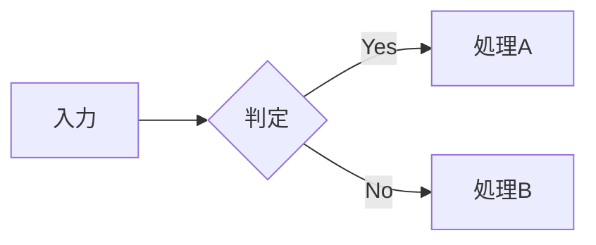

# 画像と図版

:::{.chapter-lead}
技術書の紙面では、スクリーンショットや写真を本文と並べたり、手順の要所に印を付けたり、仕組みを図で示したりする場面が多くあります。本章では、画像の大きさと配置・キャプションと図番号・複数の画像の並べ方を説明し、続いてスクリーンショットへの注釈・SVG による作図・mermaid によるダイアグラムを扱います。作りたい紙面に応じて、必要な節から読んでください。
:::

## 画像レイアウト @image-layout

画像ファイルは、章ごとに `images/<章のファイル名>/` へ置きます（`23-figures.md` なら `images/23-figures/`）。原稿にはファイル名だけを書けば、ビルド時にその章のディレクトリから探します。ほかの章の画像を使うときは、`images/11-workflow/logo.webp` のように `images/` から書きます。画像ディレクトリは `vs create` で章を作ると一緒に作られます。

### `{width=… align=…}` — 画像の幅と配置を指定する

画像記法の末尾に `{}` を添えると、画像の幅と配置、枠の有無を指定できます。原画像そのものを加工せず、紙面上での見せ方だけを調整できます。幅は本文の幅に対する `%` のほか、`40mm` や `4em` のような単位つきの長さでも書けます。配置は `left`・`center`・`right` のいずれかで、どちらか一方だけでも書けます。

```markdown
{width=30% align=left}
{width=50%}
{align=right}
```

たとえば次のように、幅 50%・中央寄せで配置してみます。{.aki}

```markdown
{width=50% align=center}
```

表示結果は次のようになります。{.aki}

{width=50% align=center}

#### 文中に置いた画像の幅を決める

段落の途中や、箇条書き・表の中に置いた画像にも `width` が効きます。アイコンのような小さな画像を文字と並べるときは、`em`（本文の文字 1 字分）で指定すると、文字の大きさにそろえやすくなります。

```markdown
設定画面は、歯車のアイコン {width=1em} から開きます。
```

`%` は、その画像を含む段落（表の中ならセル）の幅に対する割合です。幅を指定しないと、画像は元の大きさのまま置かれ、大きな画像は本文の幅いっぱいに広がります。

#### `border` — 画像の枠を外す・付ける

段落に単独で置いた画像には、キャプションの有無を問わず、既定で細い枠が付きます。白背景のスクリーンショットや図版が、紙面の余白に溶けて輪郭を失わないようにするためです。ロゴや透過画像のように枠が邪魔なときは、`border=off` で外します。

```markdown
{width=30% border=off}
```

文中に置いた画像には枠が付きません。付けたいときは `border=on` と書きます。枠の色は、`stylesheets/custom.css` で `--color-figure-border`（既定 `#ccc`）を上書きすると変えられます。

### `** タイトル **` — キャプションと図番号を付ける

画像の直前に `** タイトル **` という独立した行を置くと、その行が画像のキャプションとして表示されます。行頭と行末の `**` は太字ではなく、画像へ結び付くキャプションを示します。

```markdown
** アインシュタインの肖像 **
{width=40% align=center}
```

表示結果は次のようになります。{.aki}

** アインシュタインの肖像 **
{width=40% align=center}

さらにタイトルの末尾に `@ラベルID` を付けると、「**図 2-1: アインシュタインの肖像**」のように章番号付きの**図番号**が自動で割り振られ、本文中から `@ラベルID` で参照できるようになります。

```markdown
** アインシュタインの肖像 @einstein-portrait **
{width=40% align=center}
```

表示結果は次のようになります（図番号が自動で付きます）。{.aki}

** アインシュタインの肖像 @einstein-portrait **
{width=40% align=center}

図番号は表・リストにも同じ要領で付けられます。たとえば上で定義した図は、本文から参照すると @einstein-portrait のように図番号付きのリンクへ展開されます。自動ID・参照の書き方・重複チェックなど詳しい仕組みは @chapref:ch-cross-reference で解説します。

### `.pictures` — 写真グリッド

同じまとまりとして見せたい複数の画像を、グリッド状に並べます。画像数に応じて列数が調整されるため、個々の幅を指定せずに写真一覧を構成できます。

```markdown
:::{.pictures}


:::
```

表示結果は次のようになります。{.aki}

:::{.pictures}


:::

### `.image-group` — 2 枚を横に並べる

2枚の画像を横に並べます。最初の画像に `{width=30%}` を指定すると比率を調整できます。

```markdown
:::{.image-group}
{width=30%}

:::
```

表示結果は次のようになります。{.aki}

:::{.image-group}
{width=30%}

:::

### `.img-text` / `.text-img` — 画像＋本文の横並び

画像と本文を二列に分けて横へ並べます。画像を先に置くか本文を先に置くか、どちらを広く取るかに応じて、次のクラスを使い分けます。

| クラス名 | 左 | 右 | 列比率 |
|---|:---:|:---:|:---:|
| `.img-text`  | 画像 | 本文 | 1:1 |
| `.img-text2` | 画像 | 本文 | 1:2 |
| `.img-text3` | 画像 | 本文 | 1:3 |
| `.text-img`  | 本文 | 画像 | 1:1 |
| `.text2-img` | 本文 | 画像 | 2:1 |
| `.text3-img` | 本文 | 画像 | 3:1 |

```markdown
:::{.img-text2}


アルベルト・アインシュタインは、特殊相対性理論と一般相対性理論を提唱した物理学者です。`.img-text2` では画像と本文が 1:2 の比率で並びます。
:::
```

表示結果は次のようになります。{.aki}

:::{.img-text2}


アルベルト・アインシュタインは、特殊相対性理論と一般相対性理論を提唱した物理学者です。`.img-text2` では画像と本文が 1:2 の比率で並びます。
:::

### `.sideimage-right` / `.sideimage-left` — サイドイメージ

本文の横に画像を置き、本文を回り込ませます。`.sideimage-right` は画像を右、`.sideimage-left` は画像を左に置きます（`.sideimage` と書いても `.sideimage-left` と同じです）。画像の `{width=NN%}` で、画像側の幅の割合を調整できます。

```markdown
:::{.sideimage-right}
アルベルト・アインシュタインは、特殊相対性理論と一般相対性理論を提唱したことで知られる物理学者です。本文はこのように画像の左側へ回り込みます。`.sideimage-right` では画像が右側に配置されます。

{width=30%}
:::
```

表示結果は次のようになります。{.aki}

:::{.sideimage-right}
アルベルト・アインシュタインは、特殊相対性理論と一般相対性理論を提唱したことで知られる物理学者です。本文はこのように画像の左側へ回り込みます。`.sideimage-right` では画像が右側に配置されます。

{width=30%}
:::

### `.gap-s` / `.gap-m` / `.gap-l` — 画像と本文の間隔を変える

`.img-text` などの横並びのクラスに併記すると、画像と本文の間隔を変えられます。

```markdown
:::{.img-text .gap-s}


小さな余白（0.5rem）で配置
:::

:::{.img-text .gap-m}


標準の余白（1rem）で配置
:::

:::{.img-text .gap-l}


大きな余白（1.5rem）で配置
:::
```

表示結果は次のようになります（余白が段階的に広がります）。{.aki}

:::{.img-text .gap-s}


小さな余白（0.5rem）で配置
:::

:::{.img-text .gap-m}


標準の余白（1rem）で配置
:::

:::{.img-text .gap-l}


大きな余白（1.5rem）で配置
:::

## 書籍紹介カード

### `.book-card` — 参考書籍カード

参考文献や、本文とあわせて紹介したい書籍をカード形式で表示します。表紙画像を左、書名と説明を右に並べることで、通常の文献一覧よりも書籍の特徴を伝えやすくなります。

```markdown
:::{.book-card}

**はじめての技術書づくり**
はじめて技術書を書く方にお勧め。電子書籍執筆システム Vivlio Starter の実践ガイドです。
:::
```

表示結果は次のようになります。{.aki}

:::{.book-card}

**はじめての技術書づくり**
はじめて技術書を書く方にお勧め。電子書籍執筆システム Vivlio Starter の実践ガイドです。
:::

## 図解注釈の方法 @showcase-howto

操作手順のスクリーンショットでは、ボタンを枠で囲む、矢印で指す、丸数字を本文と対応させるといった注釈が必要になります。画像編集ソフトで直接描き込む方法では、位置を少し直すだけでも元データを開き、画像を書き出し直します。原稿と注釈が別々のファイルに分かれるため、変更の経緯も追いにくくなります。

`:::{.showcase}` を使うと、こうした注釈を**原稿の中へ文字として記述できます**。元画像は変更せず、注釈の種類・位置・大きさを数値で管理します。原稿と一緒に差分を記録でき、位置の修正も数値を書き換えるだけで反映できます。

### 基本の書き方

`:::{.showcase}` ブロックの中に、**画像を 1 枚**と、**注釈行**を並べます。

```markdown
:::{.showcase}

# 行頭が # の行はコメントです（出力されません）
rect:1 530, 335, 175, 165 {pos=bottom} 愛用のバイオリン
pointer:2 490, 130 {label="白髪"} くしゃくしゃの白髪
:::
```

表示結果は次のようになります。{.aki}

:::{.showcase}

rect:1 530, 335, 175, 165 {pos=bottom} 愛用のバイオリン
pointer:2 490, 130 {label="白髪"} くしゃくしゃの白髪
:::

注釈行は、次の四つの部分をスペースで区切って書きます。

| 部分 | 例 | 意味 |
|---|---|---|
| コマンドと番号 | `rect:1` | 何を描くか。`:1` が丸数字の番号 |
| 座標 | `530, 335, 175, 165` | どこに描くか。カンマ区切り |
| オプション | `{pos=bottom}` | どう描くか。省略可 |
| 著者コメント | `愛用のバイオリン` | **画像には表示されません** |

<!-- no-lint -->
最後の著者コメントには、各注釈が何を示すのかを書きます。紙面上には表示されませんが、「① 愛用のバイオリン ② くしゃくしゃの白髪」のようにまとめられ、画像の `alt` 属性（代替テキスト）へ入ります。原稿を直すときの手がかりになるとともに、読み上げソフトや画像を表示できない環境にも注釈の意味を伝えられます。

### 座標はパーミルで指定する

座標は画像のピクセル数ではなく、**画像の左上を (0, 0)、右下を (1000, 1000) とする千分率（パーミル）**で指定します。横方向は幅の千分率、縦方向は高さの千分率です。


画像の縦横比が同じであれば、高解像度版へ差し替えたり、ビルド時に画像を最適化したりしても、注釈は同じ相対位置に置かれます。

とはいえ、画面上で位置を測るときに得られるのはピクセル値です。そこで**`px` を付ければ実測ピクセルでも書けます**。ビルド時に自動でパーミルへ換算されるので、電卓を叩く必要はありません。

```markdown
# どちらでも同じ場所を指す（元画像が 1280 × 768px の場合）
rect:1 530, 335, 175, 165
rect:1 678px, 257px, 224px, 127px
```

:::{.tip}
最初は画面上で測った `px` を使い、配置が決まってからパーミルへ直すと、計算と調整を分けられます。画像を差し替える予定がなければ、`px` のまま残しても構いません。
:::

### `rect` — 対象を枠で囲む

`rect` は、指定した座標から幅・高さの分だけ枠を描きます。

```markdown
rect:[番号] [X], [Y], [幅], [高さ] {オプション} 著者コメント
```

丸数字を枠のどこに置くかは `pos` で決めます。省略すると `left`（枠の左辺）です。

| 指定 | 丸数字の位置 |
|---|---|
| `pos=left` | 枠の左辺の中点（既定） |
| `pos=right` | 枠の右辺の中点 |
| `pos=top` | 枠の上辺の中点 |
| `pos=bottom` | 枠の下辺の中点 |
| `pos=center` | 枠の内部中央 |

枠線は `border` で、塗りつぶしは `background` で変えられます。`border` は CSS と同じ「太さ・線種・色」の書き方で、線種は `solid` / `dashed` / `dotted` が使えます。

```markdown
:::{.showcase}

rect:1 530, 335, 175, 165 {pos=right}
rect:2 725, 545, 220, 150 {pos=center border="3 dashed #1c7ed6" background="rgba(28,126,214,0.15)"}
:::
```

表示結果は次のようになります。{.aki}

:::{.showcase}

rect:1 530, 335, 175, 165 {pos=right}
rect:2 725, 545, 220, 150 {pos=center border="3 dashed #1c7ed6" background="rgba(28,126,214,0.15)"}
:::

### `pointer` — 対象を指し示す

`pointer` は、ホームベース型の記号の先端で一点を示します。ボタン・アイコン・小さな部品など、枠で囲むほどの広がりがない対象に向いています。

```markdown
pointer:[番号] [X], [Y] {オプション} 著者コメント
```

座標には、記号の左上ではなく、**矢印の先端を置く点**を指定します。記号本体は `dir` の向きに応じて、先端の反対側へ伸びます。ボタンや文字を隠さないよう、対象の中心ではなく**外周**へ先端を置くと読みやすくなります。

| 指定 | 向き | 本体が伸びる方向 |
|---|---|---|
| `dir=right` | ▶ 右向き（既定） | 先端の左側 |
| `dir=left` | ◀ 左向き | 先端の右側 |
| `dir=up` | ▲ 上向き | 先端の下側 |
| `dir=down` | ▼ 下向き | 先端の上側 |

`label` を付けると、本体の中に短い文字を埋め込めます。`:番号` を省略すればラベルだけになり、丸数字は描かれません。

```markdown
:::{.showcase}

# 番号とラベルの両方（既定の右向き。本体は先端の左へ伸びる）
pointer:1 490, 130 {label="白髪"}
# 下向き（本体は先端の上へ伸びる）
pointer:2 672, 225 {dir=down label="弓"}
# 番号を省略＝ラベルのみ（左向き。本体は先端の右へ伸びる）
pointer 805, 440 {dir=left label="糸巻き"}
:::
```

表示結果は次のようになります。{.aki}

:::{.showcase}

pointer:1 490, 130 {label="白髪"}
pointer:2 672, 225 {dir=down label="弓"}
pointer 805, 440 {dir=left label="糸巻き"}
:::

### `crop` — 画像の周囲を切り落とす

<!-- no-lint -->
画像の余分な周囲は、画像属性の `crop` で削げます。値は CSS と同じ「上・右・下・左」の時計回りで、1 つ（四辺共通）・2 つ（上下／左右）・3 つ（上／左右／下）・4 つのいずれかで書きます。段落に単独で置いた画像でも、`:::{.showcase}` の中の画像でも使えます（文中に置いた画像には効きません）。単独の画像では、キャプションと図番号・`align`・`border`・`width` もそのまま効きます。

```markdown
# 上下左右を均等に
{crop="50"}

# 上下 30、左右 100
{crop="30 100"}

# 上 30 / 左右 100 / 下 60
{crop="30 100 60"}

# 上 30 / 右 250 / 下 60 / 左 100（px でも可）
{crop="30 250 60 100"}
```

`crop` を指定しても、**座標の基準は切り落とす前の元画像のままです**。変わるのは表示する範囲だけで、注釈の座標系は移動しません。注釈を書いた後から切り抜く範囲を加えたり調整したりしても、注釈の座標はそのまま使えます。

```markdown
:::{.showcase}
{crop="30 250 60 100"}
# crop を足しても座標はそのまま（元画像基準のため）
rect:1 530, 335, 175, 165 {pos=bottom} 愛用のバイオリン
:::
```

表示結果は次のようになります（右側の書棚と机が窓の外へ出ます）。{.aki}

:::{.showcase}
{crop="30 250 60 100"}
rect:1 530, 335, 175, 165 {pos=bottom} 愛用のバイオリン
:::

### オプション一覧

`{}` の中には、次のキーをスペース区切りで並べられます。値に空白を含めたいときは `border="3 dashed blue"` のように二重引用符で囲みます。

| キー | 対象 | 説明（かっこ内は既定値） |
|---|---|---|
| `pos` | rect | 丸数字を枠のどこに置くか（`left`） |
| `dir` | pointer | 矢印の向き（`right`） |
| `label` | pointer | 本体に埋め込む文字（なし） |
| `border` | rect | 枠線の太さ・線種・色（`3 solid #ff3b30`） |
| `background` | rect / pointer | 塗りの色（rect は `transparent`、pointer は `#ff3b30`） |
| `color` | 共通 | 数字・ラベルの文字色（rect は濃色、pointer は `white`） |
| `font-size` | 共通 | 文字の大きさ（数字 28 / ラベル 30） |

画像側の属性は `width`（既定 `100%`）と `crop` の二つです。

普通の画像と同じく、`:::{.showcase}` の直前の行に `** タイトル @ラベルID **` を置くと、キャプションと図番号が付き、本文から `@ラベルID` で参照できます。

### PDF・EPUB・Kindle での見え方

`:::{.showcase}` は、ビルド時に「元画像＋注釈を焼き込んだ 1 枚の画像」に変換されます。枠も矢印も丸数字も画像の中に入るため、**PDF でも EPUB でも Kindle でも同じ見た目**になります。PDF では注釈がベクタのまま印刷解像度で出ます。

電子書籍向けの画像形式は自動で選ばれます。スクリーンショットのように平坦な色の画像は文字がにじまない PNG で、写真のように色数の多い画像はファイルが太らない JPEG で書き出されます。著者が指定することはありません。

:::{.memo}
図解注釈の合成には ImageMagick と librsvg が必要です。未導入の環境では**注釈なしの通常画像として出力**され、ビルドが止まることはありません（そのときは警告でお知らせします）。`vs doctor --fix` で導入できます。
:::

## 自分で図版を描く（SVG）

座標系の模式図、構造の対応表、値の推移など、スクリーンショットでは用意できない図は、著者が作図します。その形式には **SVG を使います**。PNG のようなラスター画像と異なり、拡大しても線や文字の輪郭を保てます。図形や文字を数値で記述するため、後から位置や内容を修正しやすいことも、技術書の図版に適しています。

Vivlio Starter は SVG をベクター形式のまま PDF と EPUB へ収録します。図中の文字も画像へ変換せず、**書籍と同じ書体で組みます**。`<text>` に含まれる文字は、ビルド時に必要な分だけフォントから取り出され、SVG 自体へ埋め込まれます。そのため、読者の環境に同じフォントがなくても、図の字形を保てます。

:::{.note}
Kindle だけは事情が異なります。KFX 形式は SVG を扱えないため、ビルド時に JPEG へ変換されます。この変換では、ビルド環境で利用できる書体が図中の文字に使われます。書籍に設定した書体での表示を確認する場合は、PDF または EPUB を参照してください。
:::

### SVG 図版の雛形

次のコードは、SVG 図版を作成するときの雛形です。新しいファイルへコピーし、図形やテキストを置き換えて利用できます。作図ソフトやコード生成ツールを使う場合も、寸法・書体・配色を整えるための参考にしてください。

```svg
<svg xmlns="http://www.w3.org/2000/svg"
     width="100%" viewBox="0 0 640 400" role="img">
  <!-- 幅は全幅 640 か半幅 320 の二択。1 単位 = 0.25mm。
       縦は中身の高さで決め、上下の余白は 12（3mm）。 -->
  <title>図の内容を一文で。本文の alt と逐語一致させる</title>
  <style>
    /* 字 ------------------------------------- */
    text   { font-family: "Zen Kaku Gothic New", sans-serif; }
    .label { font-size: 14px; fill: #1a1a1a; }  /* 本文相当 */
    .note  { font-size: 12px; fill: #993c1d; }  /* 注記 */
    .title { font-size: 17px; font-weight: 700;
             fill: #1a1a1a; }                   /* 図の題 */

    /* 線 ------------------------------------- */
    .rule  { stroke: #1a1a1a; stroke-width: 2; fill: none; }
    .frame { stroke: #9aa0a6; stroke-width: 1; fill: none; }
    /* 背景の目盛 */
    .guide { stroke: #9aa0a6; stroke-width: 1; fill: none;
             stroke-dasharray: 4 4; }

    /* 面 ------------------------------------- */
    .plate     { fill: #ffffff; }  /* 線の上に重ねる面 */
    .area      { fill: #4e7ca1; }  /* 値の大きさを表す面 */
    .area-pale { fill: #c9d3da; }  /* 背景側の領域 */

    /* 強調 ----------------------------------- */
    .mark  { stroke: #993c1d; stroke-width: 2.5; fill: none; }
    .alert { stroke: #74202c; stroke-width: 3.5; fill: none; }
    .mark-text { font-size: 14px; font-weight: 700;
                 fill: #993c1d; }

    /* 系列。明るさと線種の両方で分ける ------- */
    .s1 { stroke: #22496b; stroke-width: 2.5; fill: none; }
    .s2 { stroke: #4e7ca1; stroke-width: 2.5; fill: none;
          stroke-dasharray: 10 5; }
    .s3 { stroke: #8fb0c8; stroke-width: 2.5; fill: none;
          stroke-dasharray: 2 4; stroke-linecap: round; }
    .s4 { stroke: #6e97b5; stroke-width: 2.5; fill: none;
          stroke-dasharray: 12 4 2 4; }
  </style>

  <text class="label" x="20" y="40">ラベル</text>
</svg>
```

#### 寸法は「4 = 1mm」で決める

`viewBox` の数値は、単独では実寸を表しません。紙面上の大きさを決めるのは、**viewBox の幅と font-size の比**です。そこで「4 単位 = 1mm」と決め、判型に合わせて viewBox の幅を設定すると、その後の座標や寸法をミリメートルへ読み替えながら設計できます。

| プリセット | 判型 | 版面幅 | viewBox の幅 |
| :--- | :--- | ---: | ---: |
| `a5_*` | A5 | 108mm | 432 |
| `b5_*` | JIS B5 | 137mm | 548 |
| `a4_*` | A4 | 162mm | 640 |

この換算で、よく使う値は次のようになります。

| 用途 | 単位 | 実寸 | ポイント |
| :--- | ---: | ---: | ---: |
| 図の題 | 17 | 4.25mm | 約 12pt |
| 本文相当のラベル | 14 | 3.5mm | 約 10pt |
| 目盛・注記 | 12 | 3.0mm | 約 8.5pt |
| 構造線 | 2 | 0.5mm | 約 1.4pt |
| 補助線 | 1 | 0.25mm | 約 0.7pt |

:::{.tip}
**ルートの `<svg>` に `width="100%"` を必ず書いてください。** 画像の CSS は `max-inline-size: 100%` で、これは上限であって指定幅ではありません。`viewBox` しか持たない SVG は本来の寸法を持たないため、ブラウザ既定の 300px（約 79mm）で組まれ、「160mm のつもりが半分の大きさで出る」ことになります。
:::

図を半分の幅で置くときは、原稿側で幅を絞ったうえで viewBox の幅も半分にします。原稿の指定を忘れると `width="100%"` が版面全幅に効いて、文字が倍の大きさで出ます。

```markdown
{width=50%}
```

#### 書体は書籍のものを名指しする

`font-family` には `book.yml` の書体名をそのまま書いてください。`typography.heading.font` の値（既定は `Zen Kaku Gothic New`）が図のラベルに、`typography.body.font` が地の文相当に対応します。

`sans-serif` のような汎用名しか書かなかった場合も、ビルドが書籍の書体へ置き換えます。`sans-serif` は見出し書体、`serif` は本文書体、`monospace` はコード書体です。ただし**名指ししたほうが意図は残る**ので、迷ったら書いてください。

**太字は使えます。** Regular と Bold の両方が埋め込まれるので、`font-weight: 700` を指定しても紙面で細く出たり、にじんだ疑似太字になったりしません。

:::{.notice}
**外部フォントを参照する書き方は効きません。** `@import` も、相対パスの `@font-face` も、図の中では必ず失敗します。`` から参照される SVG は独立した文書として扱われ、外のファイルを読めないためです。書体は名前で指定するだけにしてください。実体はビルドが埋め込みます。
:::

#### 白黒印刷でも読めるようにする

技術書の多くは本文が白黒印刷です。**色の違いは、印刷されると明るさの違いだけになります。**

雛形の色を明るさ（0〜255 のグレー値）に直すと、次のように並びます。

| クラス | 色 | グレー値 |
| :--- | :--- | ---: |
| `.label` / `.title` | `#1a1a1a` | 32 |
| `.alert` | `#74202c` | 65 |
| `.s1` | `#22496b` | 72 |
| `.note` / `.mark` / `.mark-text` | `#993c1d` | 90 |
| `.s2` / `.area` | `#4e7ca1` | 119 |
| `.s4` | `#6e97b5` | 145 |
| `.guide` / `.frame` | `#9aa0a6` | 158 |
| `.s3` | `#8fb0c8` | 170 |
| `.area-pale` | `#c9d3da` | 208 |

系列は同じ色相の明度差で作ってあるので、白黒でも順序が保たれます。ただし**明るさだけに頼れない組み合わせが三つ**あります。`.alert`（65）と `.s1`（72）、`.s4`（145）と `.guide`（158）、`.guide`（158）と `.s3`（170）です。いずれも差が小さく、白黒ではほぼ同じ濃さに見えます。

系列を四つ並べると、明度の刻みはさらに詰まります。そこで**線種と太さという二つ目の手がかり**を足してあります。色が失われても、線の見た目で区別がつきます。

| クラス | 線種 | 実寸 |
| :--- | :--- | :--- |
| `.s1` | 実線 | — |
| `.s2` | 破線 | 2.5mm 描いて 1.25mm あける |
| `.s3` | 点線 | 0.5mm 描いて 1mm あける |
| `.s4` | 一点鎖線 | 3mm・1mm・0.5mm・1mm の繰り返し |
| `.guide` | 細い破線 | 1mm 描いて 1mm あける |
| `.frame` | 細い実線 | — |
| `.alert` | 太い実線 | 他の線より 1mm 太い |

:::{.memo}
系列名を線の終端へ直接置ける図では、凡例よりも直接ラベルが適しています。凡例を使うと、読者は線の見た目と名前を行き来して照合します。線の色が白黒印刷で近くなるほど、この照合は難しくなります。線の近くに名前を置けば、その対応を図の中で直接読めます。
:::

`.s3`（170）と `.area-pale`（208）は白地の上では薄く、細い線にすると印刷で飛びます。この二つは**面か太い線にだけ**使ってください。線の上に文字を重ねるときは、`.plate`（白）を下に敷くと読めます。

作図後は PDF を開き、プレビューや印刷ダイアログで白黒表示を確認します。区別しにくい線があれば、色の差を広げるだけでなく、実線・破線・点線など線種にも違いを持たせます。

## ダイアグラム（mermaid）

### ` ```mermaid ` — フローチャート・シーケンス図など

[mermaid](https://mermaid.js.org/)のコードフェンスで記述した図は、ビルド時に画像へ変換されます。標準の mermaid 記法をそのまま使い、Vivlio Starter 独自の書き方は加えていません。**PDF にはベクター形式、EPUB・Kindle にはラスター形式**で収録されます。フローチャートやシーケンス図など、要素の関係で構成される図をテキストとして管理できます。

言語名に `mermaid` を指定したコードフェンスに、mermaid の図ソースを書きます。

````markdown

````

上のように書くと、次の図が出力されます。


@ch-markdown-tutorial の章にあるフレーバー系統図も、この mermaid 記法で描いています。

### 使える図の種類

`mmdc` が対応する範囲の全ダイアグラム種別を受け付けます（flowchart / sequenceDiagram / classDiagram / stateDiagram / erDiagram / gantt / pie など）。図ソースの 1 行目に種別を書きます。各図の記法と例は、[Mermaid ドキュメント日本語訳の「ダイアグラム構文」](https://mermaid.dokyumento.jp/intro/syntax-reference.html)を参照してください。最新の仕様は、[公式ドキュメントの「Diagram Syntax」](https://mermaid.js.org/intro/syntax-reference.html)で確認できます。

### 見た目の調整

図中テキストのフォントは**本書の設定に自動で従います**（`config/book.yml` の見出しフォント）。図だけに特殊なフォントを使うことはできません。テーマ色はライトで固定です。曲線の形など mermaid 固有の見た目は、図ソース側の `%%{init: {'flowchart': {'curve': 'stepBefore'}}}%%` で著者が制御します（Vivlio Starter は関与しません）。

:::{.memo}
mermaid の描画には `mmdc`（`@mermaid-js/mermaid-cli`）が必要です。未導入の環境では `mermaid` は**コードブロックのまま出力**され、ビルドが止まることはありません（そのときは警告でお知らせします）。`vs doctor --fix` で導入できます。図 1 枚ごとに Chromium の起動コストがかかりますが、生成物がキャッシュされるため、再ビルドは高速です。
:::
