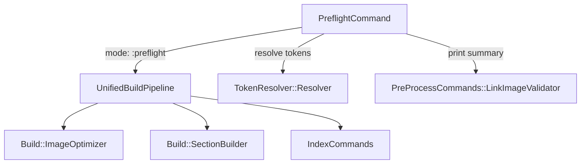

# vs preflight — 統合仕様書

## 概要

`vs preflight` は、`vs build`（約600秒）の前に原稿のエラーチェックだけを約6秒で行う高速チェックコマンドである。
PDF生成を伴わず、Step 1〜4（画像最適化・テーマ画像準備・Markdown前処理・索引スキャン）のみを実行する。

### 設計方針

専用パイプラインクラスを新設するのではなく、既存の `UnifiedBuildPipeline` に `mode: :preflight` を追加する。
これにより：

- `pipeline.rb` に `register_preflight_steps` を1メソッド追加するだけで実現できる
- build 側の Step 1〜4 の変更が preflight に自動追従する
- 専用パイプラインクラスが不要で、重複実装を避けられる

### 実行ステップ

```
Step 1: 画像最適化（--no-resize でスキップ）
Step 2: テーマ画像準備
Step 3: Markdown前処理（preprocess_sections!）
Step 4: 索引スキャン（index_enabled? の場合のみ）
```

Step 0（クリーン）・Step 5 以降（HTML変換・PDF生成）は実行しない。
中間生成物のクリーンアップも実行しない。

---

## 用語集

| 用語 | 説明 |
|---|---|
| **Preflight** | 飛行前点検に由来。ビルド前の原稿チェックを指す。 |
| **PreflightCommand** | Samovar CLI の `preflight` コマンド実装クラス。 |
| **Entry** | `TokenResolver::Entry` オブジェクト。章ファイルの情報を保持する。 |
| **Resolver** | `TokenResolver::Resolver` オブジェクト。章トークンを Entry に解決する。 |
| **Step 1** | 画像最適化（`Build::ImageOptimizer.optimize_images!`）。 |
| **Step 2** | テーマ画像準備（`Build::ImageOptimizer.prepare_theme_images!`）。 |
| **Step 3** | Markdown前処理（`Build::SectionBuilder.preprocess_sections!`）。 |
| **Step 4** | 索引スキャン（`IndexCommands.process_index_for_build!`）。 |
| **⚠️ 警告** | ビルドを継続できるが注意が必要な問題（画像不在、未定義クロスリファレンスなど）。 |
| **❌ エラー** | ビルドに影響する重大な問題（コードインクルードファイル不在、QueryStream展開エラーなど）。 |

---

## アーキテクチャ

```
bin/vs
  └─ CLI.start(argv)
       └─ RootCommand#call
            └─ PreflightCommand#call
                 ├─ TokenResolver::Resolver#resolve(targets)  # 章トークン解決
                 └─ UnifiedBuildPipeline.new(self, entries:, mode: :preflight)
                      └─ register_preflight_steps
                           ├─ Step 1: Build::ImageOptimizer.optimize_images!
                           ├─ Step 2: Build::ImageOptimizer.prepare_theme_images!
                           ├─ Step 3: Build::SectionBuilder.preprocess_sections!(entries)
                           └─ Step 4: IndexCommands.process_index_for_build!
```

### コンポーネント間の依存関係



---

## ファイル構成

### 新規ファイル

| ファイル | 役割 |
|---|---|
| `lib/vivlio/starter/cli/samovar/preflight_command.rb` | PreflightCommand（Samovar CLI） |

### 変更ファイル

| ファイル | 変更内容 |
|---|---|
| `lib/vivlio/starter/cli/build/pipeline.rb` | `register_steps` にパターンマッチ追加、`register_preflight_steps` メソッド追加 |
| `lib/vivlio/starter/cli/loader.rb` | `require_relative 'preflight'` 追加（不要なら省略） |
| `lib/vivlio/starter/cli/samovar.rb` | `require_relative 'samovar/preflight_command'` 追加 |
| `lib/vivlio/starter/cli/samovar/root_command.rb` | `public_commands` に `'preflight'` 追加 |
| `lib/vivlio/starter/cli/samovar/help_command.rb` | preflight をヘルプ一覧に追加 |

---

## インターフェース

### PreflightCommand

```ruby
class PreflightCommand < Samovar::Command
  self.description = 'ビルド前の原稿エラーチェックを高速実行します（Step 1〜4 のみ）'

  many :targets, 'チェック対象（章番号 / 範囲 / スラッグ）', default: []

  options do
    option '--[no]-resize', '画像最適化を行う（--no-resize で無効）', default: true, key: :resize
    option '--log <level>', 'ログレベルを指定（error/warn/info/debug）', key: :log_level
    option '-h/--help', 'このコマンドの使い方を表示', key: :help
  end

  def call
    # --help 表示
    # LinkImageValidator リセット
    # TokenResolver で entries 解決
    # UnifiedBuildPipeline.new(self, entries:, mode: :preflight).run
    # サマリー表示
    # エラーあり → 1、警告のみ → 0
  end
end
```

### UnifiedBuildPipeline の変更

```ruby
def register_steps
  case mode
  in :single    then register_single_mode_steps
  in :preflight then register_preflight_steps
  in _          then register_full_mode_steps
  end
end

def register_preflight_steps
  [
    ['Step  1 (optimize images)',      -> { run_step1_optimize_images }],
    ['Step  2 (prepare theme images)', -> { Build::ImageOptimizer.prepare_theme_images! }],
    ['Step  3 (preprocess sections)',  -> { Build::SectionBuilder.preprocess_sections!(entries) }],
    ['Step  4 (index scan and build)', -> { run_step4_index_processing }],
  ].each { |label, handler| add_step(label, handler) }
end
```

---

## データモデル

### 入出力

```
入力:
  targets: Array<String>   # 章トークン（空 = 全章）
  options[:resize]: Boolean
  options[:log_level]: String | nil

出力（標準出力）:
  各ステップのログ（Common.log_action / log_warn / log_error 経由）
  サマリー:
    ⚠️  警告: N 件
    ❌  エラー: N 件
    ⏱  経過時間: N.Ns

終了コード:
  0: エラーなし（警告のみ、または問題なし）
  1: エラー1件以上
```

### エラー・警告フォーマット

| 種別 | 記号 | フォーマット |
|---|---|---|
| 画像ファイル不在 | ⚠️ | `{ファイル名}:{行番号} - 画像 '{画像名}' が見つかりません` |
| コードインクルードファイル不在 | ❌ | `ファイルが見つかりません: {パス}` |
| QueryStream展開エラー | ❌ | `QueryStream 展開エラー: {詳細}` |
| クロスリファレンス未定義ラベル | ⚠️ | `{ファイル名}:{行番号} - 未定義のラベルID: {ラベル}` |

これらは既存の `Common.log_warn` / `Common.log_error` 経由で出力される。
`PreProcessCommands::LinkImageValidator` が画像検証を担い、サマリーは `LinkImageValidator.print_summary` を参考に実装する。

### エラーハンドリング

| エラー種別 | 対応 |
|---|---|
| 章トークンが catalog.yml に存在しない | `log_error` でメッセージを表示し、終了コード 1 で終了 |
| プロジェクト外での実行 | `Common.ensure_configured!` が例外を発生させ、RootCommand がハンドリング |
| ステップ実行中の例外 | `StandardError` をキャッチし、`log_error` で表示して終了コード 1 |
| `--log` オプションの不正値 | BuildCommand と同様に `normalize_log_option_tokens` で正規化 |

---

## Requirements

### Requirement 1: コマンド呼び出し形式

**User Story:** As a 著者, I want `vs preflight` を様々な引数形式で呼び出せる, so that 全体チェックと部分チェックを使い分けられる.

#### Acceptance Criteria

1. THE PreflightCommand SHALL `vs preflight` を引数なしで呼び出した場合、catalog.yml に登録された全章を対象としてチェックを実行する。
2. WHEN `vs preflight 0` が呼び出された場合、THE PreflightCommand SHALL `00-preface.md` を対象としてチェックを実行する。
3. WHEN `vs preflight 1-10` が呼び出された場合、THE PreflightCommand SHALL `01-xxx` から `10-xxx` の範囲に含まれる章を対象としてチェックを実行する。
4. WHEN `vs preflight install` が呼び出された場合、THE PreflightCommand SHALL slug `install` を含む章（例: `91-install.md`）を対象としてチェックを実行する。
5. WHEN `vs preflight --help` が呼び出された場合、THE PreflightCommand SHALL コマンドの使い方・引数・オプションを標準出力に表示して終了する。
6. THE PreflightCommand SHALL 章トークンの解釈を `TokenResolver::Resolver` に委譲し、`vs build` と同一のトークン解釈ロジックを使用する。

### Requirement 2: 実行ステップ

**User Story:** As a 著者, I want preflight が build の Step 1〜4 に相当する処理を実行する, so that PDF生成なしに原稿エラーを素早く検出できる.

#### Acceptance Criteria

1. THE PreflightPipeline SHALL Step 1（画像最適化）を実行する。ただし `--no-resize` オプションが指定された場合はスキップする。
2. THE PreflightPipeline SHALL Step 2（テーマ画像準備）を実行する。
3. THE PreflightPipeline SHALL Step 3（Markdown前処理）を対象章に対して実行する。前処理には frontmatter付加・画像パス修正・QueryStream展開・コードインクルード・クロスリファレンスが含まれる。
4. WHEN `index_glossary.enabled` が `true` の場合、THE PreflightPipeline SHALL Step 4（索引スキャン）を実行する。
5. THE PreflightPipeline SHALL Step 5以降（HTML変換・PDF生成）を実行しない。
6. THE PreflightPipeline SHALL 中間生成物（ルート直下の `.md` ファイル等）のクリーンアップを実行しない。

### Requirement 3: エラー・警告の検出と報告

**User Story:** As a 著者, I want preflight が原稿のエラーと警告を検出して報告する, so that build 前に問題を修正できる.

#### Acceptance Criteria

1. WHEN 画像ファイルが存在しない場合、THE PreflightPipeline SHALL `⚠️ {ファイル名}:{行番号} - 画像 '{画像名}' が見つかりません` の形式で警告を出力する。
2. WHEN コードインクルード対象ファイルが存在しない場合、THE PreflightPipeline SHALL `❌ ファイルが見つかりません: {パス}` の形式でエラーを出力する。
3. WHEN QueryStream展開でテンプレートまたはデータが見つからない場合、THE PreflightPipeline SHALL `❌ QueryStream 展開エラー: {詳細}` の形式でエラーを出力する。
4. WHEN クロスリファレンスで未定義ラベルが参照された場合、THE PreflightPipeline SHALL `⚠️ {ファイル名}:{行番号} - 未定義のラベルID: {ラベル}` の形式で警告を出力する。
5. THE PreflightPipeline SHALL 全ステップ完了後にサマリーを出力する。サマリーには警告件数・エラー件数・経過時間を含む。
6. WHEN エラーが1件以上検出された場合、THE PreflightCommand SHALL 終了コード 1 で終了する。
7. WHEN 警告のみ（エラーなし）の場合、THE PreflightCommand SHALL 終了コード 0 で終了する。

### Requirement 4: オプション

**User Story:** As a 著者, I want preflight に build と共通のオプションを指定できる, so that チェック条件を柔軟に制御できる.

#### Acceptance Criteria

1. THE PreflightCommand SHALL `--[no]-resize` オプションをサポートする。`--no-resize` 指定時は Step 1（画像最適化）をスキップする。デフォルトは `true`（実行する）。
2. THE PreflightCommand SHALL `--log <level>` オプションをサポートする。`error/warn/info/debug` を指定可能で、ログ出力レベルを制御する。
3. THE PreflightCommand SHALL `-h/--help` オプションをサポートする。指定時はヘルプを表示して終了する。

### Requirement 5: パフォーマンス

**User Story:** As a 著者, I want preflight が高速に完了する, so that 執筆中に頻繁に実行できる.

#### Acceptance Criteria

1. THE PreflightPipeline SHALL 全章チェック時に `Build::SectionBuilder` の並列処理（`parallel_each`）を使用する。
2. THE PreflightPipeline SHALL Step 5以降（HTML変換・Vivliostyle CLI呼び出し・PDF生成）を実行しないことで、`vs build` より大幅に短い実行時間を実現する。

### Requirement 6: CLI 統合

**User Story:** As a 著者, I want `vs preflight` が他の `vs` コマンドと同様に動作する, so that 一貫した操作体験を得られる.

#### Acceptance Criteria

1. THE PreflightCommand SHALL `Samovar::Command` を継承して実装される。
2. THE PreflightCommand SHALL `RootCommand` の `public_commands` に `'preflight'` として登録される。
3. THE PreflightCommand SHALL `vs --help` のコマンド一覧に表示される。
4. THE PreflightCommand SHALL プロジェクトルート（`config/book.yml` が存在するディレクトリ）以外では実行できない。プロジェクト外で実行した場合は適切なエラーメッセージを表示する。
5. THE PreflightCommand SHALL `loader.rb` に `require_relative 'preflight'` が追加されることで、他のコマンドと同様にロードされる。

### Requirement 7: 既存コマンドとの関係

**User Story:** As a 著者, I want preflight が既存コマンドと明確に区別される, so that 各コマンドの役割を混同しない.

#### Acceptance Criteria

1. THE PreflightCommand SHALL `vs lint`（textlintによる文章品質チェック）とは独立して動作し、相互に依存しない。
2. THE PreflightCommand SHALL `vs doctor`（環境診断）とは独立して動作し、相互に依存しない。
3. THE PreflightCommand SHALL `vs build` の Step 1〜4 と同等の処理を実行するが、`vs build` のコードを直接呼び出す形で実装し、重複実装を避ける。

---

## テスト戦略

### 方針

**デュアルテストアプローチ：**
- 例示テスト（unit tests）: 特定の入力・出力・オプション動作を確認
- プロパティテスト（property-based tests）: 普遍的な性質を多数の入力で検証

プロパティテストライブラリ: `propcheck`（最低 100 イテレーション）
タグ形式: `# Feature: vs-preflight, Property {N}: {property_text}`

### テストファイル配置

```
test/
  cli/
    samovar/
      preflight_command_test.rb   # 例示テスト
    build/
      preflight_pipeline_test.rb  # プロパティテスト
```

### 例示テスト

```
test_should_run_all_chapters_when_no_targets_given
test_should_resolve_chapter_number_token
test_should_resolve_range_token
test_should_skip_step1_when_no_resize
test_should_skip_step4_when_index_disabled
test_should_not_generate_html_or_pdf
test_should_register_in_public_commands
test_should_appear_in_help_output
test_should_print_help_with_help_option
```

### プロパティテスト

| # | Property | Validates |
|---|---|---|
| 1 | 全 Entry に対して `preprocess_sections!` が呼ばれる | Req 2.3 |
| 2 | 画像警告フォーマットが `/⚠️ .+:\d+ - 画像 '.+' が見つかりません/` にマッチ | Req 3.1 |
| 3 | コードインクルードエラーが `/❌ ファイルが見つかりません: .+/` にマッチ | Req 3.2 |
| 4 | QueryStream エラーが `/❌ QueryStream 展開エラー: .+/` にマッチ | Req 3.3 |
| 5 | クロスリファレンス警告が `/⚠️ .+:\d+ - 未定義のラベルID: .+/` にマッチ | Req 3.4 |
| 6 | サマリーが警告件数・エラー件数・経過時間の全てを含む | Req 3.5 |
| 7 | `exit_code == (error_count > 0 ? 1 : 0)` | Req 3.6, 3.7 |

---

## 実装タスク

- [x] 1. `UnifiedBuildPipeline` に preflight モードを追加する
  - `register_steps` を pattern matching に変更し、`in :preflight` ブランチを追加する
  - `register_preflight_steps` メソッドを追加し、Step 1〜4 のみを登録する
  - 対象ファイル: `lib/vivlio/starter/cli/build/pipeline.rb`

- [x] 2. `PreflightCommand` を新規作成する
  - [x] 2.1 `lib/vivlio/starter/cli/samovar/preflight_command.rb` を作成する
  - [ ]* 2.2 例示テストを書く（`test/cli/samovar/preflight_command_test.rb`）

- [x] 3. CLI に `PreflightCommand` を統合する
  - [x] 3.1 `lib/vivlio/starter/cli/samovar.rb` に require を追加する
  - [x] 3.2 `root_command.rb` の `public_commands` に `'preflight'` を追加する
  - [x] 3.3 `help_command.rb` の `COMMAND_CATEGORIES` に preflight を追加する
  - [x] 3.4 `loader.rb` に require を追加する

- [-] 4. チェックポイント — 全テストがパスすることを確認する

- [ ]* 5. プロパティテストを書く（`test/cli/build/preflight_pipeline_test.rb`）
  - [ ]* 5.1〜5.7 各 Property を実装する

- [ ] 6. `CHANGELOG.md` を更新する

> `*` 付きタスクはオプション。MVP 優先の場合はスキップ可。

---

## CHANGELOG エントリ

```markdown
### Added
- **`vs preflight` コマンドを実装**: `vs build`（約600秒）の前に原稿のエラーチェックだけを
  約6秒で行う高速チェックコマンド。Step 1〜4（画像最適化・テーマ画像準備・Markdown前処理・
  索引スキャン）のみを実行し、PDF生成を伴わない。画像不在・コードインクルードファイル不在・
  QueryStream展開エラー・クロスリファレンス未定義ラベルを検出して報告する。
```
