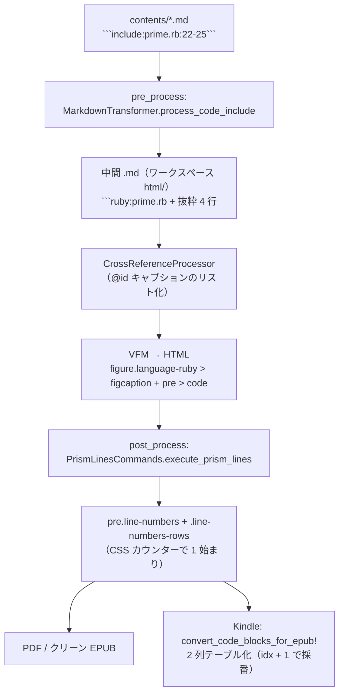

# コードインクルード範囲指定時の行番号を元ファイルの実行番号に合わせるための仕様書

> 作成日: 2026-07-08
> ステータス: **実装待ち**
> 対象: `` ```include:file.rb:22-25``` `` で範囲取り込みしたコードブロックの表示行番号
> 関連: `lib/vivlio_starter/cli/pre_process/markdown_transformer.rb`, `lib/vivlio_starter/cli/prism_lines.rb`, `lib/vivlio_starter/cli/build/epub_builder.rb`, `stylesheets/prism.css`, `stylesheets/code.css`, `stylesheets/page-settings.css`, `lib/vivlio_starter/cli/techbook/processor.rb`, `docs/specs/epub-code-line-numbers-spec.md`, `docs/archives/svg_luster_bugfix_technical_notes.md`

## 背景
現在は、`include:prime2.rb:22-25 `` のように範囲指定で取り込んだコードは、現状ハイライト表示の行番号が常に `1, 2, 3, 4` から振り直される。元ファイルでの実際の行番号（`22, 23, 24, 25`）を表示できれば、抜粋元との対応が取りやすい。`prism.css`（行番号プラグインの `counter-reset` / 開始値）を調整し、取り込み時に開始行番号を `<pre>` 等へ渡す仕組みを足す必要がある。

---

## 1. 現状の実装（調査結果・2026-07-08 時点）

行番号が確定するまでのパイプラインは次の 3 段階に分かれており、**開始行番号の情報は第 1 段階（pre_process）で消失する**。



### 1.1 pre_process: include 展開（開始行が消える場所）

- `lib/vivlio_starter/cli/pre_process/markdown_transformer.rb` の `process_code_include`。
- `` ```include:([^:`\s]+)(?::(\d+)-(\d+))?\s*``` `` を検出し、`extract_line_range(lines, start_line, end_line)` で抜粋したうえで、次の置換文字列を組み立てる:

  ```ruby
  replacement = "```#{language}:#{original_path}\n#{code_content}```"  # code_content は末尾に改行を含む
  ```

  → `start_line` はここで捨てられ、後段には伝わらない。
- 範囲指定の救済仕様（実装済み・変更しない）:
  - 終了行がファイル末尾超過 → 末尾へ**クランプ**して取り込み（警告ログ）。
  - 開始行がファイル末尾超過・逆順など救済不能 → **全文取り込みへフォールバック**（警告ログ）。
- コードブロック内・インラインコード内の include 記法（記法説明用の例文）はスキップされ展開されない。

### 1.2 VFM: フェンス情報文字列 → figure/figcaption

- 中間 .md の `` ```ruby:prime.rb `` は VFM により次の構造へ変換される（`stylesheets/code.css` のセレクタが前提とする構造）:

  ```html
  <figure class="language-ruby">
    <figcaption>prime.rb</figcaption>
    <pre class="language-ruby"><code class="language-ruby">…</code></pre>
  </figure>
  ```

  すなわち **`:` 以降の情報文字列は figcaption のテキストとして HTML まで届く**。これが pre_process → post_process へメタ情報を運べる唯一の既存チャネルである。

### 1.3 post_process: 行番号ガターの生成

- `lib/vivlio_starter/cli/post_process.rb` の `execute_post_process` から `PrismLinesCommands.execute_prism_lines(html_file)`（`lib/vivlio_starter/cli/prism_lines.rb`）が呼ばれる。
- `decorate_pre_tag(pre, document)` が**すべての `<pre>`** に `line-numbers` クラスを付け、行数ぶんの空 `<span>` を持つ `<span class="line-numbers-rows">` を `<code>` 末尾へ追加する。
- 番号の描画は `stylesheets/prism.css` の CSS カウンター:

  ```css
  pre[class*="language-"].line-numbers { counter-reset: linenumber; }   /* ← 常に 0 リセット */
  .line-numbers-rows > span { counter-increment: linenumber; }
  .line-numbers-rows > span:before { content: counter(linenumber); }
  ```

  → **常に 1 始まり**。開始値を変える手段が HTML 側に無い。

### 1.4 Kindle: テーブル化（もう 1 つの採番箇所）

- `lib/vivlio_starter/cli/build/epub_builder.rb` の `convert_code_blocks_for_epub!`（`flavor == :kindle` のときのみ）が `pre.line-numbers` を 2 列テーブル `table.vs-code-epub` に変換する。
- 採番は `build_code_table` 内の `idx + 1` で**ハードコードされた 1 始まり**。
- クリーン EPUB（Kobo/Apple Books）はテーブル化せず、PDF と同じ CSS カウンター方式のまま。

### 1.5 クロスリファレンスとの相互作用（設計上の制約）

- `lib/vivlio_starter/cli/pre_process/cross_reference_processor.rb` の `CaptionedBlockTransformer` は、include 展開**後**の中間 .md に対して動く。
- `find_block_start` は「キャプション行 `**… @id**` の直後、空行と `:::{` だけを飛ばした行」がフェンス開始であることを前提にする。**キャプションとフェンスの間に HTML コメント等の行を挿入するとリスト検出が壊れる**。
- 一方、`list_markdown` はフェンスブロックを行ごと verbatim コピーするため、**フェンス情報文字列に載せた情報はクロスリファレンス処理を安全に通過する**。
- → 開始行番号の伝搬は「`<!--marker-->` コメント方式」ではなく「**フェンス情報文字列（figcaption）方式**」を採用する（§2.2）。

### 1.6 付随バグ: `code.css` が未定義の `--code-font` を参照している

行番号とは独立だが、**同じ `stylesheets/code.css` を触るため本タスクで併せて直す**。

定義されているカスタムプロパティは `--font-code` ただ一つ（`stylesheets/page-settings.css:134`）で、`--code-font` は**どこにも定義がない**。にもかかわらず `code.css` は 3 箇所で `var(--code-font)` を参照する:

| 箇所 | 宣言 | 実際の帰結 |
|---|---|---|
| `code.css:5`（`code`） | `font-family: var(--code-font);` | フォールバック無しの未定義 `var()` は *invalid at computed-value time* となり、宣言は `unset` に落ちる。`font-family` は継承プロパティなので**親（本文の `--font-main-text` = 明朝）を継承する** |
| `code.css:20`（`pre, pre[class*="language-"]`） | `font-family: var(--code-font);` | 同上 |
| `code.css:193`（`body.vs-kindle table.vs-code-epub`） | `font-family: var(--code-font, monospace);` | フォールバックがあるので**総称 `monospace`** に落ちる（`HackGen35 Console NF` が効かない） |

被害の範囲は、`prism.css` が別セレクタで救っている分だけ狭い:

- `prism.css:14` の `code[class*="language-"]` は特異度 (0,1,1) で `code.css:4` の `code` (0,0,1) に勝つため、**ハイライト済みコードブロックの中身は正しく `--font-code` で組まれる**。
- `pre[class*="language-"]` は両者とも (0,1,1) で、`chapter.css` の import 順（`prism.css` → `code.css`）により **`code.css` が後勝ちして無効化される**。ただし文字は内側の `<code>` にあるので実害は出ていない。
- 実害が出るのは (a) **`language-*` クラスを持たない素のインライン `<code>`**（本文中の `` `book.yml` `` 等 → 明朝で組まれる）、(b) **Kindle のコードテーブル `table.vs-code-epub`**（総称 monospace）、(c) **`language-*` を持たない素の `<pre>`**。なお (c) の唯一の実例である `.terminal` の `<pre>` は `chapter-common.css` 側で `font-family: var(--font-code), monospace` を明示済み（`../archives/terminal-literal-spec.md`）。

この不具合は一度発見されているが、**Techbook モードの上書きレイヤでしか回避されていない**。`lib/vivlio_starter/cli/techbook/processor.rb:346` がビルド時に `:root { --code-font: var(--font-code); }` と `code, pre, code[class*="language-"], pre[class*="language-"] { font-family: var(--font-code), monospace !important; }` を生成 HTML の `<head>` へインライン `<style>` として注入する（経緯: `docs/archives/svg_luster_bugfix_technical_notes.md` §4.8 — Type 3 フォント混入対策の一環）。

分岐は「PDF 経路か EPUB 経路か」**ではなく**「`output.pdf.techbook` が `true` か `false` か」である点に注意する。`pipeline.rb:116` の `techbook post-process` ステップは**ターゲットに関わらず無条件に走り**（有効判定は `Techbook::Processor#enabled?` が内部で行う）、注入先の `html/` は **PDF も EPUB/Kindle も共有する原本**なので、`techbook: true` なら 4 ターゲットすべてにこの `<style>` が乗る。Kindle の `strip_webp_inline_styles_for_kindle!` は webp の `url()` を含む宣言だけを剥がすため、`--code-font: var(--font-code);` は Kindle でも残る（`test/vivlio_starter/cli/epub_builder_sanitize_test.rb:326` がこの挙動を固定している）。

| | `--code-font` の解決 |
|---|---|
| `techbook: true` | 全ターゲットで注入され**救われる** |
| `techbook: false`（コメント上の既定値） | **どのターゲットでも未定義のまま** |

本リポジトリの `config/book.yml:246` は `techbook: true` のため、この不具合は日常のビルドでは顕在化しない。`code.css` 本体を直せばモード差そのものが消える。

---

## 2. 要求仕様

### 2.1 機能要件

| # | 要件 |
|---|---|
| R1 | `` ```include:prime.rb:22-25``` `` で取り込んだコードは、PDF（通常/印刷用）で行番号 `22, 23, 24, 25` を表示する |
| R2 | 範囲指定なしの `` ```include:prime.rb``` `` は従来どおり `1` 始まり（出力 HTML の差分は data 属性以外に生じないこと） |
| R3 | 終了行クランプ時（例: 60 行のファイルに `55-70` 指定）は `55` 始まりで末尾行（60）まで表示する |
| R4 | 救済不能な範囲指定で全文フォールバックした場合は従来どおり `1` 始まり |
| R5 | Kindle（テーブル化方式）でも同じ開始行番号で採番する |
| R6 | クリーン EPUB（CSS カウンター方式のまま）でも同じ開始行番号で表示する |
| R7 | `@id` 付きキャプション（クロスリファレンス）と組み合わせた範囲 include でも R1〜R6 を満たす（`24-cross-reference.md` の実例が回帰テスト対象） |
| R8 | figcaption の**表示テキストは従来どおりパスのみ**（例: `prime.rb`）。開始行マーカーは post_process で除去する |
| R9 | include を使わず著者が直接 `` ```ruby:foo.rb#L5 `` と書いた場合も `5` 始まりになる（伝搬記法を公開仕様とする） |
| R10 | `stylesheets/code.css` の未定義カスタムプロパティ `var(--code-font)` を解消し、素のインライン `<code>` と Kindle のコードテーブルがコードフォントで組まれる（§1.6・§3.5） |

### 2.2 伝搬記法（フェンス情報文字列マーカー）

- `process_code_include` が生成するフェンス情報文字列を、範囲指定 include の場合のみ次へ変更する:

  ````
  ```ruby:prime.rb#L22-L25
  ````

  形式は GitHub パーマリンク風の `#L<開始行>-L<終了行>`。**終了行はクランプ後の実効値**を書く（60 行ファイルに 22-70 指定なら `#L22-L60`）。
- 消費側（post_process）が使うのは開始行のみ。終了行は中間 .md のデバッグ容易性と将来のキャプション範囲表示（§6）のために持たせる。
- 全文取り込み（範囲指定なし・全文フォールバック）ではマーカーを**付けない**。
- パース用正規表現（figcaption テキスト末尾に対して）: `/#L(\d+)(?:-L(\d+))?\z/`。パス自体に `#` が含まれる可能性は排除できないため、**必ず末尾アンカーで最後のマーカーのみ**を取り出す。

---

## 3. 実装設計

### 3.1 pre_process（`markdown_transformer.rb` / `process_code_include`）

- 範囲指定が有効（`selected_lines` が nil でない）な場合、置換文字列を次のように変更する:

  ```ruby
  # effective_end = [end_line, lines.size].min（extract_line_range のクランプと同値）
  replacement = "```#{language}:#{original_path}#L#{start_line}-L#{effective_end}\n#{code_content}```"
  ```

  実装メモ: `extract_line_range` は現在 `Array` か `nil` を返すのみで実効終了行を外へ返さない。呼び出し側で `[end_line, lines.size].min` を再計算するか、`extract_line_range` の戻り値を拡張する（どちらでも可。重複計算を避けるなら後者）。
- 範囲指定なし・全文フォールバック時は従来どおり `"```#{language}:#{original_path}\n…"`（マーカーなし）。
- スキップ判定（コードブロック内・インラインコード内）・警告ログ・エラー処理は一切変更しない。

### 3.2 post_process（`prism_lines.rb` / `decorate_pre_tag`）

`decorate_pre_tag(pre, document)` に開始行マーカーの消費処理を追加する:

1. `pre.parent` が `<figure>` で、その直下に `<figcaption>` があるか調べる（`pre` 単体・figcaption 無しならスキップ＝従来動作）。
2. figcaption のテキスト末尾を `/#L(\d+)(?:-L(\d+))?\z/` で照合。マッチしなければ従来動作。
3. マッチしたら:
   - `start = $1.to_i`（`start < 1` なら不正としてマーカー除去のみ行い従来動作）。
   - `pre['data-start'] = start.to_s`（Prism 公式 line-numbers プラグインの属性名に合わせる）。
   - `pre['style']` に `counter-reset: linenumber #{start - 1}` を**追記**する（既存 style がある場合は `;` で連結）。インラインスタイルは `prism.css` の `counter-reset: linenumber`（クラスセレクタ）より優先されるため、CSS 側の変更は不要。
   - figcaption のテキストからマーカーを除去し、パスのみに戻す（R8）。
4. 以降の `line-numbers` クラス付与・`.line-numbers-rows` 生成は従来どおり（span の個数は行数のまま。開始値は counter-reset だけで制御する）。

順序の注意: `execute_post_process` では `prism_lines` → `wrap_cross_ref_code_blocks!` の順で実行される。`wrap_cross_ref_code_blocks!` は `<figure>` ごと `div.cross-ref-list` に移動するだけなので、figure 内で完結する本処理と干渉しない。

### 3.3 Kindle テーブル化（`epub_builder.rb`）

- `convert_code_pre_to_table!` で `start = (pre['data-start'] || 1).to_i` を読み取り、`build_code_table(doc, lines, language_class, start:)` へ渡す。
- `build_code_table` の採番を `idx + 1` → `idx + start` に変更する（`build_code_row` は受け取った番号を出すだけなので変更不要）。
- 2〜3 桁の行番号がセル幅 `td.vs-code-num` に収まるかは既存の既知問題（`epub-code-line-numbers-spec.md` §0）の範囲であり、本タスクでは対応しない。

### 3.4 CSS（`stylesheets/prism.css`）

- **ルール変更は不要**（インライン style が既存の `counter-reset: linenumber` を上書きする）。
- `pre[class*="language-"].line-numbers` のルールに「`data-start` 付きの pre はインライン style の `counter-reset` が優先される」旨のコメントを 1 行追記する（挙動を CSS だけ読んだ人が誤解しないため）。
- コメントを追記した場合は `ruby copy_to_scaffold.rb` で `lib/project_scaffold/stylesheets/prism.css` へ同期すること（scaffold は手動同期）。

### 3.5 `--code-font` の解消（`stylesheets/code.css`・§1.6 の付随バグ）

方針は「**参照側を定義名（`--font-code`）に合わせる**」。`--code-font` という別名を `page-settings.css` に新設する手もあるが、フォント定義の真実が二重化し、著者が `stylesheets/custom.css` で `--font-code` だけを上書きしたときに追随しない。Techbook が注入している `--code-font: var(--font-code);` は「別名を足す」側の対処であり、恒久策としては採らない。

- `code.css` の 3 箇所を書き換える。総称フォールバックを併せて足し、カスタムプロパティが解決できなくても明朝へ落ちないようにする:
  - `code.css:5`（`code`） → `font-family: var(--font-code), monospace;`
  - `code.css:20`（`pre, pre[class*="language-"]`） → `font-family: var(--font-code), monospace;`
  - `code.css:193`（`body.vs-kindle table.vs-code-epub`） → Kindle(KFX) は `var()` を解さないため、Kindle 劣化規約（`../archives/terminal-literal-spec.md` / `../archives/epub-kindle-layout-spec.md` と同方針）に従い**具体名で** `font-family: "HackGen35 Console NF", monospace;` と書く。
- `lib/vivlio_starter/cli/techbook/processor.rb:346` の `--code-font: var(--font-code);` 注入は本修正後は不要になるので**削除する**。同ブロックの `code, pre, … { font-family: var(--font-code), monospace !important; text-shadow: none !important; }` は Type 3 フォント対策なので**残す**。
- 修正後は `ruby copy_to_scaffold.rb` で `lib/project_scaffold/stylesheets/code.css` へ同期する。

### 3.6 変更しないもの（スコープ外）

- `extract_line_range` の救済仕様（クランプ・フォールバック）と警告文言。
- クリーン EPUB の「長行折返しで番号がずれる」既知問題（`epub-code-line-numbers-spec.md`）。
- figcaption への範囲表示（`prime.rb (22-25行)` など）は行わない（§6 将来拡張）。
- 行番号ガター幅（`width: 3em` は 1000 行未満想定のまま）。
- `page-settings.css` のフォント変数の名前・値（`--font-code` は現状のまま）。

---

## 4. エッジケースと期待動作

| ケース | 中間 .md のフェンス | data-start | 表示 |
|---|---|---|---|
| `include:prime.rb:22-25`（正常） | `` ```ruby:prime.rb#L22-L25 `` | `22` | 22〜25 |
| `include:prime.rb`（全文） | `` ```ruby:prime.rb `` | なし | 1 始まり（従来） |
| 終了行超過 `55-70`（60 行ファイル） | `` ```ruby:prime.rb#L55-L60 `` | `55` | 55〜60 |
| 開始行超過・逆順（全文フォールバック） | `` ```ruby:prime.rb `` | なし | 1 始まり |
| 同一 include 記法が複数箇所 | 各出現ごとに独立にマーカー付与 | 各 pre に個別 | 各々正しい開始行 |
| コードブロック/インラインコード内の記法例 | 非展開（従来どおり） | なし | — |
| `@id` キャプション付き範囲 include | マーカーはフェンスごと `list_markdown` を素通り | `22` 等 | 正しい開始行＋リスト番号 |
| 著者手書きの `` ```ruby:foo.rb#L5 `` | そのまま | `5` | 5 始まり（R9） |
| figcaption なしの素の `` ``` `` フェンス | — | なし | 1 始まり（従来） |
| パスに `#` を含む＋マーカー | 末尾アンカーで最後の `#L…` のみ解釈 | 正しく抽出 | — |

---

## 5. テスト計画

1. **`test/vivlio_starter/cli/markdown_transformer_test.rb`（既存へ追加）**
   - 範囲指定 include → 置換結果のフェンスが `` ```ruby:prime.rb#L22-L25 `` になる。
   - 全文 include → マーカーなし。
   - 終了行クランプ → `#L55-L60`（実効終了行）。
   - 全文フォールバック → マーカーなし。
   - 既存の回帰テスト（クランプ／フォールバック／スキップ判定／行番号報告）が引き続き通ること。
2. **`test/vivlio_starter/cli/prism_lines_test.rb`（新設）**
   - `figure > figcaption('prime.rb#L22-L25') + pre > code` 入力 → `pre[data-start="22"]`・style に `counter-reset: linenumber 21`・figcaption テキストが `prime.rb` に戻る・`.line-numbers-rows` の span 数は行数どおり。
   - マーカーなし figcaption → data-start なし・style 追加なし（従来出力と同一）。
   - figcaption なしの pre 単体 → 従来出力と同一。
   - 既存 style 属性を持つ pre → `;` 連結で counter-reset が追記される。
3. **`test/vivlio_starter/cli/epub_builder_test.rb`（既存へ追加）**
   - `pre.line-numbers[data-start="22"]` のテーブル化 → 1 行目の `td.vs-code-num` が `22`。
   - data-start なし → 従来どおり `1` 始まり。
4. **`--code-font` 解消（§3.5）の確認**
   - `grep -r -- '--code-font' stylesheets/ lib/` がヒット 0 件になること（scaffold 同期後も含む）。`techbook/processor.rb:390` の「`--code-font` 未定義時の…」というコメントも実情に合わせて書き直す。
   - `test/vivlio_starter/cli/techbook/processor_test.rb:73` / `test/vivlio_starter/cli/epub_builder_sanitize_test.rb:312,326` は注入文字列 `--code-font: var(--font-code);` を期待値に持つため、注入削除に合わせて更新する（`epub_builder_sanitize_test` 側は「webp を含まない宣言は残る」ことの検証なので、別の無害な宣言に差し替えれば意図は保てる）。
   - PDF で本文中の素のインライン `` `book.yml` `` が明朝ではなくコードフォントで組まれること（現状は継承で明朝になっている）。
5. **実ビルド確認（手動）**
   - 同梱マニュアル `contents/24-cross-reference.md` の `` ```include:prime.rb:14-17``` ``（`@prime-range`）が PDF で 14〜17 と表示され、リスト番号参照も従来どおり解決すること。
   - 範囲 include を含まない章の生成 HTML がビルド前後で（data 属性以外）差分を持たないこと。
   - Techbook ターゲットが Type 3 フォント混入なしで完走すること（`--code-font` 注入の削除が §4.8 の対策を壊していないこと）。

---

## 6. 受け入れ条件

- [ ] R1〜R10 をすべて満たす。
- [ ] §5 の自動テストが全件パスし、既存テストにリグレッションがない。
- [ ] pdf / print_pdf / epub / kindle の 4 ターゲットがビルドエラーなく完走する。
- [ ] `stylesheets/code.css` と `lib/project_scaffold/stylesheets/code.css` から `--code-font` が消え、Techbook の別名注入も削除されている。
- [ ] `contents/22-extentions.md`（コードインクルード節・行番号節）に「範囲指定時は元ファイルの行番号で表示される」旨と手書きマーカー記法（R9）を追記し、`ruby copy_to_scaffold.rb` で scaffold へ同期する。
- [ ] `CHANGELOG.md` の unreleased / Added に記載する。

### 将来拡張（本タスクではやらない）

- figcaption への範囲表示（例: `prime.rb (22-25行)`）。マーカーに終了行を含めてあるため、post_process 側の表示ポリシー変更のみで実現できる。
- `include:file.rb:22-`（末尾まで）や複数範囲指定などの記法拡張。
