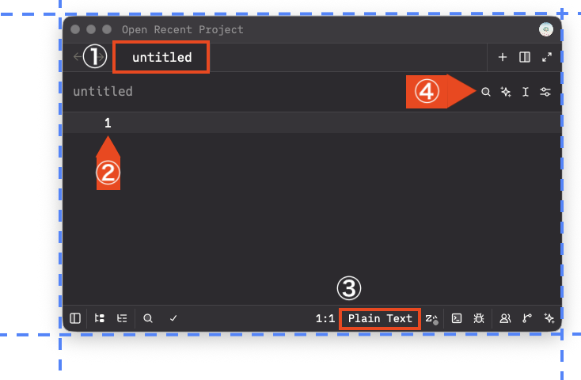

# 機能仕様書：図解注釈記法（Explanatory Diagram Syntax）

> **ステータス（2026-07-16）: Phase 0〜3 実装済み。Phase 4 は掲載まで完了。**
> 原稿は `22-extentions.md`「図解注釈の方法」（リファレンス）と `94-sample.md`（バイオリンの
> 逸話に沿った作例）へ掲載済み。§7.7 の視覚定数は実測レイアウトで妥当と判断し初期値のまま。
> scaffold 同期（`copy_to_scaffold.rb`）は未実行。
> 実測での確認: PDF は単章ビルドで枠・破線枠・引き出し記号・丸数字の描画を確認。
> EPUB はフルビルドで「PNG のみ同梱・src が .png へ差し替わる」ことと、epubcheck が
> showcase 起因のエラーを出さないこと（既存の索引 RSC-005/012 のみ）を確認。
> **Kindle Previewer での実機確認は未実施。**
> **仕様との差異（2 点）**:
> 1. 未参照 SVG は「コピー後に削除」（§7.9-2）ではなく `localized_image?` のコピー除外で
>    対処した（同梱フィルタは元々 rel を見て選択しており、1 行の除外で足りるうえ
>    stale ファイルが残らないため）。
> 2. **ラスター形式は PNG 固定（§6.3）ではなく PNG / JPEG の自動判定**とした。§6.3 の
>    「スクリーンショットは JPEG だと文字端にリンギング」は正しいが、写真を PNG で焼くと
>    可逆ゆえに数倍太る（実測 2.85MB → JPEG 415KB）。元画像のユニーク色数で写真か否かを
>    判定し選び分ける（`PHOTO_COLOR_THRESHOLD = 8192`。実測: PDF ページ描画 664〜875 色 /
>    平坦なロゴ 5,648 / 写真 17,122〜92,141。色数÷画素数の比率は小さなロゴが写真と重なるため
>    使えず絶対値で判定）。参照先は `data-vs-raster` 属性で明示し、EpubBuilder に拡張子を
>    推測させない（`--no-clean` で前回形式の残骸を拾わないため）。
>
> **仕様に無かった追加要件（実装で判明）**: §8 は前処理の他ステップとの干渉を「無し」と
> しているが、**コードスパンの退避が必須**だった。記法そのものを解説する原稿では
> ```` ```markdown ```` フェンスの中に showcase の**書き方の例**が入るため、退避しないと
> 作例が変換に食われて消える（22-extentions.md で実際に発生）。MathTransformer と同じく
> `MarkdownUtils.extract_code_spans` で退避してから走査する。回帰テストあり。
>
> **解決済み（2026-07-16）**: textlint が showcase ブロックを日本語の文として読む誤検出
> （`sentence-length` / `max-comma`）は、allowlist ではなく lint システム内部の記法ガード
> `Lint::NotationGuard` で根治した。showcase は「機械データを持つコンテナ」として宣言され、
> ブロック全体が textlint へ渡る前に空行化される（`textlint_allowlist.yml` の「VFM 記法」
> 節は撤去済み）。詳細: [lint-notation-guard-spec.md](../archives/lint-notation-guard-spec.md)。

## 1. 概要
技術文書やマニュアル作成において、スクリーンショット等の画像（図版）に対して「トリミング」「対象を囲む枠（色・線種のカスタマイズ可）」「引き出し記号（ホームベース型等）」および「説明テキスト」を、外部の画像編集ソフトを使わずにMarkdown単体で表現・オーサリングするための拡張記法。

イメージ画像 も参考にすること。

---

## 2. 構文（Syntax）

### 2.1 コンテナブロック
本機能は、コロン3つ（フェンス記法）で囲まれた `.showcase` カスタムブロック内に記述する。

### 2.2 トリミング・コマンド
画像の不要な領域を四辺から削ぎ落とすためのコマンド。構文: `crop [上] [右] [下] [左]`単位: px 例: `crop 10px 15px 10px 15px`

### 2.3 注釈（アノテーション）
画像上の特定座標に対して、枠線や記号、丸数字マッピングを行う。

### 2.3.1 rect コマンド
構文: rect:[番号] [X], [Y], [幅], [高さ] {オプション} [著者コメント]
意味: 指定座標から指定された幅・高さの枠（Rectangle）で囲み、丸数字のバッジを紐付ける。
仕様:
コロン（:）の直後に丸数字の番号を指定する。
座標と寸法（X, Y, 幅, 高さ）は、慣習に従いカンマ（,）で区切る。
機械データ（座標）と拡張属性（{}）、人間用のテキスト（著者コメント）の各境界はスペースで区切る。

### 2.3.2 pointer コマンド
構文: pointer:[番号] [X], [Y] {オプション} [著者コメント]
意味: 指定座標（X, Y）に、注目箇所を指し示すバッジ（デフォルトは■▶のホームベース型矢印）を配置し、内部に丸数字を表示する。
仕様:
rect コマンドと完全に対称（一貫性）のある構文構造を持つ。
矢印の向く方向は、オプション内（例: {dir=right}）で指定する。
座標の基準: 指定する（X, Y）は、記号全体の左上ではなく、「矢印の先端（尖っている先っちょ）の着地ポイント」とする。
描画の方向: 矢印の本体は、オプションで指定された向き（例: {dir=right} であれば右向き ▶ のため、先端から左側に向けて本体 ■ が伸びる）に従って自動的に描画される。ターゲット（アイコン等）に記号が被さるのを防ぐため、著者はターゲットの「外側の境界（エッジ）」の座標を指定する。
座標系: 画像の左上を原点 (0, 0)、右下を (1000, 1000) とする「千分率（パーミル）座標系」（画像の絶対解像度に依存せずレスポンシブに対応するため）。

番号: 1 や 2 などの数値を指定すると、自動で ① ② もしくはリッチな丸数字CSS/SVGに変換される。

### 3. 拡張属性（オプション）
中括弧 {...} 内に空白区切りでキー値ペアを指定することで、配置やスタイルを柔軟にカスタマイズ可能。

#### 3.1 丸数字の配置位置 (pos)
枠（rect）に対する丸数字の相対位置を指定する。デフォルト（省略時）は left。
pos=left （左側）
pos=right （右側）
pos=top （上側）
pos=bottom （下側）
pos=center （枠の内部中央）

#### 3.2 スタイル調整
color: 文字の色を指定（例: red, blue, #ff3b30）。デフォルトは white。
font-size: 丸数字や記号のフォントサイズ・スケールを指定（例: 24px, 既定値: 16px）。
background: 背景色を指定（例: red, blue, #ff3b30）。デフォルトは rectではtransparent, pointerではred。
border: 枠線のスタイルを指定（例: 2px solid red）。デフォルトは 2px solid red。

### 4. 記述例
:::{.showcase}
# 画像そのものにトリミング属性を内包させる
# 画像の周囲を切り取る場合（スペース区切り・時計回り 上 右 下 左）
{width=100% crop="40px 30px 20px 10px"}

```text
clip-path: inset(); と同じ

```

# 上下だけを切り取る場合（CSSの慣習を踏襲して2つで指定（上下10px、左右20px）も可能に）
{width=100% crop="10px 20px"}

# 機械データ（座標・オプション）と 著者コメントをスペースで美しく分離
# 四角形の枠を描画する。
# 丸数字の番号は①、X, Y座標と、幅、高さをパーミル座標系で指定する。
# オプションは{}で指定する。
# pos=right は、丸数字①を四角形の枠の右側に配置する意味
# 「untitledタブの枠」は、著者のコメント。画面には表示させない。
rect:1 190, 30, 360, 90 {pos=right} untitledタブの枠

# pointer: 矢印の座標とオプション
# 矢印（番号4）
# ▶の先端（尖っている先っちょ）の着地ポイント(810, 50)を指定する。
# オプションが存在しないときには、{}を省略できる。
# 「検索ボタン」は著者用のコメント
pointer:4 810, 50 検索ボタン

# label オプションを指定すると、■▶ の■の領域に「検索」と白い文字で埋め込まれる。
# ④ も一緒に表示される。
pointer:4 810, 50 {label="検索"} 検索について説明すること

# :番号 を省略すると、丸数字は表示されず、「検索」ラベルのみが表示される。
pointer 810, 50 {label="検索"} 検索について説明すること
:::

# 枠の「内部中央」に配置
# CSSの書き方そのままで一括指定
rect 580, 810, 20, 70 {pos=center border="3px dashed blue" background="rgba(0,0,255,0.2)" color="white"}
:::

---

# 実装仕様（2026-07-07 追記・実装者: Opus 4.8 向け）

以降は §1〜§4 の記法案をレビューして確定させた**実装仕様**である。§1〜§4 と矛盾する場合は
本章が優先する。

## 5. 記法レビューと確定事項

記法の設計判断（パーミル座標系・rect/pointer の対称構文・「機械データ／{オプション}／
著者コメント」の 3 層分離）は妥当であり採用する。曖昧だった点を以下のとおり確定する。

### 5.1 crop は「画像属性」に一本化（§2.2 の単独コマンド案は廃止）

`crop` はトリミング対象である画像自身の属性として `{crop="…"}` 形式のみを採用する。
§2.2 の行コマンド形式（`crop 10px 15px 10px 15px`）は実装しない（画像とコマンドの対応が
暗黙になり、将来ブロック内複数画像を許すとき破綻するため）。
値は CSS shorthand 準拠で 1/2/4 個（上／上下・左右／上右下左）。

### 5.2 座標の基準は「クロップ前の元画像」で固定

`rect` / `pointer` の座標・寸法は、**crop 適用前の元画像**に対するパーミル
（左上 (0,0)〜右下 (1000,1000)。X は幅の、Y は高さの千分率）とする。
crop は「見せる窓」を変えるだけで座標系を動かさない。これにより **crop 値を後から調整しても
全注釈の座標が無効にならない**（実装上も viewBox の付け替えだけで済む。§7.4）。

### 5.3 単位: 無単位＝パーミル、px 接尾辞＝元画像の実ピクセル

著者はスクリーンショットをプレビューツールで測るため、実測値は px で得られる。
パーミルへの手計算を強いないよう、座標・寸法・crop 値はすべて次の 2 形式を受け付ける。

- 無単位の数値: パーミル（推奨。画像を Retina 2x 版に差し替えても記述が生きる）
- `px` 接尾辞つき: 元画像の実ピクセル（ビルド時に画像実寸からパーミルへ変換される）

`font-size`・`border` の太さ等の**スタイル寸法**だけは例外で、「クロップ後の画像幅を
1000 とする正規化単位」とする（px 接尾辞は許容するが同じ意味。§7.3）。読者が見る大きさは
表示幅に対する比率で決まるため、この定義が視覚的に一貫する。

### 5.4 番号の省略・描画方式

- `rect` / `pointer` とも `:番号` は省略可（対称性）。省略時はバッジ（丸数字）を描かない。
- 丸数字は Unicode の ①… ではなく **SVG の `<circle>` + `<text>` で描画**する。
  フォント依存がなく、任意の番号・色指定・サイズ調整が効くため。

### 5.5 既定値（確定）

| 項目 | 既定値 |
|---|---|
| `rect` の `border` | `3 solid #ff3b30`（太さは正規化単位） |
| `rect` の `background` | `transparent` |
| `rect` の `pos` | `left`（バッジ中心を枠の左辺中点に載せる。`right`/`top`/`bottom` は各辺中点、`center` は枠中心） |
| `pointer` の `dir` | `right`（▶ が右を向く＝本体は先端の左側に伸びる） |
| `pointer` の `background`（本体色） | `#ff3b30` |
| `color`（数字・ラベル文字色） | rect バッジ: `#222222`（白丸に濃色文字）／ pointer: `white` |
| バッジ | 白円 + 濃色細枠 + 番号（イメージ画像 ①〜④ のスタイル） |
| `font-size` | バッジ番号 28・pointer ラベル 30（正規化単位。§7.7 の定数で一元管理し、レイアウト目視で調整する） |

### 5.6 正準の記述例（§4 の例を整理・置き換え）

```markdown
:::{.showcase}
{width=100% crop="40px 30px 20px 10px"}
# ここはコメント行（出力されない）
rect:1 190, 30, 360, 90 {pos=right} untitled タブの枠
pointer:2 120px, 180px {dir=up} 行番号 1
rect:3 580, 810, 200, 70 {pos=center border="3 dashed blue" background="rgba(0,0,255,0.2)"}
pointer:4 810, 50 {label="検索"} 検索アイコン。④とラベルが本体に入る
pointer 810, 120 {label="検索"} 番号省略＝ラベルのみ
:::
```

ブロックの規則:
- 画像行はブロック内に**ちょうど 1 枚**。2 枚目以降は警告して無視する。
- `#` 始まりの行はコメント（前処理でブロックごと消費するため、見出し記法とは衝突しない）。
- 画像属性は `width`（→ 出力 `` の `style="width: …"`。既定 100%）と `crop` のみ解釈し、
  他は警告なしで無視する。
- 著者コメントは出力画像には描かないが、`` へ「① コメント ② コメント…」形式で
  集約する（読み上げ・検索・画像非表示時のフォールバックに資する。HeadingImageComposer と同思想）。

## 6. アーキテクチャ

### 6.1 基本方針: 前処理で「合成 SVG + PNG」を焼き、`<figure>` に置換する

数式 SVG 化（math_transformer.rb）と完全に同型の経路を取る。
`:::{.showcase}` ブロックは **前処理（VFM より前）で丸ごと消費**され、
生成画像への `` 参照に置き換わる。PDF・EPUB・Kindle が同じ生成物を共有する。

```
:::{.showcase} ブロック
  │  前処理 ShowcaseTransformer（新規）
  │    1. パース（画像行 + rect/pointer 行）
  │    2. 合成 SVG 生成（元画像を base64 PNG で埋め込み + 注釈をベクタ描画）
  │    3. rsvg-convert + magick で PNG にラスタライズ（EPUB/Kindle 用）
  │    4. キャッシュ書き出し: .cache/vs/build/html/images/showcase/<章slug>/<hash>.{svg,png}
  ▼
<figure class="vs-showcase">/<hash>.svg" …></figure>
  │
  ├─ PDF     : SVG のまま Vivliostyle へ（枠・矢印・数字がベクタで鮮明）
  └─ EPUB/Kindle: EpubBuilder が src を .svg → .png へ差し替え（§7.9）
```

### 6.2 なぜ CSS オーバレイ（position 重ね）にしないか

HTML + `position: absolute` の重ね合わせは PDF では動くが、リフロー型 EPUB
（特に Kindle）は固定寸法・重ね合わせを描画しない——これは章扉（③-a）で実証済みの
既知問題である。合成 SVG に一本化すれば **PDF/EPUB/Kindle で同一の見た目が 1 つの
コードパスで保証**され、Kindle 向け CSS 劣化対策（ADMONITION_LABELS ＋ literal color CSS の
3 点セット）が**そもそも不要**になる。出力は素の `<figure>` なので Kindle に壊される
要素がない。

### 6.3 ターゲット別の出力形式

| ターゲット | 形式 | 理由 |
|---|---|---|
| PDF（通常・print） | SVG（元画像は base64 PNG 埋め込み） | 注釈がベクタのまま印刷解像度で出る。SVG を `` で参照すると外部リソースを読めない（ブラウザ仕様）ため base64 埋め込みは必須 |
| EPUB（クリーン）・Kindle | PNG（SVG をラスタライズ） | Kindle は「SVG 内の base64 埋め込み画像」を非対応（変換時ブロッキングエラー。HeadingImageComposer と同じ制約）。スクリーンショットは平坦色が多く JPEG だと文字端にリンギングが出るため **PNG** とする（章扉の JPEG とは使い分け） |

### 6.4 依存ツールとフォールバック

- **ImageMagick（magick）**: 元画像の実寸取得（px→パーミル変換・viewBox 計算）＋
  PNG data URI 化。
- **librsvg（rsvg-convert）**: SVG → PNG ラスタライズ。

両方とも章扉合成で既に任意依存として `vs doctor` が案内済み。**どちらかが欠ける場合、
showcase ブロックは「注釈なしの通常画像」へ縮退**する（画像行だけを残して `` 化し、
rect/pointer は捨てて警告）。原稿がビルド不能になることはない。

## 7. 実装詳細

### 7.1 新規ファイル構成

| ファイル | 責務 |
|---|---|
| `lib/vivlio_starter/cli/pre_process/showcase_transformer.rb` | ブロック検出・パース・キャッシュ管理・外部ツール呼び出し・`<figure>` 置換（統括） |
| `lib/vivlio_starter/cli/pre_process/showcase_svg_builder.rb` | パース済み注釈データ → SVG 文字列の**純関数**生成（外部ツール非依存・単体テスト容易） |

分割理由: SVG 幾何計算（座標変換・多角形頂点・バッジ配置）はツールなしで決定的に
テストできる。ツール依存（magick/rsvg）は transformer 側に隔離し、テストでは DI で
差し替える（MathTransformer の `renderer:` 引数と同じ手法）。

### 7.2 パース仕様

中間表現はすべて `Data.define`（Ruby 4.0 スタイル・CONFIG と同様）:

```ruby
Annotation = Data.define(:type, :number, :coords, :options, :comment)
# type: :rect | :pointer
# number: Integer | nil（:番号 省略時）
# coords: rect => [x, y, w, h] / pointer => [x, y]（パーミル正規化済み Float）
# options: Hash（キーは String。例 { 'pos' => 'right', 'border' => '3 dashed blue' }）
# comment: String（著者コメント。alt 集約用）

ShowcaseBlock = Data.define(:image_path, :alt, :width, :crop, :annotations)
# crop: [top, right, bottom, left]（パーミル正規化済み Float。crop 無しは [0,0,0,0]）
```

行パターン（ブロック内の行単位で照合）:

```ruby
# 数値トークン: パーミル or px（例 "190" / "120px"）
NUM = /-?\d+(?:\.\d+)?(?:px)?/

IMAGE_LINE   = /^!\[([^\]]*)\]\(([^)]+)\)(?:\{([^}]*)\})?\s*$/
RECT_LINE    = /^rect(?::(\d+))?\s+(#{NUM})\s*,\s*(#{NUM})\s*,\s*(#{NUM})\s*,\s*(#{NUM})(?:\s+\{([^}]*)\})?(?:\s+(.*))?$/
POINTER_LINE = /^pointer(?::(\d+))?\s+(#{NUM})\s*,\s*(#{NUM})(?:\s+\{([^}]*)\})?(?:\s+(.*))?$/
COMMENT_LINE = /^#/
```

`{…}` オプションのトークナイズ（値の空白は二重引用符で保護。`border="3 dashed blue"`）:

```ruby
OPTION_TOKEN = /([\w-]+)=(?:"([^"]*)"|(\S+))/
# scan して { key => 引用値 or 裸値 } の Hash にする
```

パース不能な行（rect/pointer で始まるのに照合しない等）は**その行だけ捨てて**
警告する（§7.10）。ブロック全体は生かす。

### 7.3 座標変換（パーミル ⇔ 実ピクセル）

元画像実寸 `(orig_w, orig_h)` は `magick identify`（HeadingImageComposer.image_dimensions
と同一手法）で取得する。

- 入力の正規化: `"120px"` → `120 / orig_w * 1000`（X・幅・crop 左右）、
  `120 / orig_h * 1000`（Y・高さ・crop 上下）。無単位はそのまま。
- SVG 内部座標: viewBox を元画像のピクセル座標系で張るため、描画時は
  `x_px = X / 1000.0 * orig_w`、`y_px = Y / 1000.0 * orig_h` に戻す。
- **スタイル寸法の単位 `u`**: `u = crop後の幅px / 1000.0`。
  `border` の太さ 3 → `stroke-width="#{3 * u}"`、`font-size` 28 → `#{28 * u}px`。
  クロップ後の表示幅に対する比率なので、どんな解像度の元画像でも見た目が揃う。

### 7.4 SVG 構造（crop は viewBox で実現）

crop は画像加工ではなく **viewBox の切り出し窓**として実装する（無劣化・キャッシュ効率良）:

```xml
<svg xmlns="http://www.w3.org/2000/svg" xmlns:xlink="http://www.w3.org/1999/xlink"
     viewBox="{crop_left_px} {crop_top_px} {cropped_w_px} {cropped_h_px}"
     width="{cropped_w_px}" height="{cropped_h_px}"
     role="img" aria-label="…">
  <image xlink:href="data:image/png;base64,…" x="0" y="0"
         width="{orig_w}" height="{orig_h}"/>   <!-- 元画像を原寸で敷く -->
  <!-- 以降、注釈を元画像ピクセル座標で描画（viewBox 外は自動的に見えない） -->
  <rect …/> <g class="badge">…</g> <polygon …/> …
</svg>
```

- ルートに `width`/`height`（クロップ後実寸）を明示する。`` の固有アスペクト比の
  解決をブラウザ・rsvg の双方で確実にするため（数式 SVG が ex 値を data-vs-* に退避したのと
  役割は同じだが、こちらはピクセル既知なので直接書けば足りる）。
- `xlink:href` 併記は HeadingImageComposer と同じ旧リーダー互換措置。
- 埋め込み data URI は **PNG**（§6.3）。長辺 `EMBED_MAX_EDGE = 2000` px 超は縮小
  （スクリーンショットの文字が潰れない上限として。定数化して調整可能に）。
  縮小しても viewBox 座標系は元画像実寸で張るため座標計算は影響を受けない
  （`<image>` の width/height 指定で引き伸ばされる）。
- テキスト・属性値のエスケープは HeadingImageComposer の `escape_text` / `escape_attr` と
  同等の private ヘルパを builder 内に持つ（モジュール間の内部ヘルパ共有はしない）。

### 7.5 rect の描画

```xml
<rect x="{x_px}" y="{y_px}" width="{w_px}" height="{h_px}"
      fill="{background|transparent}" stroke="{border色}"
      stroke-width="{border太さ*u}" stroke-dasharray="{§7.5.1}" rx="{2*u}"/>
```

#### 7.5.1 border 値のパース

`"3 dashed blue"`（太さ・線種・色。CSS 順序に寛容: トークンを種別判定して振り分ける）。
線種 → dasharray 対応: `solid` → なし / `dashed` → `#{8*u},#{5*u}` / `dotted` → `#{2*u},#{4*u}`。
色は SVG がそのまま CSS 色（named / #hex / rgba()）を受けるため無変換で通す。

#### 7.5.2 バッジ（丸数字）の配置

`pos` に応じたバッジ中心（バッジ半径 `R = 26 * u`）:

| pos | バッジ中心 |
|---|---|
| left / right | 枠の左辺／右辺の中点（辺に跨って載る） |
| top / bottom | 枠の上辺／下辺の中点 |
| center | 枠の中心 |

```xml
<g>
  <circle cx="…" cy="…" r="{R}" fill="white" stroke="#333333" stroke-width="{2.5*u}"/>
  <text x="…" y="{cy + font*0.34}" text-anchor="middle"
        font-family="sans-serif" font-size="{28*u}" font-weight="700" fill="{color}">{番号}</text>
</g>
```

`y` の `+0.34em` 相当補正は HeadingImageComposer の baseline 計算と同じ流儀
（dominant-baseline は rsvg / 各ブラウザで挙動差があるため使わない）。

### 7.6 pointer の描画（ホームベース五角形）

先端座標 `(tx, ty)`（元画像 px）、本体高さ `H = 72 * u`、先端長 `hd = H / 2`、
本体長 `bl`（後述）として、**dir=right の基準形**を定義し、`transform="rotate(θ tx ty)"` で
回転させる:

```
基準形（dir=right）: 先端が (tx,ty)、本体は左へ伸びる
points: (tx,ty) (tx-hd,ty-H/2) (tx-hd-bl,ty-H/2) (tx-hd-bl,ty+H/2) (tx-hd,ty+H/2)
θ: right=0 / down=90 / left=180 / up=270
```

**文字（番号・ラベル）は回転させない**。`<polygon>` のみ rotate し、テキストは
「先端から dir の逆方向へ `hd + bl/2` 進んだ点」を本体中心として別要素で水平描画する:

| dir | 本体中心 |
|---|---|
| right | `(tx - hd - bl/2, ty)` |
| left | `(tx + hd + bl/2, ty)` |
| up | `(tx, ty + hd + bl/2)` |
| down | `(tx, ty - hd - bl/2)` |

本体長 `bl` は内容から自動算出:
`bl = max(H * 1.2, 内容幅 + 24u)`。内容幅 ≒ ラベル文字数 × フォントサイズ
（CJK 全角 1 文字 = 1em の素朴見積り。HeadingImageComposer.wrap_text と同じ割り切り）＋
番号バッジ分（番号があれば `2R + 8u`）。

本体内のレイアウト: 番号があれば白抜き小バッジ（`R_in = 20 * u` の白枠円 + 番号）を
先頭に、続けてラベルを `color`（既定 white）で描く。番号のみ／ラベルのみ／両方の 3 態に対応。
dir=up/down で本体が縦になる場合もテキストは水平のまま本体中心に置く（イメージ画像の ② と同じ）。

### 7.7 定数の一元管理

視覚定数（`R`, `H`, フォントサイズ、既定色、dasharray 係数、`EMBED_MAX_EDGE`,
ラスタライズ倍率）は builder 冒頭に定数としてまとめ、`STYLE` 的な Hash に押し込まず
名前付き定数で並べる。初期値は §5.5 とし、**Phase 4 のレイアウト目視確認で調整する**前提。

### 7.8 出力・キャッシュ・置換

MathTransformer の経路をそのまま踏襲する:

- 出力先: `File.join(Common::BUILD_HTML_DIR, 'images', 'showcase', chapter_slug)`
- `` 参照: `images/showcase/#{chapter_slug}/#{key}.svg`（**asset_prefix 無し**の
  消費者 dir 相対。数式 SVG と同じ理由——ビルド生成物は workspace 内実体であり、
  EPUB の prefix 剥がしを素通りし、PDF は pdf/ ミラーで解決する。math_transformer.rb の
  P4b §2.1 コメント参照）
- キャッシュキー: `Digest::SHA256.hexdigest("v1|#{画像バイト列のSHA256}|#{crop正規化値}|#{注釈のJSON}")[0, 16]`
  画像**内容**をキーに含めるため、著者がスクリーンショットを撮り直せば再生成される。
  `<hash>.svg` と `<hash>.png` が両方存在すればスキップ（--no-clean ビルドで効く）。
- ラスタライズ: `rsvg-convert -w {cropped_w_px * 2} -f png`（2 倍で焼き、リーダー側の
  縮小表示で鮮明に。上限 2600px にクランプ）。JPEG 化はしない（§6.3）。
  白フラット化も不要（PNG は透過を保持できる。スクリーンショットに透過があっても安全）。

置換後の HTML（ブロック全体がこれ 1 つに置き換わる。前後に空行を補い独立段落化）:

```html
<figure class="vs-showcase">

</figure>
```

### 7.9 EPUB / Kindle の差し替え（EpubBuilder）

前処理で PNG は常に SVG と対で生成済みなので、EpubBuilder 側は**参照の書き換えのみ**:

1. 章 HTML の `img.vs-showcase[src$=".svg"]` の `src` を `.png` に差し替える
   （epub / kindle 両フレーバー共通。Nokogiri パスは inject_heading_images_for_epub! と
   同じ場所——PDF 完成後の共有 HTML 書き換え列——に 1 メソッド追加）。
2. 消費者 dir へコピー済みの未参照 `.svg` を削除する（パッケージ肥大の防止。
   images/** 一括コピー（epub_builder.rb L116 付近）はそのままにし、後段で
   `images/showcase/**/*.svg` を削除するのが単純）。

万一 PNG が無い場合（前処理がツール不在で縮退した場合はそもそも `img.vs-showcase` が
生成されないため通常起きない）は src を変えず警告に留める。

### 7.10 警告メッセージ（actionable 原則）

すべて `Common.log_warn`。**修正例（before → after）と出現位置を必ず添える**:

```
🟡 [showcase] 10-intro.md 内の rect 記法を解釈できません: "rect 190 30 360 90"
   → 座標はカンマ区切りです。例: rect:1 190, 30, 360, 90 {pos=right} コメント
🟡 [showcase] 10-intro.md: ImageMagick / librsvg が見つからないため注釈なしの画像に縮退します
   → `vs doctor --fix` で導入できます（brew install imagemagick librsvg）
🟡 [showcase] 10-intro.md: showcase ブロック内に画像が 2 枚あります。2 枚目以降は無視します
   → 1 ブロック 1 画像です。別の :::{.showcase} ブロックに分けてください
🟡 [showcase] 10-intro.md: showcase ブロックに画像がありません。ブロックを出力しません
   → 先頭に  を置いてください
```

## 8. パイプライン統合（変更ファイル一覧）

| ファイル | 変更 |
|---|---|
| `markdown_preprocessor.rb` | `run` に `transform_showcases!` を **`validate_links_and_images!` の直後**に挿入。ImagePathNormalizer が画像パスを `asset_prefix + images/<章dir>/…` へ正規化した**後**（実ファイル解決は prefix を剥がして `Common::IMAGES_DIR` 基準で行う）、かつ他の変換がブロック内部の行（`{…}` や `[…]`）を壊す**前**でなければならない |
| `pre_process/showcase_transformer.rb` | 新規（§7.1） |
| `pre_process/showcase_svg_builder.rb` | 新規（§7.1） |
| `build/epub_builder.rb` | `localize_showcase_images!` を追加し、inject_heading_images_for_epub! と同じ呼び出し列（epub / kindle 両フレーバー）に組み込む（§7.9） |
| `stylesheets/chapter-common.css` | `figure.vs-showcase { margin: 1em 0; text-align: center; break-inside: avoid; }` `figure.vs-showcase img { max-width: 100%; }` 程度の最小スタイル。**Kindle 用 `body.vs-kindle` 節は不要**（§6.2）。root のみ編集し、scaffold 同期は copy_to_scaffold.rb（ユーザー実行）に委ねる |
| `cli/doctor.rb`（該当箇所） | magick / rsvg の任意ツール案内文に「図解注釈（showcase）」を用途として追記（既に章扉用に検出済みなら文言のみ） |
| `CHANGELOG.md` | 機能追加を記載 |

前処理の他ステップとの干渉について: `transform_showcases!` 完了時点でブロックは
`<figure>` HTML に置換済みのため、後続の `normalize_container_fences!` /
`transform_links!` / `strip_index_markup!` 等は showcase の中身に触れない
（alt はエスケープ済み・HTML 内にリンク記法や `[…]` は残らない）。
`strip_html_comments!`（run の 2 番目）はブロック内の `#` コメント行に影響しない
（HTML コメントのみ対象）。

## 9. テスト計画

Minitest。`test/vivlio_starter/cli/pre_process/` 配下に新設。DAMP・DI 徹底。

| テスト | 内容 | 外部ツール |
|---|---|---|
| `showcase_parser_test.rb` | 行パース（rect/pointer/番号省略/px 混在/オプション引用値/crop shorthand 1・2・4 個/不正行の無視）を `assert_pattern` で構造検証 | 不要 |
| `showcase_svg_builder_test.rb` | 画像寸法を引数 DI で与え、生成 SVG 文字列を検証: viewBox が crop を反映する／rect 座標のパーミル→px 変換／pointer の rotate 角と本体中心／dasharray／バッジ有無／エスケープ | 不要 |
| `showcase_transformer_test.rb` | ブロック → `<figure>` 置換の統合。実画像は fixtures に小さな PNG を置く。magick / rsvg 不在時は `skip`（ツールガード）。縮退経路（ツール不在を DI で強制 → 通常画像化＋警告）はガード不要で常時実行 | 一部 skip |
| `epub_builder` 既存テストへの追加 | `img.vs-showcase` の src 差し替えと不要 svg 削除 | 不要 |

- PDF プロバイダ二系統（Standard/Enhanced）には**一切触れない**ため `rake test:standard` への
  影響なし。HexaPDF 依存も生じない。
- レイアウト目視用に、サンプル章（既存の page_layout 用原稿）へ showcase ブロックを
  1 つ追加して `rake test:layout` の対象に含める（Phase 4）。

## 10. 実装ステップ

1. **Phase 0 — 純関数コア**: `showcase_svg_builder.rb`（パーサ含む・Data.define 中間表現）
   ＋ parser / builder テスト。外部ツール依存ゼロでレッド→グリーンまで完結させる。
2. **Phase 1 — 前処理統合（PDF 経路）**: `showcase_transformer.rb`・
   `markdown_preprocessor.rb` へのフック・キャッシュ・縮退・警告。
   `vs build --chapter <n>` で PDF に SVG 注釈が出ることを確認。
3. **Phase 2 — EPUB/Kindle 経路**: PNG ラスタライズ＋ `epub_builder.rb` の src 差し替え
   ＋ svg 削除。epubcheck・Kindle Previewer で確認。
4. **Phase 3 — 仕上げ**: chapter-common.css・doctor 文言・CHANGELOG・
   本仕様書のステータス更新。
5. **Phase 4 — 調整**: サンプル章での目視レイアウト確認 → §7.7 の視覚定数を調整。
   copy_to_scaffold.rb 実行（ユーザー）で scaffold へ同期。

## 11. スコープ外（将来拡張の余地）

- `ellipse` / `line`（自由線）/ `arrow`（2 点間矢印）コマンド — rect/pointer と同じ
  3 層構文で追加可能な設計になっている。
- `caption="…"` オプション → `<figcaption>` 出力（図番号運用と合わせて別途検討）。
- showcase 外の単独画像への `{crop="…"}` 対応 — 記法は本仕様のまま拡張できるが、
  変換パスが別になるため今回は見送る。
- 座標拾いの支援ツール（`vs preview` 連携等）。
