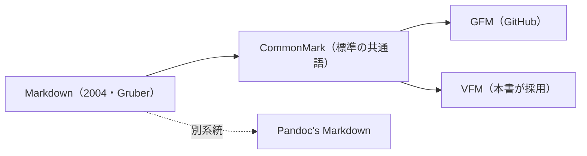

# 機能仕様書：Mermaid 図のビルド時レンダリング（Mermaid Diagram Rendering）

> 作成日: 2026-07-17
> ステータス: **実装済み**（2026-07-18・コード＋CSS＋doctor＋テスト。§12-1=mmdc / §12-2=案1 fontFamily 固定 / §12-3=showcase 同型 / §12-4=見送りで確定）。残: mmdc 導入環境での実ビルド確認（§10-8）・原稿更新（§10-9・21 章置換/22 章リファレンス）・Kindle Previewer 実機確認（§10-10）
> 対象: ` ```mermaid ` フェンスブロックを、ビルド時に図（PDF はベクタ SVG・EPUB/Kindle はラスター）へ変換し、全ターゲットで表示できるようにする。
> 決定事項（未確定・§12 に論点を集約。実装着手前にユーザー確認する）:
> - レンダラは **`@mermaid-js/mermaid-cli`（`mmdc`）** を第一候補とする（公式・オフライン可・SVG 出力）。
> - 生成物の扱いは **図解注釈（showcase / explanatory-diagram-spec）と同型**——前処理で図を生成して `<figure class="vs-mermaid">` へ置換し、PDF はベクタ SVG、EPUB/Kindle は対のラスターへ `EpubBuilder` が差し替える。ラスター化判定・`data-vs-raster` 属性・キャッシュ機構・localize 差し替えは showcase の実装を**流用**する。
> - `mmdc` 不在時は**注記付きコードブロックへ縮退**し、ビルドは止めない（`vs doctor` の案内対象に追加）。
> 関連: `docs/archives/explanatory-diagram-spec.md`（合成 SVG / ラスター差し替えの前例＝実装の下敷き）, `docs/archives/math-frontispiece-svg-spec.md`（前処理 SVG 化の前例）, `lib/vivlio_starter/cli/pre_process/showcase_transformer.rb`, `lib/vivlio_starter/cli/build/epub_builder.rb`（`localize_showcase_images!`）, `docs/specs/vivliostyle-css-pitfalls-notes.md`（SVG intrinsic size 等）, 記憶 `node26-puppeteer-extract-hang`（puppeteer/Chromium 展開の落とし穴）。

## 0. 背景・目的

現状、原稿に ` ```mermaid ` を書いても図にはならず、Prism でハイライトされた**コードブロックとして本文に出てしまう**（`prism_lines.rb` が全 `<pre>` に行番号を付けるため、図の代わりに行番号付きソースが載る）。技術書ではフローチャート・シーケンス図・クラス図・系統図などの需要が大きく、著者が Markdown だけで図を書き、PDF・EPUB・Kindle のすべてで同じ図が出る状態を提供する。

「著者がそう書けばそう図になる」を、既存の showcase（図解注釈）と同じ生成・差し替えパイプラインで実現し、ターゲット横断の一貫性（PDF=ベクタ鮮明 / EPUB=ラスター堅牢）を保証する。

## 1. 現状調査結果（2026-07-17 時点）

実装者が前提にすべき現行アーキテクチャ:

1. **mermaid レンダリングは未導入**。スペルチェック辞書（`config/spellcheck_dictionaries/npm.txt`）に `remark-mermaidjs` / `rehype-mermaid` の語があるだけで、パイプラインに図化ステップは無い。
2. **コードブロックは全 `<pre>` に行番号が付く**（`prism_lines.rb#add_prism_line_numbers` が `document.css('pre').each` で無条件付与）。よって ` ```mermaid ` は**コード保護される前に本文から抜き出して図へ置換**しなければならない（Prism へ流すと図が出ない）。
3. **前例＝showcase（explanatory-diagram-spec）**: 前処理 `ShowcaseTransformer.transform`（`markdown_preprocessor.rb:158` の `transform_showcases!`）が「元画像＋注釈を焼き込んだ合成 SVG」を生成し `<figure class="vs-showcase">` へ置換。PDF はベクタ SVG、EPUB/Kindle は `EpubBuilder#localize_showcase_images!`（`epub_builder.rb:919`）が `data-vs-raster` の対ラスターへ src を差し替える。**この構造をそのまま踏襲**する。
4. **数式 SVG 化（math-frontispiece-svg-spec）**: `MathTransformer` が LaTeX を SVG 画像化して `` にする前例。「外部ツール不在時は本文を変えず縮退」の作法（`transform_math!` の `available?` ガード）を mermaid でも踏襲する。
5. **コード保護の仕組み**: `MarkdownUtils.extract_code_spans` / `Masking`。` ```mermaid ` は言語付きフェンスなので通常はコードとして保護される。mermaid 抽出はこの保護より前段で行う（§4.2 の順序）。
6. **Chromium 資産**: ビルドは Vivliostyle 経由で Chromium を使う。`mmdc` も puppeteer 経由で Chromium を起動する。**Node 26 × puppeteer/extract-zip の展開デッドロック**（記憶 `node26-puppeteer-extract-hang`）に留意——`mmdc` 導入で同種の Chromium 取得が走る場合、既存の回避知見を適用する。

## 2. 記法仕様

### 2.1 基本

標準的な mermaid のコードフェンスをそのまま使う（**独自記法は作らない**）。

````markdown

````

- mermaid の全ダイアグラム種別（flowchart / sequence / class / state / er / gantt / pie 等）を `mmdc` がサポートする範囲で受け付ける。
- 記法解説フェンス（` ```markdown ` 内に書かれた ` ```mermaid ` の例示）は変換しない（コード保護内はスキップ・§4.2）。

### 2.2 キャプション・図番号（要検討・§12-3）

showcase／画像キャプションと同じクロスリファレンス機構（`@id` 図番号）に載せられるか検討する。第一段階では**キャプションなし**の素の図から始め、需要を見てキャプション対応を足す（YAGNI）。

### 2.3 直角線などの見た目調整

mermaid のカーブスタイルは図ソース側の `%%{init: {'flowchart': {'curve': 'stepBefore'}}}%%` で著者が制御する（vivlio-starter は関与しない）。テーマ色・フォントは §5 でビルド側が既定を与える。

## 3. アーキテクチャ

### 3.1 レンダラ選定

| 案 | 内容 | 評価 |
|---|---|---|
| **A: `@mermaid-js/mermaid-cli`（`mmdc`）** | 公式 CLI。puppeteer で Chromium を起動し SVG/PNG 出力 | **第一候補**。オフライン可・公式追従・SVG 出力でベクタ品質。Chromium 依存が難点（§6・Node 26 注意） |
| B: Kroki 等の HTTP サービス | 図ソースを送信して画像を得る | **不採用**。オフライン不可・原稿内容を外部送信（機密面）・ビルド再現性がサービス可用性に依存 |
| C: mermaid.js をヘッドレスで自前実行 | puppeteer を直接叩き mermaid.js を評価 | mmdc の再実装。保守コスト過大で不採用 |
| D: 著者が手で SVG 化 | 現状。draw.io 等で描いて画像に | 記法サポートの放棄（本仕様の目的外） |

→ **案 A（mmdc）を採用**。生成物の後段処理は showcase 資産を流用するため、mermaid 固有の新規実装は「フェンス抽出 → mmdc 呼び出し → figure 置換」に限られる。

### 3.2 処理フロー（showcase 同型）

```
前処理 MermaidTransformer:
  ```mermaid 抽出 → mmdc で SVG 生成（キャッシュ）
    → <figure class="vs-mermaid"></figure>
PDF:   SVG のままベクタ描画
EPUB/Kindle: EpubBuilder が data-vs-raster の PNG へ src 差し替え（localize）
```

## 4. 実装設計

### 4.1 前処理 `MermaidTransformer.transform`

`ShowcaseTransformer` と同型のモジュールとして新設する。

**アルゴリズム**:

1. コード保護の**前段**で ` ```mermaid ... ``` ` ブロックを行スキャンで抽出する（記法解説フェンス内・インラインコード内は除外＝`code_line_numbers` の作法を流用）。
2. 各図ソースについて、**図ソース＋テーマ＋フォント＋mermaid バージョンのハッシュ**をキーにキャッシュ（`.cache/vs/mermaid/<hash>.svg` / `.png`）を引く。無ければ `mmdc` で生成する。
3. ブロックを `<figure class="vs-mermaid">.svg" alt="<図ソース先頭行や種別>" data-vs-raster="images/mermaid/<hash>.png"></figure>` の生 HTML へ置換する。画像は章の画像ディレクトリへ配置（showcase と同じ配置規約）。
4. `mmdc` 不在・生成失敗時は**注記付きコードブロックへ縮退**（§6）。

### 4.2 パイプラインへの組み込み位置

`MarkdownPreprocessor#run` の **`transform_showcases!` の近傍**（コード保護・数式化・コードインクルードより前）に `transform_mermaid!` を追加する。理由: (a) ` ```mermaid ` がコードとして保護／Prism 化される前に横取りする必要がある、(b) 画像パス正規化（`normalize_image_paths!`）との前後関係を showcase に合わせる。**正確な挿入位置は実装時に順序テストで確定**する（terminal 化・数式化・コードインクルードとの相互作用を確認）。

### 4.3 レンダラ呼び出し `MermaidRenderer`

- `mmdc -i <input.mmd> -o <output.svg>`（PNG も同様に `-o output.png`）を `Open3` で実行。
- 入力は一時 `.mmd` ファイル（`Tempfile.create`——`Tempfile.new` の GC 削除バグ回避・記憶 `strscan-kramdown-flaky` 隣接の lint 教訓と同根）。
- 背景透過（`-b transparent`）、テーマ・フォントは §5 の設定を `mmdc` の `--configFile` / `--cssFile` または `%%{init}%%` 注入で渡す。
- 生成物のラスター形式（PNG/JPEG）は showcase の色数自動判定（`PHOTO_COLOR_THRESHOLD`）を流用——ただし mermaid 図は平坦色ゆえ実質 **PNG 固定**で足りる見込み（実装時に確認）。

### 4.4 EPUB/Kindle 差し替え

showcase の `localize_showcase_images!`（`epub_builder.rb:919`）を **`vs-mermaid` セレクタにも効かせる**（`img.vs-showcase[data-vs-raster]` → `img.vs-showcase, img.vs-mermaid` へ拡張、または汎用 `img[data-vs-raster]` へ一般化）。SVG 内テキストのフォント問題（§5）はラスター化で回避される（レンダリング時のフォントで焼くため）。

## 5. フォントとテーマ

### 5.1 CJK フォント（PDF の要）

mermaid の SVG は図中テキストを `<text>` 要素で出す。**PDF では Vivliostyle が SVG を描画するため、`<text>` の `font-family` に本書の和文フォントが解決できないと文字が出ない／豆腐になる**。対策の候補（実装時に決定・§12-2）:

1. **mmdc の themeVariables で `fontFamily` を本書の和文フォントに固定**して SVG を出す（Vivliostyle 側でフォントが解決できる前提）。
2. **SVG 内テキストをパス化**して font 依存をなくす（showcase が注釈テキストで採る手法に倣う。ファイルは太るが環境非依存で最も堅牢）。

EPUB/Kindle はラスター化で焼き込むためこの問題は出ない（レンダリング環境のフォントで確定）。

### 5.2 ライト／ダークテーマ

- PDF は単一テーマ。EPUB はリーダーのダークモードがある。第一段階では**ライト固定**（`neutral` テーマ・透過背景）で出し、ダーク対応は将来課題とする（showcase・数式も単一ラスターで運用しているのと同じ割り切り）。

## 6. 縮退・エラー処理・doctor 連携

- **`mmdc` 不在**: `MermaidRenderer.available?` が false のとき、`transform_math!` と同じく `Common.log_warn` で一度だけ案内し、` ```mermaid ` ブロックは**注記付きコードブロック**（例: 図ソースの上に `🟡 mermaid 未導入のため図を生成できません` のプレースホルダ、または素のコードブロックのまま）で残す。ビルドは継続。
- **生成失敗（構文エラー等）**: 該当ブロックのみ縮退し、`ファイル:行 - mermaid の生成に失敗しました` を著者向けに出す（[[warning-messages-actionable]] の流儀＝出現箇所つき）。
- **`vs doctor`**: `mmdc`（`@mermaid-js/mermaid-cli`）を検出対象に追加し、`--fix` の導入対象 `ToolUpgrader::TOOLS` に含める（npm -g 系）。Node 26 × puppeteer の注意は既存の doctor 案内に合流。

## 7. CSS・レイアウト

`stylesheets/chapter-common.css` に `.vs-mermaid` の最小スタイル（中央寄せ・最大幅・上下マージン）を追加。SVG の intrinsic size 落とし穴（`vivliostyle-css-pitfalls-notes`）に留意し、`img.vs-mermaid { max-width: 100%; height: auto; }` を基本とする。root 編集 → `copy_to_scaffold.rb` 同期（[[scaffold-sync-workflow]]）。

## 8. 制限事項（ドキュメント記載予定）

1. `mmdc`（Node パッケージ）が必要。未導入時は図にならず縮退する。
2. 図中テキストのフォントは本書設定に従う（§5）。特殊フォントを図だけに使うことはできない。
3. 第一段階はライトテーマ固定・キャプション/図番号なし。
4. 巨大な図は版面に収めるため縮小される（可読性は著者が図の分割で調整）。
5. ビルド時間: 図 1 枚ごとに Chromium 起動コストがかかる（キャッシュで再ビルドは高速）。

## 9. テスト計画

Minitest。ruby-coding-rules 適用。`mmdc` 実行は重く環境依存のため、レンダラはスタブ／DI で差し替える。

1. `MermaidTransformer` ユニット: ` ```mermaid ` 抽出（記法解説フェンス内・インラインコード内は不変）・`<figure class="vs-mermaid">` 置換・キャッシュキーの決定性・`mmdc` 不在時の縮退（本文が壊れない）。
2. `EpubBuilder` の localize 拡張: `img.vs-mermaid[data-vs-raster]` が対 PNG へ差し替わる／クリーン EPUB・Kindle 双方。
3. パイプライン順序テスト: terminal 化・数式化・コードインクルードと共存しても mermaid が Prism 化されないこと。
4. `rake test` 全通過・`rubocop` クリーン。

## 10. 実装手順（チェックリスト）

1. [ ] §12 の要決定事項をユーザーと確定（レンダラ・フォント方式・配置）
2. [ ] `MermaidRenderer`（`mmdc` ラッパ・`available?`・DI）＋ユニット
3. [ ] `MermaidTransformer.transform` ＋抽出・置換・キャッシュ＋ユニット
4. [ ] `MarkdownPreprocessor#transform_mermaid!` を順序テストで位置確定のうえ組み込み
5. [ ] `EpubBuilder` の localize を `vs-mermaid` へ拡張＋テスト
6. [ ] `chapter-common.css`（root）へ `.vs-mermaid` を追加し scaffold 同期
7. [ ] `vs doctor` に `mmdc` 検出＋`--fix` 導入を追加
8. [ ] `vs build` で PDF（ベクタ）・EPUB/Kindle（ラスター）を実測（CJK フォント・ダーク時の見え方）
9. [ ] 原稿更新（21 章の系統図を mermaid へ置換する案を含め、22 章にリファレンス節を新設）
10. [ ] Kindle Previewer 3 で実機確認

## 11. 考慮した代替案（不採用）

| 案 | 不採用理由 |
|---|---|
| Kroki 等の外部サービスでレンダリング | オフライン不可・原稿の外部送信・再現性がサービス依存 |
| ブラウザ実行時に mermaid.js で動的描画 | 静的な PDF/EPUB には不適（実行環境がない） |
| VFM/Vivliostyle 本体の mermaid 対応を待つ | 時期不明・本書のビルドは前処理で自己完結させる方針 |
| mermaid 専用の独自簡易記法を作る | 標準 mermaid をそのまま使うのが学習コスト最小（fancy list と同じ「既知記法を踏襲」方針） |

## 12. 要決定事項（実装着手前にユーザー確認）

1. **レンダラ**: `mmdc`（案 A）で確定してよいか。Chromium 依存を許容するか（既に Vivliostyle で Chromium は使用中）。
2. **CJK フォント方式**: SVG の `<text>` を (1) フォント指定のまま出す か (2) パス化して環境非依存にするか。堅牢性なら (2)、ファイルサイズなら (1)。
3. **生成物の配置とキャッシュ位置**: showcase と揃えて章の画像ディレクトリ＋`.cache/vs/mermaid/` でよいか。
4. **キャプション/図番号・ダークテーマ**: 第一段階では見送り（YAGNI）でよいか。
5. **21 章の系統図**: mermaid 実装後、現在の罫線図を mermaid へ置き換えるか、罫線図のまま残すか（罫線図は「行番号が付く」課題があるため、mermaid 化 or 行番号抑制のいずれかで解決する）。
