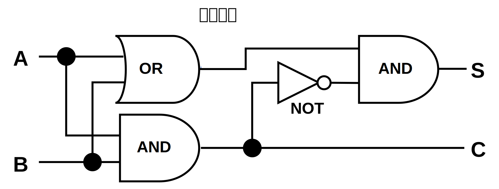

---
link:
  - rel: 'stylesheet'
    href: 'stylesheets/style.css'
lang: 'ja'
---

# 半加算器のアセンブリ実装{#h1_1 .chapter}

<div class="subtitle">
『Vivliostyle CSS組版入門』サンプル
</div>

## 半加算器の回路図{#h2_1 .section}

{width=210 .float-right}

## 回路図の解析

半加算器の回路図から読み取れる論理：
- OR ゲート: A と B の少なくとも一方が1なら1
- NOT ゲート: 入力を反転
- AND ゲート: A と B が両方1なら1

最終的に
- **出力S（和）**: A XOR B
- **出力C（桁上がり）**: A AND B

### アセンブリコード（x86-64 AT&T構文）

```assembly
# データセクション
.data
    input_a:  .byte 0    # 入力A
    input_b:  .byte 0    # 入力B
    output_s: .byte 0    # 出力S（和）
    output_c: .byte 0    # 出力C（桁上がり）

# テキストセクション
.text
.globl _main

_main:
    # 入力値を設定（例：A=1, B=1）
    movb $1, input_a     # A = 1
    movb $1, input_b     # B = 1
    
    # 半加算器の実行
    call half_adder
    
    # プログラム終了
    mov $60, %rax        # sys_exit
    mov $0, %rdi         # exit status
    syscall

half_adder:
    # 入力値をレジスタにロード
    movb input_a, %al    # A を al にロード
    movb input_b, %bl    # B を bl にロード
    
    # S = A XOR B の計算
    movb %al, %cl        # A を cl にコピー
    xorb %bl, %cl        # cl = A XOR B
    movb %cl, output_s   # 結果をSに保存
    
    # C = A AND B の計算
    movb %al, %dl        # A を dl にコピー
    andb %bl, %dl        # dl = A AND B
    movb %dl, output_c   # 結果をCに保存
    
    ret
```

## 使用するアセンブリ命令

### 1. データ移動命令
- `movb`: 8ビットデータの移動
- `movb $1, %al`: 即値1をalレジスタに格納
- `movb %al, %cl`: alレジスタの値をclレジスタにコピー

### 2. 論理演算命令
- `xorb %bl, %cl`: XOR演算（排他的論理和）
- `andb %bl, %dl`: AND演算（論理積）

### 3. 制御命令
- `call half_adder`: 関数呼び出し
- `ret`: 関数からの復帰

## 真理値表

| A | B | S (A XOR B) | C (A AND B) |
|---|---|-------------|-------------|
| 0 | 0 |      0      |      0      |
| 0 | 1 |      1      |      0      |
| 1 | 0 |      1      |      0      |
| 1 | 1 |      0      |      1      |

## レジスタの使用

- `%al, %bl`: 入力値A, Bの格納
- `%cl`: XOR演算の結果（和S）
- `%dl`: AND演算の結果（桁上がりC）

## 実行手順

1. 入力値A, Bをメモリに設定
2. `half_adder`関数を呼び出し
3. レジスタに入力値をロード
4. XOR演算でS（和）を計算
5. AND演算でC（桁上がり）を計算
6. 結果をメモリに保存
7. 関数から復帰


```c
#include <stdio.h>

// C言語での半加算器実装（アセンブリ相当の動作）
void half_adder(int a, int b, int *s, int *c) {
    // アセンブリでの XOR 操作に相当
    *s = a ^ b;  // S = A XOR B
    
    // アセンブリでの AND 操作に相当
    *c = a & b;  // C = A AND B
}

int main() {
    // 実際の計算例
    printf("\n計算例:\n");
    printf("=======\n");
    int s, c;
    
    half_adder(1, 1, &s, &c);
    printf("1 + 1 = %d%d (2進数)\n", c, s);
    printf("       = %d (10進数)\n", c * 2 + s);
    
    half_adder(1, 0, &s, &c);
    printf("1 + 0 = %d%d (2進数)\n", c, s);
    printf("       = %d (10進数)\n", c * 2 + s);
    
    return 0;
}
```

```zsh
計算例:
=======
0 + 0 = 00 (2進数)
      =  0 (10進数)
0 + 1 = 01 (2進数)
      =  1 (10進数)
1 + 0 = 01 (2進数)
      =  1 (10進数)
1 + 1 = 10 (2進数)
      =  2 (10進数)
```

