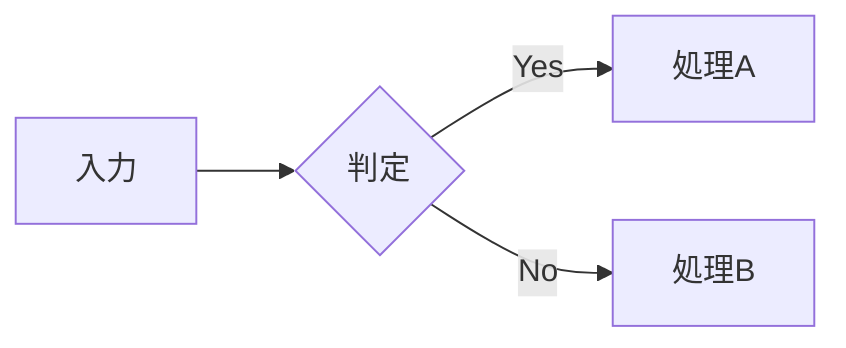

# {{TITLE}}

::: {.chapter-lead}
各章の冒頭に置かれる短い導入文を記述します。この章で扱うテーマや内容の概要を読者に伝えつつ、学びへの期待やワクワク感を高めてください。身近なエピソードや歴史的背景を差し込むと読者が引き込まれます。
:::

ここに本文を記述します。**太字**、*斜体*、***太字+斜体***、~~取り消し線~~、`インラインコード`

バッククォート自身を含む場合: `` ` ``

エスケープ: \*アスタリスク\*、\`バッククォート\`、\# ハッシュ

振り仮名（ルビ）: {相対性理論|そうたいせいりろん}

脚注: 本文中に脚注を付けます[^1]。インライン脚注も使えます^[これはインライン脚注です。]。

[^1]: 脚注の内容をここに記述します。

改行: 1行目<br>
2行目

水平線:

---

## セクション見出し {#section-id}

::: {.section-lead}
章の中の各セクション（節）の冒頭に置かれる導入文を記述します。セクションで扱うトピックの簡潔な紹介と、読者の興味を引きつける導入部を記述してください。
:::

### リスト

箇条書き:

- 項目1
- 項目2
  - 子項目1
  - 子項目2

番号付き:

1. 最初の項目
2. 2番目の項目
   1. 子項目1
   2. 子項目2

定義リスト:

用語1
: 用語1の説明をここに記述します。
  説明が長い場合は、半角スペースで字下げして次の行に続けます。

用語2
: 一つの用語に複数の語義がある場合は、`: ` の行を並べます。
: 二つめの語義です。

英字・ローマ数字のマーカー（fancy list）:

a. 小英字のリスト
b. 二番目の項目

(1) 括弧付き数字
(2) 二番目の項目

I. 大ローマ数字
II. 二番目の項目

複合番号（1.1 / 1.2）:

::: {.outline-list}
1. 概要
   1. この機能について
   2. インストール方法
2. 使い方
:::

リスト装飾（青コメ）:

- ▶ ポイント解説をここに書きます
- ▶ 補足情報をここに書きます

リスト装飾（赤コメ）:

- ❶ 最初の手順
- ❷ 次の手順
- ❸ 最後の手順

### 引用ブロック

> 引用文をここに記述します。

> **引用元**: 著者名
>
> 複数段落の引用も可能です。

> 入れ子の引用
>> 2レベル目の引用

### 表（テーブル）

| 左揃え | 中央揃え | 右揃え |
| :--- | :---: | ---: |
| テキスト | テキスト | 123 |
| テキスト | テキスト | 456 |

横結合（`||`）と複数行ヘッダー:

|          |       結合       ||
| ヘッダー1 | ヘッダー2 | ヘッダー3 |
| :------- | :------: | -------: |
| セル1     |      長いセル      ||
| セル2     |  中央寄せ  |   右寄せ  |

::: {.long-table}
| 縦に長い表 | 説明 |
| :--- | :--- |
| 項目1 | 説明1 |
| 項目2 | 説明2 |
:::

::: {.rotate-table}
| 列1 | 列2 | 列3 | 列4 | 列5 |
|---|---|---|---|---|
| ... | ... | ... | ... | ... |
:::

---

## コードブロック

### キャプションなし

```ruby
def greet(name)
  "こんにちは、#{name}さん!"
end

puts greet('読者')
```

### キャプション付き（コロン形式）

```ruby:hello.rb
def greet(name)
  "こんにちは、#{name}さん!"
end
```

### コメント強調 `[!]`

```ruby
def greet(name)
  puts "Hello, #{name}!"   # [!] この行が赤色で強調される
  puts "Goodbye!"           # 通常のコメント
end
```

### ソースコードの読み込み

```include:sample.rb```

### ソースコードの読み込み（範囲指定）

```include:prime.rb:10-17```

### 入れ子コードブロック（チルダ）

~~~markdown
```ruby
def greet(name)
  puts "Hello, #{name}!"
end
```
~~~

### 入れ子コードブロック（バッククォート4つ）

````markdown
```ruby
def greet(name)
  puts "Hello, #{name}!"
end
```
````

### 行番号を途中から始める

```ruby:excerpt.rb#L5
def hello
end
```

---

## ターミナル・実行結果・図

### ターミナルへの入力

::: {.terminal}
$ vs build
$ cp *.png *.bak
:::

### 実行結果・出力例

::: {.output}
✅ ビルドが完了しました
- 出力: dist/sample.pdf
:::

### 罫線図・アスキーアート

::: {.diagram}
```
       A
     ┌─┴─┐
     B    C
```
:::

### ダイアグラム（mermaid）



---

## 数式

インライン数式: $E = mc^2$

ディスプレイ数式（`$$` で囲みます。複数行に分けて書けます）:

$$
\gamma = \frac{1}{\sqrt{1 - \dfrac{v^2}{c^2}}}
$$

---

## 画像

標準:


幅・配置指定:

{width=50%}

{width=40% align=right}

{width=40% .align-right}

周囲を切り落とす（上・右・下・左の時計回り。1 つなら四辺共通）:

{crop="30 100"}

---

## VFM 拡張記法

### セクション化（カスタムID・クラス）

```markdown
# 見出し {#my-id}

# 見出し {.my-class}

## Not Sectionize {.just-a-heading} ##
```

### Frontmatter

```markdown
---
title: 'タイトル'
author: '著者名'
vfm:
  hardLineBreaks: true
  math: true
---
```

### 画像のキャプション（単独行）


{id="fig2" data-sample="sample"}

---

## Vivlio Starter 拡張記法

### テキスト配置

::: {.align-left}
左寄せテキスト
:::

::: {.align-center}
中央寄せテキスト
:::

::: {.align-right}
右寄せテキスト
:::

::: {.text-right}
右寄せ（テキスト揃え方向のみ変更、要素幅は維持）
:::

インライン右寄せ: 段落末尾に `{.text-right}` を付ける。{.text-right}

### 注記・補足ブロック

::: {.column}
**💡 コラム見出し**

コラムの本文をここに記述します。補足情報や豆知識を表示するのに便利です。
:::

::: {.tip}
効率化やトラブル回避のためのヒントやコツをここに書きます。
:::

::: {.memo}
覚書きや注釈など、本文の補足メモをここに書きます。
:::

::: {.note}
**注意**: 補足説明や注意事項をここに記述します。上下の罫線で区切られます。
:::

::: {.notice}
重要な注意事項を左側のアクセントラインで強調して表示します。
:::

### 画像とテキストの横並び

::: {.img-text}

画像の右側に配置されるテキストです。等幅で2分割されます。
:::

::: {.img-text2}

テキスト側が2倍の幅になります。
:::

::: {.img-text3}

テキスト側が3倍の幅になります。
:::

### テキストと画像の逆配置

::: {.text-img}
テキストが左側に配置されます。

:::

::: {.text2-img}
テキスト側が2倍の幅になります。

:::

::: {.text3-img}
テキスト側が3倍の幅になります。

:::

### 余白の調整

::: {.img-text .gap-s}

小さな余白（0.5rem）
:::

::: {.img-text .gap-m}

標準の余白（1rem）
:::

::: {.img-text .gap-l}

大きな余白（1.5rem）
:::

### サイドイメージ

::: {.sideimage-right}

画像の左側にテキストが回り込みます。
:::

::: {.sideimage-left}

画像の右側にテキストが回り込みます。
:::

### 画像グリッド

::: {.pictures}


:::

::: {.pictures}


:::

### 2枚横並び（比率調整可）

::: {.image-group}
{width=40%}

:::

### 書籍紹介カード

::: {.book-card}

**書籍タイトル**
著者名 著（2024年）
書籍の説明文をここに記述します。
:::

### 段組

::: {.text-2dan}
二段組で表示されるテキストです。長い文章や箇条書きを紙面効率よく配置できます。

- 項目1
- 項目2
- 項目3
:::

### 図解注釈（スクリーンショットに枠・矢印・番号）

::: {.showcase}

# 行頭が # の行はコメントです（出力されません）
rect:1 530, 335, 175, 165 {pos=bottom} 著者向けの覚書き
pointer:2 490, 130 {label="ここ"} 指し示したい箇所
:::

座標は画像の左上を (0, 0)、右下を (1000, 1000) とする千分率です。`530px` のように `px` を付ければ実測ピクセルでも書けます（ビルド時に換算されます）。

### 会話文

::: {.talk}
haruka: 話者は `config/talk.yml` にキーで登録します。
mirai: 行頭の「キー: 」で話者が切り替わります。
haruka: 字下げした行は、直前の発話の続きになります。
       このように続けて書けます。
:::

### キーボード入力

保存は 〘Ctrl〙 + 〘S〙 で行います。

---

## 余白・改ページ

### 段落後の余白

少し間を空けたい段落。{.aki}

2行分の余白を空けたい段落。{.aki2}

### 余白の微調整

@vspace:10

上の段落から 10mm 下げて始めます。

@vspace:-0.5lh

上方向に 0.5行分 詰めます。

### 字下げ

@hspace:2 行頭を 2 文字ぶん下げます。単位を省くと em（全角の文字数）です。

### 改ページ

水平線 `---` を 1 行置くと改ページされます。`@pagebreak` と書いても同じです。

必ず右ページ（奇数）から始めたいときは `@pagebreak:recto`、左ページなら `@pagebreak:verso` と書きます（EPUB・Kindle では単純な改ページに劣化します）。

---

## ビルド時に差し込む値

本書は v@version 時点の情報です（@today 更新）。

| 記法 | 差し込まれる値 |
| :--- | :--- |
| `@version` | `config/book.yml` の `project.version` |
| `@title` | `config/book.yml` の `book.main_title` |
| `@today` | ビルドを実行した日付 |

### QR コード

サンプルコードはこちら: @qr:https://github.com/Atelier-Mirai/vivlio-starter

---

## 相互参照（クロスリファレンス）

### 定義側

**サンプルコード @sample-code**
```ruby
def hello(name)
  puts "Hello, #{name}!"
end
```

**データ表 @data-table**
| 項目 | 値 |
| :--- | ---: |
| A | 100 |
| B | 200 |

**図の定義 @sample-fig**


**自動ID @auto**
```ruby
puts "自動IDのサンプル"
```

### 見出しにラベルを付ける

見出しの行末に半角空白を挟んで `@id` と書きます（紙面には出ません）。

```markdown
## インストール @install
```

### 参照側

本文に @sample-code と書くと「リスト 1-1」へ展開されます。@data-table や @sample-fig も同じ要領です。番号は章をまたいでも自動で解決されます。

見出しラベルは `@install` のように書いて参照します。ページ番号を添えたいときは `@pageref:install` です（PDF では「（p.200）」が付き、EPUB では省かれます）。

---

## 索引・用語集

```markdown
[用語|読み]を本文中に記述します。
[相対性理論|そうたいせいりろん]
[Ruby|るびー]
```

::: {.note}
**注意**: 索引・用語集の記法は `[]` を使います。ルビ記法 `{単語|読み}` と混同しないでください。
:::

---

## QueryStream（データ展開）

```markdown
= books                    # 全件展開
= books | tags=ruby        # タグで絞り込み
= books | -year | 3        # 年度降順・3件
= book  | タイトル名       # 一件検索
= books | :full            # fullスタイルで展開
```

`data/books.yml` の例:

```yaml
- title: 書籍タイトル
  author:
    name: 著者名
  desc: 書籍の説明文。
  cover: cover.webp
  tags: [ruby, programming]
  year: 2024
```

`templates/_book.md` の例:

```markdown
::: {.book-card}

**= title**
= author.name 著
= desc
:::

`=` とキー名の間には**半角スペースが要ります**（`=title` では展開されません）。
```

---

## リンク

インラインリンク: [リンクテキスト](https://example.com)

参照リンク: [リンクテキスト][ref]

[ref]: https://example.com

自動リンク: <https://example.com>

---

## 生のHTML

<div class="custom">
  HTMLタグをそのまま記述することもできます。
</div>
