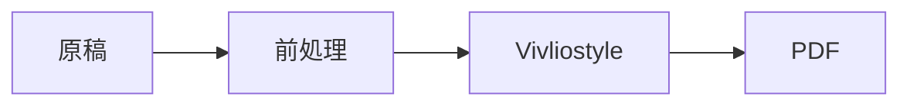

# Vivlio Starter 独自の記法

:::{.chapter-lead}
Vivlio Starter が足している記法を並べます。新しい記法を実装したら、ここにも 1 例足してください（`notation-implementation-guide.md` のチェックリスト）。
:::

## インライン記法

### 索引語

本文中に [索引見本|さくいんみほん] と書くと、索引に載り、傍点が付きます。

### 相互参照

図表やリストに `@label` で名前を付け、本文から参照します。

** 参照される見本のコード @sample-code **

```ruby
puts "参照の的"
```

本文からは @sample-code のように参照します。

### インライン脚注

行の途中で脚注を差し込めます^[インライン脚注の中身です。]。

### 画像の属性

{width=40% align=center}

## コンテナ記法

### 注記・補足

:::{.note}
`note` は補足です。
:::

:::{.notice}
`notice` は注意喚起です。
:::

:::{.tip}
`tip` は助言です。
:::

:::{.memo}
`memo` は覚え書きです。
:::

### コラム

:::{.column}
## コラム：見出しを持てます

`column` は独立した読み物です。
:::

### 端末と出力

:::{.terminal}
$ vs build
$ vs preflight
:::

:::{.output}
```text
ruby 4.0.6 (2026-07-14 revision 03b6d3f889) +PRISM [arm64-darwin25]
```
:::

### 章・節のリード文

:::{.section-lead}
節の冒頭に置く導入文です。
:::

### 配置

:::{.align-center}
中央寄せのブロックです。
:::

:::{.align-right}
右寄せのブロックです。
:::

### 図版と画像の並べ方

:::{.sideimage-right}
{width=25%}

画像の脇に本文が回り込みます。
:::

:::{.image-group}
{width=30%}
{width=30%}
:::

### 書影

:::{.book-card}

**書名がここに入ります**
紹介文がここに入ります。
:::

### 会話文

:::{.talk}
haruka: 会話文の記法です。話者ごとに色が変わります。
mirai: 続けて話せます。
       行頭を字下げすると、同じ話者の続きになります。
:::

### 長い表・回転する表

:::{.long-table}
| 項目 | 説明 |
|------|------|
| 折返し | 版面に収まらない表を折り返します |
:::

:::{.rotate-table}
| 項目 | 説明 |
|------|------|
| 回転 | 横長の表をページごと回転させます |
:::

## 生成資産をともなう記法

### 図表（mermaid）



### 注釈つきスクリーンショット（showcase）

:::{.showcase}

# 行頭が # の行はコメントです（出力されません）
rect:1 40, 40, 120, 80 {pos=bottom} 枠の見本
pointer:2 200, 120 {label="矢印"} 矢印の見本
:::

## ソースコードの取り込み

`codes/` に置いたファイルを取り込みます。

```include: codes/sample.rb
```

## 改ページ

改ページ記法は次の行に置きます。

@pagebreak
